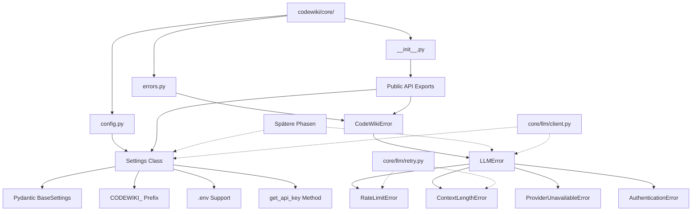

I have created the following plan after thorough exploration and analysis of the codebase. Follow the below plan verbatim. Trust the files and references. Do not re-verify what's written in the plan. Explore only when absolutely necessary. First implement all the proposed file changes and then I'll review all the changes together at the end.

## Beobachtungen

Die Codebase nutzt aktuell eine `dataclass`-basierte Config in `file:codewiki/src/config.py` mit Umgebungsvariablen ohne Prefix. Die Error-Hierarchie in `file:codewiki/cli/utils/errors.py` ist CLI-spezifisch mit Exit-Codes, aber ohne LLM-spezifische Exceptions. Das `core/` Verzeichnis existiert noch nicht und muss komplett neu erstellt werden. Die Dependencies `pydantic`, `pydantic-settings`, `python-dotenv` und `rich` sind bereits vorhanden, aber `anthropic` und `google-generativeai` SDKs fehlen noch (werden in späteren Phasen benötigt).

## Ansatz

Wir erstellen eine neue `codewiki/core/` Verzeichnisstruktur mit drei Kernmodulen: `config.py` für zentrale Pydantic Settings, `errors.py` für LLM-spezifische Exception-Hierarchie, und `__init__.py` für saubere Public API. Die neue Config-Klasse wird Pydantic Settings nutzen mit `CODEWIKI_` Prefix für Umgebungsvariablen und `.env` Support, während die bestehende `src/config.py` vorerst für Backward-Compatibility erhalten bleibt. Die Error-Hierarchie wird parallel zur CLI-Error-Struktur existieren, aber fokussiert auf LLM-spezifische Fehlerbehandlung.

## Implementierungsschritte

### 1. Verzeichnisstruktur erstellen

Erstelle die neue Verzeichnisstruktur:

```
codewiki/
├── core/
│   ├── __init__.py
│   ├── config.py
│   └── errors.py
```

Das `core/` Package muss später in `file:pyproject.toml` unter `tool.setuptools.packages` hinzugefügt werden (Liste: `"codewiki.core"`).

### 2. Exception-Hierarchie implementieren (`core/errors.py`)

Erstelle `file:codewiki/core/errors.py` mit folgender Struktur:

**Basis-Exception:**
- `CodeWikiError(Exception)` - Basis für alle CodeWiki Core Errors
  - Unterscheidet sich von `file:codewiki/cli/utils/errors.py:CodeWikiError` durch fehlende Exit-Codes (nicht CLI-spezifisch)

**LLM-spezifische Exceptions:**
- `LLMError(CodeWikiError)` - Basis für alle LLM-Errors
  - Attribute: `provider: str`, `model: str`, `message: str`
  - Konstruktor sollte diese Felder akzeptieren und speichern

- `RateLimitError(LLMError)` - Rate Limit überschritten
  - Zusätzliches Attribut: `retry_after: float | None = None`
  - Für exponential backoff in späteren Phasen

- `ContextLengthError(LLMError)` - Context Window überschritten
  - Zusätzliche Attribute: `max_tokens: int`, `actual_tokens: int`
  - Nicht retry-bar, wird sofort hochgeworfen

- `ProviderUnavailableError(LLMError)` - Provider API nicht erreichbar
  - Für Netzwerkfehler, Timeouts, 5xx Errors

- `AuthenticationError(LLMError)` - API Key ungültig
  - Für 401/403 Errors

**Implementierungshinweise:**
- Nutze `@dataclass` für strukturierte Error-Daten (siehe Design-Dokument Zeile 128-152)
- Alle Exceptions sollten aussagekräftige `__str__()` Methoden haben
- `LLMError` sollte als Abstract Base Class fungieren

### 3. Pydantic Settings implementieren (`core/config.py`)

Erstelle `file:codewiki/core/config.py` mit der `Settings` Klasse:

**Pydantic Settings Konfiguration:**
```python
from pydantic_settings import BaseSettings, SettingsConfigDict
from pydantic import Field, field_validator
```

- `model_config = SettingsConfigDict(env_prefix="CODEWIKI_", env_file=".env", env_file_encoding="utf-8")`
- Alle Umgebungsvariablen werden mit `CODEWIKI_` Prefix geladen (z.B. `CODEWIKI_MAIN_MODEL`)

**Felder-Gruppen:**

| Kategorie | Felder | Defaults | Validierung |
|-----------|--------|----------|-------------|
| **LLM Provider** | `main_model: str` | `"claude-sonnet-4-20250514"` | `@field_validator` für gültige Prefixes |
| | `fallback_models: list[str]` | `["gpt-4o"]` | - |
| | `cluster_model: str` | `main_model` | - |
| **API Keys** | `anthropic_api_key: str \| None` | `None` | - |
| | `openai_api_key: str \| None` | `None` | - |
| | `google_api_key: str \| None` | `None` | - |
| | `groq_api_key: str \| None` | `None` | - |
| | `cerebras_api_key: str \| None` | `None` | - |
| **Performance** | `max_concurrent_modules: int` | `5` | `Field(ge=1, le=20)` |
| | `retry_attempts: int` | `3` | `Field(ge=1, le=10)` |
| | `retry_base_delay: float` | `1.0` | `Field(ge=0.1)` |
| **Token Limits** | `max_tokens_per_module: int` | `36_369` | - |
| | `max_tokens_per_leaf: int` | `16_000` | - |
| **Output** | `output_dir: str` | `"./docs"` | - |
| | `log_level: str` | `"INFO"` | - |
| | `log_file: str \| None` | `None` | - |

**Validator-Methode:**
- `validate_model(cls, v: str)` - Prüft ob Model-Name mit gültigen Prefixes startet
  - Gültige Prefixes: `("claude", "gpt", "o1", "o3", "gemini", "groq/", "cerebras/")`
  - Wirft `ValueError` bei ungültigem Model

**Helper-Methode:**
- `get_api_key(self, provider: str) -> str`
  - Parameter: `provider` in `["anthropic", "openai", "google", "groq", "cerebras"]`
  - Gibt entsprechenden API Key zurück
  - Wirft `AuthenticationError` aus `file:codewiki/core/errors.py` wenn Key fehlt
  - Mapping: `{"anthropic": self.anthropic_api_key, ...}`

**Referenz:** Design-Dokument Zeilen 334-391 für vollständige Implementierung

### 4. Public API definieren (`core/__init__.py`)

Erstelle `file:codewiki/core/__init__.py` mit Exports:

**Config Exports:**
```python
from codewiki.core.config import Settings

__all__ = ["Settings"]
```

**Error Exports:**
```python
from codewiki.core.errors import (
    CodeWikiError,
    LLMError,
    RateLimitError,
    ContextLengthError,
    ProviderUnavailableError,
    AuthenticationError,
)

__all__ = [
    "Settings",
    "CodeWikiError",
    "LLMError",
    "RateLimitError",
    "ContextLengthError",
    "ProviderUnavailableError",
    "AuthenticationError",
]
```

**Verwendung:**
- Andere Module können importieren via: `from codewiki.core import Settings, LLMError`
- Saubere Trennung zwischen Public API und Implementierungsdetails

### 5. Package-Registrierung

Update `file:pyproject.toml`:

**In `tool.setuptools.packages` Liste hinzufügen:**
```python
"codewiki.core"
```

Die Liste sollte dann enthalten:
```python
packages = [
    "codewiki",
    "codewiki.core",  # NEU
    "codewiki.cli",
    # ... rest bleibt gleich
]
```

### 6. Backward-Compatibility sicherstellen

**Wichtig:** Die bestehende `file:codewiki/src/config.py` wird NICHT gelöscht oder modifiziert in dieser Phase.

**Koexistenz:**
- `file:codewiki/src/config.py` - Bleibt für CLI und bestehenden Code
- `file:codewiki/core/config.py` - Neue zentrale Settings für Refactoring

**Migrations-Strategie:**
- Spätere Phasen werden schrittweise von `src.config.Config` zu `core.Settings` migrieren
- CLI wird in Phase 6 einen Adapter bekommen: `cli/config_loader.py` lädt aus Keyring/JSON und konvertiert zu `core.Settings`

### 7. Validierung und Testing

**Manuelle Tests:**

1. **Settings Laden:**
   - Erstelle `.env` Datei mit `CODEWIKI_MAIN_MODEL=gpt-4o`
   - Teste: `settings = Settings()` lädt korrekt
   - Teste: `settings.get_api_key("anthropic")` wirft `AuthenticationError` wenn Key fehlt

2. **Umgebungsvariablen:**
   - Setze `export CODEWIKI_ANTHROPIC_API_KEY=test-key`
   - Teste: `settings.anthropic_api_key == "test-key"`

3. **Validatoren:**
   - Teste: `Settings(main_model="invalid-model")` wirft `ValidationError`
   - Teste: `Settings(max_concurrent_modules=25)` wirft `ValidationError` (max 20)

4. **Exceptions:**
   - Teste: `raise RateLimitError(provider="anthropic", model="claude-3", message="Rate limit", retry_after=60.0)`
   - Teste: String-Repräsentation enthält alle relevanten Infos

**Import-Tests:**
```python
from codewiki.core import Settings, LLMError, RateLimitError
# Sollte ohne Fehler funktionieren
```

## Architektur-Diagramm



## Abhängigkeiten

**Benötigte Dependencies (bereits vorhanden):**
- `pydantic>=2.11.7`
- `pydantic-settings>=2.10.1`
- `python-dotenv>=1.1.1`

**Keine neuen Dependencies erforderlich für diese Phase.**

**Hinweis:** Die SDKs `anthropic` und `google-generativeai` werden erst in Phase 2 (LLM Client Implementierung) benötigt.