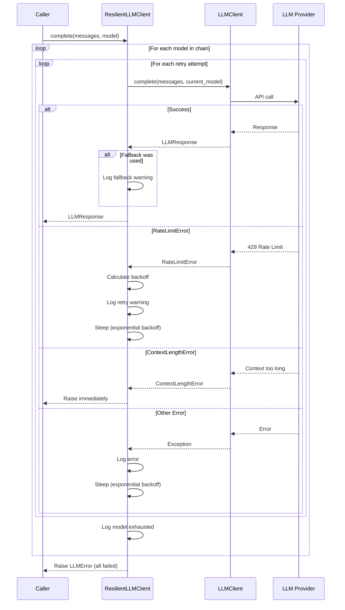

I have created the following plan after thorough exploration and analysis of the codebase. Follow the below plan verbatim. Trust the files and references. Do not re-verify what's written in the plan. Explore only when absolutely necessary. First implement all the proposed file changes and then I'll review all the changes together at the end.

## Observations

The existing codebase uses `pydantic_ai.FallbackModel` for basic retry logic with a single fallback model, synchronous `call_llm()` function, and standard Python logging. The design document specifies a more sophisticated retry system with exponential backoff, multiple fallback models, user notifications, and special error handling. The new `core/` structure (from REFACTOR-1 and REFACTOR-2) provides `Settings`, exception hierarchy (`RateLimitError`, `ContextLengthError`, etc.), `LLMClient`, and `LLMResponse` as building blocks. The subsequent phase (REFACTOR-4) will introduce a Rich-based logger, so the retry module must accept any logger interface.

## Critical Implementation Notes

### ⚠️ Async-Safety (KRITISCH)

**NIEMALS `time.sleep()` verwenden!** Das blockiert den gesamten Thread.

```python
# ❌ FALSCH - blockiert alle parallelen Tasks
time.sleep(delay)

# ✅ RICHTIG - erlaubt anderen Tasks weiterzuarbeiten
await asyncio.sleep(delay)
```

**Warum:** In Plan 05 werden Module parallel verarbeitet. Ein einziger `time.sleep()` würde alle anderen Module blockieren ("Blocking the Event Loop").

### Logger-Kompatibilität via Protocol

Da Plan 04 (Rich Logger) noch nicht umgesetzt ist, definieren wir ein `Protocol` für Duck Typing:

```python
from typing import Protocol

class LoggerProtocol(Protocol):
    """Minimal logger interface for compatibility with stdlib and future Rich logger."""
    def info(self, msg: str, *args, **kwargs) -> None: ...
    def warning(self, msg: str, *args, **kwargs) -> None: ...
    def error(self, msg: str, *args, **kwargs) -> None: ...
```

**Nutzen:**
- Funktioniert jetzt mit `logging.Logger`
- Akzeptiert später nahtlos den `CodeWikiLogger` aus REFACTOR-4
- Type Checker können Kompatibilität prüfen

### Fail-Fast vs. Retry (Fehlerklassifizierung)

**Retry (transiente Fehler - können sich selbst lösen):**
- `RateLimitError` → Provider akzeptiert Requests später wieder
- `ProviderUnavailableError` → Temporärer Ausfall
- Generische `Exception` → Unbekannter Fehler, Retry kann helfen

**Fail Fast (permanente Fehler - Retry ist sinnlos):**
- `ContextLengthError` → Prompt ist zu lang, wird auch beim 3. Versuch zu lang sein
- `AuthenticationError` → Falscher API-Key wird nicht durch Warten richtig

```python
# Explizite Unterscheidung im Code:
except ContextLengthError:
    raise  # Sofort abbrechen, kein Retry
except AuthenticationError:
    raise  # Sofort abbrechen, kein Retry
except RateLimitError as e:
    # Retry mit Backoff
    delay = self._calculate_backoff(attempt, e.retry_after)
    await asyncio.sleep(delay)
```

### Tatsächliches Modell in Response

Wenn ein Fallback-Modell zum Einsatz kommt, muss die `LLMResponse` das **tatsächlich genutzte Modell** enthalten, nicht das ursprünglich angefragte:

```python
response = await self.client.complete(messages, current_model, ...)
# response.model enthält bereits das korrekte Modell vom Provider
# → Wichtig für Metadaten und Kostenberechnung
```

### Jitter für Exponential Backoff

Um das "Thundering Herd Problem" zu vermeiden (alle parallelen Tasks starten gleichzeitig ihren Retry), fügen wir einen kleinen zufälligen Jitter hinzu:

```python
import random

def _calculate_backoff(self, attempt: int, retry_after: float | None = None) -> float:
    if retry_after is not None:
        return retry_after

    base_backoff = self.config.base_delay * (2 ** attempt)
    jitter = random.uniform(0, 0.5)  # 0-500ms Zufallsvariation
    return base_backoff + jitter
```

**Warum:** Wenn 5 Module gleichzeitig ins Rate-Limit laufen und exakt zur gleichen Millisekunde den Retry starten, kollidieren sie wieder. Der Jitter verteilt die Requests zeitlich.

## Approach

Create `file:codewiki/core/llm/retry.py` with two main components: `RetryConfig` dataclass for configuration and `ResilientLLMClient` wrapper class. The client implements a nested retry loop (outer: fallback models, inner: retry attempts per model) with exponential backoff for rate limits, immediate propagation of `ContextLengthError`, and user notifications via logger when fallbacks activate. This design separates retry logic from provider-specific code, enables flexible configuration, and maintains compatibility with both standard logging (current) and the future Rich logger (REFACTOR-4) through duck typing.

## Implementation Steps

### 1. Create `RetryConfig` Dataclass

**File:** `file:codewiki/core/llm/retry.py`

Define a configuration dataclass with:
- `max_retries: int = 3` - Maximum retry attempts per model
- `base_delay: float = 1.0` - Base delay in seconds for exponential backoff
- `fallback_models: list[str] = field(default_factory=list)` - Ordered list of fallback model names

Use `@dataclass` from Python's standard library with `field(default_factory=list)` for the mutable default.

### 2. Create `ResilientLLMClient` Class Structure

**File:** `file:codewiki/core/llm/retry.py`

Define the class with:
- Constructor accepting `client: LLMClient`, `config: RetryConfig`, and `logger: Any` (duck-typed for compatibility)
- Store these as instance attributes
- Import `LLMClient` and `LLMResponse` from `file:codewiki/core/llm/client.py`
- Import all error classes from `file:codewiki/core/errors.py`

The logger parameter uses `Any` type hint to accept both `logging.Logger` (current) and the future `CodeWikiLogger` from REFACTOR-4.

### 3. Implement Main `complete()` Method

**File:** `file:codewiki/core/llm/retry.py`

Create async method signature:
```
async def complete(
    self,
    messages: list[dict],
    model: str,
    temperature: float = 0.0,
    max_tokens: int = 4096,
    **kwargs
) -> LLMResponse
```

Build the model chain: `models_to_try = [model] + self.config.fallback_models`

Initialize `last_error = None` to track the final error if all models fail.

### 4. Implement Outer Loop (Fallback Models)

**File:** `file:codewiki/core/llm/retry.py`

Iterate over `models_to_try` with `for current_model in models_to_try:`.

After the inner retry loop exhausts all attempts for a model:
- Log warning: `self.logger.warning(f"Model {current_model} exhausted, trying fallback...")`
- Continue to next model in chain

If all models fail, raise `LLMError` with message including `last_error`.

### 5. Implement Inner Loop (Retry Attempts)

**File:** `file:codewiki/core/llm/retry.py`

Inside the outer loop, iterate: `for attempt in range(self.config.max_retries):`.

Wrap the LLM call in try-except with these handlers:

**Success case:**
- If `current_model != model`, log: `self.logger.warning(f"Used fallback model: {current_model}")`
- Return the `LLMResponse` immediately

**Error handlers:**
- `RateLimitError`: Extract `retry_after` or calculate `base_delay * 2 ** attempt`, log warning with delay, `await asyncio.sleep(delay)`, continue loop
- `ContextLengthError`: Raise immediately (not retryable)
- `AuthenticationError`: Raise immediately (not retryable)
- `ProviderUnavailableError` and generic `Exception`: Store in `last_error`, log warning with attempt number, `await asyncio.sleep(base_delay * 2 ** attempt)`, continue loop

### 6. Add Helper Method for Exponential Backoff Calculation

**File:** `file:codewiki/core/llm/retry.py`

Create private method:
```python
def _calculate_backoff(self, attempt: int, retry_after: float | None = None) -> float:
    """Calculate delay with exponential backoff and jitter.

    Args:
        attempt: Current retry attempt (0-indexed)
        retry_after: Optional delay from RateLimitError header

    Returns:
        Delay in seconds before next retry attempt
    """
    if retry_after is not None:
        return retry_after

    base_backoff = self.config.base_delay * (2 ** attempt)
    jitter = random.uniform(0, 0.5)  # Prevent thundering herd
    return base_backoff + jitter
```

**Wichtig:** Der Jitter (0-500ms Zufallsvariation) verhindert das "Thundering Herd Problem" bei parallelen Tasks.

This centralizes backoff logic and makes it easier to test/modify.

### 7. Add Imports and Module Docstring

**File:** `file:codewiki/core/llm/retry.py`

Add imports:
- `import asyncio`
- `import random`  # ← NEU: Für Jitter
- `from dataclasses import dataclass, field`
- `from typing import Protocol`  # ← GEÄNDERT: Protocol statt Any
- `from codewiki.core.llm.client import LLMClient, LLMResponse`
- `from codewiki.core.errors import (RateLimitError, ContextLengthError, ProviderUnavailableError, AuthenticationError, LLMError)`

Add module docstring explaining the retry and fallback strategy, exponential backoff, and special error handling.

### 7a. Define LoggerProtocol (NEU)

**File:** `file:codewiki/core/llm/retry.py`

Definiere das Logger-Protocol direkt nach den Imports:

```python
class LoggerProtocol(Protocol):
    """Minimal logger interface for compatibility with stdlib and future Rich logger."""
    def info(self, msg: str, *args, **kwargs) -> None: ...
    def warning(self, msg: str, *args, **kwargs) -> None: ...
    def error(self, msg: str, *args, **kwargs) -> None: ...
```

Verwende `LoggerProtocol` als Type Hint statt `Any` im `ResilientLLMClient`-Konstruktor.

### 8. Update `core/llm/__init__.py`

**File:** `file:codewiki/core/llm/__init__.py`

Export the new classes:
```python
from codewiki.core.llm.retry import ResilientLLMClient, RetryConfig
```

This makes them available via `from codewiki.core.llm import ResilientLLMClient, RetryConfig`.

### 9. Add Type Hints and Documentation

**File:** `file:codewiki/core/llm/retry.py`

Add comprehensive docstrings to:
- `RetryConfig` class: Explain each field and typical usage
- `ResilientLLMClient` class: Explain the retry/fallback strategy
- `complete()` method: Document parameters, return value, and raised exceptions
- `_calculate_backoff()` method: Explain the exponential backoff formula

Use Google-style docstrings with Args, Returns, and Raises sections.

### 10. Error Message Formatting

**File:** `file:codewiki/core/llm/retry.py`

When raising the final `LLMError` after all models fail:
- Include the original model name
- Include the list of attempted models
- Include the last error message
- Format as: `f"All models failed ({model} → {', '.join(self.config.fallback_models)}). Last error: {last_error}"`

This provides clear debugging information about what was attempted.

## Architecture Diagram



## Configuration Example

| Parameter | Default | Description |
|-----------|---------|-------------|
| `max_retries` | 3 | Retry attempts per model before fallback |
| `base_delay` | 1.0s | Base delay for exponential backoff (1s, 2s, 4s, 8s...) |
| `fallback_models` | `[]` | Ordered list of fallback models (e.g., `["gpt-4o", "gpt-4o-mini"]`) |

## Error Handling Strategy

| Error Type | Behavior | Rationale |
|------------|----------|-----------|
| `RateLimitError` | Retry with exponential backoff, respect `retry_after` | Temporary, provider will accept requests later |
| `ContextLengthError` | Raise immediately | Not fixable by retry, requires input reduction |
| `AuthenticationError` | Raise immediately | Configuration issue, retry won't help |
| `ProviderUnavailableError` | Retry, then fallback | Temporary outage, different provider may work |
| Generic `Exception` | Retry, then fallback | Unknown error, retry may succeed |

## Integration Points

- **Input:** Receives `LLMClient` instance from `file:codewiki/core/llm/client.py`
- **Configuration:** Uses `Settings` from `file:codewiki/core/config.py` to populate `RetryConfig`
- **Errors:** Catches exceptions from `file:codewiki/core/errors.py`
- **Logging:** Accepts any logger implementing `LoggerProtocol` (standard `logging.Logger` now, `CodeWikiLogger` from REFACTOR-4 later)
- **Output:** Returns `LLMResponse` dataclass from `file:codewiki/core/llm/client.py`

## Testing Strategy (Ohne API-Kosten)

### Unit Tests mit Mock-Client

Erstelle `tests/core/llm/test_retry.py` mit einem Fake-Client, der kontrolliert Fehler wirft:

```python
import pytest
import asyncio
from unittest.mock import AsyncMock, MagicMock
from codewiki.core.llm.retry import ResilientLLMClient, RetryConfig
from codewiki.core.llm.client import LLMResponse
from codewiki.core.errors import (
    RateLimitError, ContextLengthError, AuthenticationError,
    ProviderUnavailableError, LLMError
)


class FakeLLMClient:
    """Mock client that throws errors in sequence, then succeeds."""

    def __init__(self, error_sequence: list[Exception | None]):
        self.error_sequence = error_sequence
        self.call_count = 0

    async def complete(self, messages, model, **kwargs) -> LLMResponse:
        self.call_count += 1
        if self.call_count <= len(self.error_sequence):
            error = self.error_sequence[self.call_count - 1]
            if error is not None:
                raise error
        return LLMResponse(
            content="Success after retries",
            model=model,
            usage={"prompt_tokens": 10, "completion_tokens": 20, "total_tokens": 30}
        )


@pytest.mark.asyncio
async def test_retry_on_rate_limit_then_succeed():
    """Verify retry logic: 2 rate limits, then success on 3rd attempt."""
    fake_client = FakeLLMClient([
        RateLimitError("Rate limit hit", retry_after=0.01),
        RateLimitError("Rate limit hit again", retry_after=0.01),
        None  # Success
    ])
    logger = MagicMock()
    config = RetryConfig(max_retries=3, base_delay=0.01)

    resilient = ResilientLLMClient(fake_client, config, logger)
    response = await resilient.complete([{"role": "user", "content": "test"}], "claude-3")

    assert response.content == "Success after retries"
    assert fake_client.call_count == 3
    assert logger.warning.call_count >= 2  # Logged retry attempts


@pytest.mark.asyncio
async def test_fail_fast_on_context_length_error():
    """Verify ContextLengthError is raised immediately without retry."""
    fake_client = FakeLLMClient([
        ContextLengthError("Prompt too long", max_tokens=8000, actual_tokens=12000)
    ])
    logger = MagicMock()
    config = RetryConfig(max_retries=3)

    resilient = ResilientLLMClient(fake_client, config, logger)

    with pytest.raises(ContextLengthError):
        await resilient.complete([{"role": "user", "content": "x" * 100000}], "claude-3")

    assert fake_client.call_count == 1  # No retry attempted


@pytest.mark.asyncio
async def test_fail_fast_on_auth_error():
    """Verify AuthenticationError is raised immediately without retry."""
    fake_client = FakeLLMClient([
        AuthenticationError("Invalid API key")
    ])
    logger = MagicMock()
    config = RetryConfig(max_retries=3)

    resilient = ResilientLLMClient(fake_client, config, logger)

    with pytest.raises(AuthenticationError):
        await resilient.complete([{"role": "user", "content": "test"}], "claude-3")

    assert fake_client.call_count == 1  # No retry attempted


@pytest.mark.asyncio
async def test_fallback_model_on_primary_exhausted():
    """Verify fallback to secondary model after primary exhausts retries."""
    fake_client = FakeLLMClient([
        ProviderUnavailableError("Primary down"),
        ProviderUnavailableError("Primary still down"),
        ProviderUnavailableError("Primary completely dead"),
        None  # Success with fallback model
    ])
    logger = MagicMock()
    config = RetryConfig(
        max_retries=3,
        base_delay=0.001,
        fallback_models=["gpt-4o"]
    )

    resilient = ResilientLLMClient(fake_client, config, logger)
    response = await resilient.complete([{"role": "user", "content": "test"}], "claude-3")

    assert response.content == "Success after retries"
    assert fake_client.call_count == 4  # 3 retries + 1 fallback attempt
    # Verify fallback warning was logged
    assert any("fallback" in str(call).lower() for call in logger.warning.call_args_list)


@pytest.mark.asyncio
async def test_all_models_fail_raises_llm_error():
    """Verify LLMError is raised when all models and retries are exhausted."""
    fake_client = FakeLLMClient([
        ProviderUnavailableError("Down") for _ in range(6)  # 3 primary + 3 fallback
    ])
    logger = MagicMock()
    config = RetryConfig(
        max_retries=3,
        base_delay=0.001,
        fallback_models=["gpt-4o"]
    )

    resilient = ResilientLLMClient(fake_client, config, logger)

    with pytest.raises(LLMError) as exc_info:
        await resilient.complete([{"role": "user", "content": "test"}], "claude-3")

    assert "All models failed" in str(exc_info.value)
    assert fake_client.call_count == 6  # 3 + 3 attempts
```

### Testausführung

```bash
# Nur Retry-Tests ausführen (schnell, keine API-Kosten)
pytest tests/core/llm/test_retry.py -v

# Mit Coverage
pytest tests/core/llm/test_retry.py --cov=codewiki.core.llm.retry -v
```

### Was die Tests verifizieren

| Test | Szenario | Erwartung |
|------|----------|-----------|
| `test_retry_on_rate_limit_then_succeed` | 2x RateLimit, dann Erfolg | 3 Aufrufe, 2 Warnings geloggt |
| `test_fail_fast_on_context_length_error` | ContextLengthError sofort | 1 Aufruf, keine Retries |
| `test_fail_fast_on_auth_error` | AuthenticationError sofort | 1 Aufruf, keine Retries |
| `test_fallback_model_on_primary_exhausted` | Primary erschöpft, Fallback funktioniert | 4 Aufrufe (3+1) |
| `test_all_models_fail_raises_llm_error` | Alle erschöpft | LLMError mit Details |