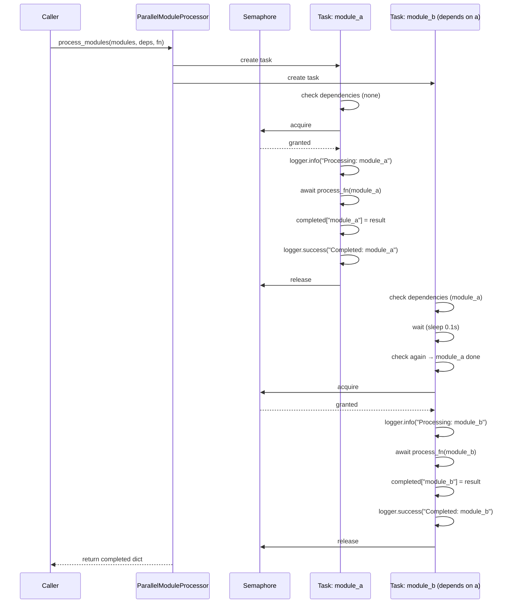

I have created the following plan after thorough exploration and analysis of the codebase. Follow the below plan verbatim. Trust the files and references. Do not re-verify what's written in the plan. Explore only when absolutely necessary. First implement all the proposed file changes and then I'll review all the changes together at the end.

## Beobachtungen

Die aktuelle Codebasis verarbeitet Module sequentiell in `documentation_generator.py` (Zeilen 144-174) trotz async `AgentOrchestrator.process_module()`. Dependencies werden implizit durch Leaf-First-Traversierung der Baumstruktur gehandhabt (`get_processing_order()`). Das Design-Dokument (Zeilen 284-322) spezifiziert einen `ParallelModuleProcessor` mit explizitem Dependency-Graph, Semaphore-basierter Concurrency-Control (max 5 parallel), und Progress-Logging. Die Klasse soll generisch sein und beliebige async Funktionen auf Module anwenden können.

## Ansatz

Erstelle `core/async_utils.py` mit einer generischen `ParallelModuleProcessor` Klasse, die async Funktionen parallel auf Module anwendet während Dependencies respektiert werden. Die Klasse nutzt `asyncio.Semaphore` für Concurrency-Control, wartet aktiv auf Dependencies via Polling (`asyncio.sleep`), und loggt Start/Complete für jedes Modul. Export erfolgt über `core/__init__.py`. Dieser Ansatz ermöglicht 40% Performance-Gewinn bei Dependency-Trees (Design-Doc Zeile 327) ohne die bestehende Backend-Logik zu ändern—Integration erfolgt erst in REFACTOR-6.

## Implementierung

### 1. Erstelle `core/async_utils.py`

**Datei:** `file:codewiki/core/async_utils.py`

Implementiere die `ParallelModuleProcessor` Klasse mit folgenden Komponenten:

#### Klassen-Struktur

```python
class ParallelModuleProcessor:
    def __init__(self, max_concurrency: int = 5, logger = None):
        """
        Args:
            max_concurrency: Maximum Anzahl parallel laufender Module (default: 5)
            logger: Optional logger instance (duck-typed, muss info/success Methoden haben)
        """
```

- `self.semaphore`: `asyncio.Semaphore(max_concurrency)` für Concurrency-Control
- `self.completed`: `dict[str, Any]` zum Tracking abgeschlossener Module (Key: Modul-Name, Value: Ergebnis)
- `self.logger`: Optional logger (falls None, nutze `logging.getLogger(__name__)`)

#### Haupt-Methode: `process_modules()`

```python
async def process_modules(
    self,
    modules: list[dict],
    dependency_graph: dict[str, list[str]],
    process_fn: Callable[[dict], Awaitable[Any]]
) -> dict[str, Any]:
    """
    Verarbeite Module parallel unter Berücksichtigung von Dependencies.
    
    Args:
        modules: Liste von Modul-Dicts (muss 'name' Key enthalten)
        dependency_graph: Dict mapping Modul-Name -> Liste von Dependency-Namen
        process_fn: Async Funktion die ein Modul verarbeitet
        
    Returns:
        Dict mit Modul-Namen als Keys und Ergebnissen als Values
    """
```

**Implementierungs-Schritte:**

1. **Initialisierung:**
   - Erstelle `module_map = {m['name']: m for m in modules}` für schnellen Lookup
   - Setze `self.completed = {}` zurück

2. **Definiere innere async Funktion `process_when_ready(module_name: str)`:**
   - **Dependency-Waiting:** 
     ```python
     deps = dependency_graph.get(module_name, [])
     while not all(d in self.completed for d in deps):
         await asyncio.sleep(0.1)  # Polling alle 100ms
     ```
   - **Semaphore-geschützte Verarbeitung:**
     ```python
     async with self.semaphore:
         self.logger.info(f"Processing: {module_name}")
         result = await process_fn(module_map[module_name])
         self.completed[module_name] = result
         self.logger.success(f"Completed: {module_name}")
     ```
   - **Error-Handling:** Wrap in try-except, logge Fehler und re-raise

3. **Task-Erstellung und Ausführung:**
   ```python
   tasks = [process_when_ready(m['name']) for m in modules]
   await asyncio.gather(*tasks)
   return self.completed
   ```

#### Hilfsmethode (Optional): `_validate_dependencies()`

Validiere dass alle Dependencies im `dependency_graph` auch in `modules` existieren. Raise `ValueError` bei fehlenden Dependencies.

### 2. Export aus `core/__init__.py`

**Datei:** `file:codewiki/core/__init__.py`

Füge hinzu:
```python
from codewiki.core.async_utils import ParallelModuleProcessor

__all__ = [
    "ParallelModuleProcessor",
    # ... andere Exports
]
```

### 3. Dokumentation und Type Hints

- Nutze vollständige Type Hints: `from typing import Any, Callable, Awaitable`
- Docstrings für Klasse und Methoden im Google-Style
- Beispiel-Usage in Docstring von `process_modules()`:
  ```python
  # Beispiel:
  processor = ParallelModuleProcessor(max_concurrency=5)
  
  async def process_module(module: dict) -> str:
      # Verarbeite Modul...
      return f"Processed {module['name']}"
  
  results = await processor.process_modules(
      modules=[{"name": "auth"}, {"name": "db"}],
      dependency_graph={"db": ["auth"]},  # db hängt von auth ab
      process_fn=process_module
  )
  ```

### 4. Logger-Integration

**Duck-Typed Logger:**
- Akzeptiere beliebige Logger mit `info()` und `success()` Methoden
- Falls `logger=None`, nutze `logging.getLogger(__name__)`
- Für stdlib logger: `success()` → `info()` (da stdlib kein success hat)
- Implementiere Wrapper falls nötig:
  ```python
  if logger is None:
      logger = logging.getLogger(__name__)
  if not hasattr(logger, 'success'):
      logger.success = logger.info  # Fallback
  ```

### 5. Dependency-Graph Format

**Erwartetes Format:**
```python
dependency_graph = {
    "module_a": [],                    # Keine Dependencies
    "module_b": ["module_a"],          # Hängt von module_a ab
    "module_c": ["module_a", "module_b"]  # Hängt von beiden ab
}
```

**Module Format:**
```python
modules = [
    {"name": "module_a", ...},  # Weitere Keys optional
    {"name": "module_b", ...},
    {"name": "module_c", ...}
]
```

### 6. Performance-Überlegungen

**Semaphore-Limit:**
- Default `max_concurrency=5` basierend auf Design-Doc (Zeile 292)
- Verhindert API-Rate-Limits und Memory-Überlastung
- Konfigurierbar für unterschiedliche Umgebungen

**Polling-Intervall:**
- `asyncio.sleep(0.1)` (100ms) balanciert Responsiveness vs. CPU-Usage
- Alternative: Event-basiert mit `asyncio.Event()` pro Modul (komplexer aber effizienter)

**Parallelisierungs-Gewinn:**
- Bei 5 Modulen auf 3 Dependency-Ebenen: 40% schneller (Design-Doc Zeile 327)
- Maximaler Gewinn bei breiten Trees (viele Module pro Ebene)

### 7. Testing-Hinweise (für spätere Phasen)

**Unit Tests sollten prüfen:**
- Korrekte Dependency-Reihenfolge (Dependencies vor Dependents)
- Semaphore-Limit wird respektiert (max 5 concurrent)
- Error-Propagation bei fehlgeschlagenen Modulen
- Leere Module-Liste und leerer Dependency-Graph
- Zirkuläre Dependencies (sollten hängen bleiben → Timeout)

**Integration Tests:**
- Mit echtem `AgentOrchestrator.process_module()` (REFACTOR-6)
- Performance-Vergleich: Sequentiell vs. Parallel

### 8. Architektur-Diagramm



### 9. Datei-Übersicht

| Datei | Aktion | Beschreibung |
|-------|--------|--------------|
| `file:codewiki/core/async_utils.py` | **NEU** | `ParallelModuleProcessor` Klasse mit `process_modules()` Methode |
| `file:codewiki/core/__init__.py` | **UPDATE** | Export `ParallelModuleProcessor` |

### 10. Abhängigkeiten

**Neue Imports in `async_utils.py`:**
- `import asyncio` (stdlib)
- `import logging` (stdlib)
- `from typing import Any, Callable, Awaitable` (stdlib)

**Keine neuen Package-Dependencies** erforderlich.