I have created the following plan after thorough exploration and analysis of the codebase. Follow the below plan verbatim. Trust the files and references. Do not re-verify what's written in the plan. Explore only when absolutely necessary. First implement all the proposed file changes and then I'll review all the changes together at the end.

## Beobachtungen zur Codebase

Die Backend-Architektur nutzt aktuell **pydantic_ai Agents** mit Tools für die Dokumentationsgenerierung, einen **OpenAI-kompatiblen Proxy** über `FallbackModel`, und **sequentielle Modul-Verarbeitung** trotz async-fähiger Agent-Orchestrierung. Die `call_llm()` Funktion ist synchron und blockiert bei Parent-Modul-Dokumentation. Token-Counting erfolgt ausschließlich über tiktoken (ungenau für Claude/Gemini). Die alte `Config` Dataclass ist in `CodeWikiDeps` und allen Backend-Modulen tief verankert. Die neuen `core/` Module (Settings, LLMClient, ResilientLLMClient, TokenCounter, ParallelModuleProcessor, CodeWikiLogger) sind implementiert aber noch nicht integriert.

## Ansatz & Begründung

**Strategie**: Inkrementelle Migration mit **Hybrid-Ansatz** – pydantic_ai Agents bleiben vorerst bestehen (Tools-System ist komplex), aber deren LLM-Backend wird auf `ResilientLLMClient` umgestellt via Custom Model Wrapper. Sync `call_llm()` wird durch async `ResilientLLMClient.complete()` ersetzt. Sequentielle Verarbeitung wird durch `ParallelModuleProcessor` ersetzt (40% Speedup laut Design-Doc). `CodeWikiDeps` erhält `core.Settings` statt alter `Config`. Alte `config.py` bleibt für CLI-Backward-Compatibility, wird aber zu Adapter für `core.Settings`. `llm_services.py` wird entfernt, da durch `core/llm/` ersetzt.

**Begründung**: Minimiert Breaking Changes (Agent-Tools bleiben unverändert), ermöglicht sofortige Nutzung von Multi-Provider-Support, Retry-Logic, nativem Token-Counting und Parallel-Processing. Vermeidet vollständige Agent-Neuentwicklung (würde Wochen dauern). CLI-Integration (Phase 7) kann alte Config-Loader nutzen und zu `core.Settings` konvertieren.

## Implementierungsschritte

### 1. Erstelle Custom pydantic_ai Model Wrapper für ResilientLLMClient

**Datei**: `file:codewiki/src/be/llm_adapter.py` (NEU)

Erstelle einen pydantic_ai-kompatiblen Model Wrapper, der `ResilientLLMClient` nutzt:

```python
from __future__ import annotations
from typing import Any
from pydantic_ai.models import Model, ModelSettings, ModelResponse, ModelMessage
from pydantic_ai.messages import TextPart, ModelResponsePart
from codewiki.core import Settings, ResilientLLMClient, LLMClient, RetryConfig
from codewiki.core.logging import CodeWikiLogger
from codewiki.core.errors import LLMError

class CodeWikiModel(Model):
    """pydantic_ai Model wrapper für ResilientLLMClient."""

    def __init__(self, settings: Settings, logger: CodeWikiLogger):
        self.settings = settings
        self.logger = logger
        base_client = LLMClient(settings)
        retry_config = RetryConfig(
            max_retries=settings.retry_attempts,
            base_delay=settings.retry_base_delay,
            fallback_models=settings.fallback_models
        )
        self.client = ResilientLLMClient(base_client, retry_config, logger)

    async def request(
        self,
        messages: list[ModelMessage],
        model_settings: ModelSettings | None = None,
    ) -> ModelResponse:
        """
        Convert pydantic_ai messages, call ResilientLLMClient, return pydantic_ai response.

        Raises:
            LLMError: On API failures (with context for debugging)
            ValueError: On invalid/empty messages
        """
        # === 1. VALIDATE AND CONVERT MESSAGES ===
        if not messages:
            error_msg = "Empty messages list provided to CodeWikiModel.request()"
            self.logger.error(error_msg)
            raise ValueError(error_msg)

        core_messages: list[dict[str, Any]] = []
        for idx, msg in enumerate(messages):
            try:
                converted = self._convert_message_to_core(msg)
                if converted:
                    core_messages.append(converted)
            except Exception as e:
                error_context = {
                    "message_index": idx,
                    "message_type": type(msg).__name__,
                    "model_settings": model_settings,
                }
                self.logger.error(
                    f"Failed to convert message at index {idx}: {e}",
                    **error_context
                )
                raise ValueError(
                    f"Invalid message at index {idx}: {e}. Context: {error_context}"
                ) from e

        if not core_messages:
            error_msg = "All messages were filtered out during conversion"
            self.logger.warning(error_msg, original_count=len(messages))
            raise ValueError(error_msg)

        # === 2. MAP MODEL SETTINGS TO LLM CALL PARAMS ===
        model_name = self.settings.main_model
        temperature = 0.0
        max_tokens = 4096

        if model_settings:
            if hasattr(model_settings, "temperature") and model_settings.temperature is not None:
                temperature = model_settings.temperature
            if hasattr(model_settings, "max_tokens") and model_settings.max_tokens is not None:
                max_tokens = model_settings.max_tokens
            if hasattr(model_settings, "model") and model_settings.model:
                model_name = model_settings.model

        # === 3. CALL RESILIENT LLM CLIENT ===
        try:
            self.logger.debug(
                f"Calling LLM: model={model_name}, messages={len(core_messages)}, temp={temperature}"
            )

            llm_response = await self.client.complete(
                messages=core_messages,
                model=model_name,
                temperature=temperature,
                max_tokens=max_tokens,
            )

        except LLMError as e:
            # Re-raise with additional context for debugging
            error_context = {
                "model": model_name,
                "message_count": len(core_messages),
                "temperature": temperature,
                "max_tokens": max_tokens,
                "first_message_preview": core_messages[0].get("content", "")[:100] if core_messages else None,
            }
            self.logger.error(
                f"LLM call failed: {e}",
                **error_context
            )
            # Attach context to exception for upstream debugging
            e.context = error_context  # type: ignore[attr-defined]
            raise
        except Exception as e:
            # Wrap unexpected errors
            error_context = {
                "model": model_name,
                "message_count": len(core_messages),
                "error_type": type(e).__name__,
            }
            self.logger.error(f"Unexpected error in LLM call: {e}", **error_context)
            raise LLMError(f"Unexpected error: {e}. Context: {error_context}") from e

        # === 4. VALIDATE AND NORMALIZE RESPONSE ===
        if not llm_response or not llm_response.content:
            self.logger.warning(
                "Received empty/partial response from LLM",
                model=model_name,
                has_response=bool(llm_response),
                has_content=bool(llm_response.content) if llm_response else False,
            )
            # Return empty response rather than failing (agent may handle gracefully)
            return ModelResponse(
                parts=[TextPart(content="")],
                model_name=model_name,
            )

        # === 5. CONVERT BACK TO PYDANTIC_AI RESPONSE ===
        response_text = llm_response.content.strip()

        self.logger.debug(
            f"LLM response received",
            input_tokens=llm_response.input_tokens,
            output_tokens=llm_response.output_tokens,
            provider=llm_response.provider,
        )

        return ModelResponse(
            parts=[TextPart(content=response_text)],
            model_name=llm_response.model,
            # Optionally include usage info if pydantic_ai ModelResponse supports it
        )

    def _convert_message_to_core(self, msg: ModelMessage) -> dict[str, Any] | None:
        """
        Convert a single pydantic_ai message to core format.

        Returns:
            dict with 'role' and 'content' keys, or None if message should be skipped.

        Raises:
            ValueError: If message has invalid structure.
        """
        # Handle different pydantic_ai message types
        if hasattr(msg, "role") and hasattr(msg, "content"):
            role = str(msg.role).lower()

            # Normalize role names
            if role in ("human", "user"):
                role = "user"
            elif role in ("ai", "assistant", "model"):
                role = "assistant"
            elif role == "system":
                role = "system"
            else:
                self.logger.warning(f"Unknown message role '{role}', defaulting to 'user'")
                role = "user"

            # Extract content (may be string or list of parts)
            content = msg.content
            if isinstance(content, list):
                # Concatenate text parts
                text_parts = []
                for part in content:
                    if hasattr(part, "content"):
                        text_parts.append(str(part.content))
                    elif hasattr(part, "text"):
                        text_parts.append(str(part.text))
                    elif isinstance(part, str):
                        text_parts.append(part)
                content = "\n".join(text_parts)

            if not content or not str(content).strip():
                self.logger.debug(f"Skipping empty message with role '{role}'")
                return None

            return {"role": role, "content": str(content)}

        # Handle raw dict format (fallback)
        if isinstance(msg, dict):
            if "role" not in msg or "content" not in msg:
                raise ValueError(f"Dict message missing 'role' or 'content': {msg.keys()}")
            return {"role": msg["role"], "content": msg["content"]}

        raise ValueError(f"Unsupported message type: {type(msg).__name__}")

    def name(self) -> str:
        """Return model identifier for pydantic_ai."""
        return f"codewiki:{self.settings.main_model}"
```

**Zweck**: Ermöglicht Nutzung von `ResilientLLMClient` mit bestehenden pydantic_ai Agents ohne Tools-Refactoring.

**Implementierungsdetails**:

1. **Message Conversion** (`_convert_message_to_core`):
   - Validates each message has `role` and `content`
   - Normalizes role names (human→user, ai→assistant)
   - Handles list content (concatenates TextParts)
   - Skips empty messages with warning
   - Raises `ValueError` with context on invalid messages

2. **ModelSettings Mapping**:
   - Extracts `temperature`, `max_tokens`, `model` from `ModelSettings`
   - Falls back to `Settings` defaults if not provided

3. **Error Handling**:
   - Empty messages list → `ValueError` with log
   - Conversion errors → `ValueError` with message index and type context
   - `LLMError` → Re-raised with attached context dict (`model`, `message_count`, `first_message_preview`)
   - Unexpected errors → Wrapped in `LLMError` with context

4. **Edge Cases**:
   - Empty messages list: Raises `ValueError` immediately
   - All messages filtered: Raises `ValueError` with original count
   - Partial/empty response: Returns `ModelResponse` with empty `TextPart` (allows agent to handle gracefully)
   - Unknown role: Logs warning, defaults to "user"

---

### 2. Refaktoriere `agent_orchestrator.py`

**Datei**: `file:codewiki/src/be/agent_orchestrator.py`

**Änderungen**:

1. **Imports aktualisieren**:
   ```python
   from codewiki.core import Settings
   from codewiki.core.logging import CodeWikiLogger
   from codewiki.src.be.llm_adapter import CodeWikiModel
   ```

2. **`__init__` anpassen**:
   - Ersetze `config: Config` durch `settings: Settings`
   - Initialisiere `CodeWikiLogger(settings)`
   - Ersetze `self.fallback_models = create_fallback_models(config)` durch `self.model = CodeWikiModel(settings, logger)`

3. **`create_agent()` anpassen**:
   - Ersetze `self.fallback_models` durch `self.model` in Agent-Konstruktor
   - Behalte Tools und System-Prompts unverändert

4. **`process_module()` anpassen**:
   - Ändere `CodeWikiDeps.config` zu `CodeWikiDeps.settings` (siehe Schritt 6)
   - Behalte async Signatur und Agent-Logik

**Entferne**: Import von `create_fallback_models` aus `llm_services.py`

---

### 3. Refaktoriere `documentation_generator.py`

**Datei**: `file:codewiki/src/be/documentation_generator.py`

**Änderungen**:

1. **Imports aktualisieren**:
   ```python
   from codewiki.core import Settings, ResilientLLMClient, LLMClient, RetryConfig, ParallelModuleProcessor
   from codewiki.core.logging import CodeWikiLogger
   ```

2. **`__init__` anpassen**:
   - Ersetze `config: Config` durch `settings: Settings`
   - Initialisiere `CodeWikiLogger(settings)`, `LLMClient(settings)`, `ResilientLLMClient` mit `RetryConfig`
   - Initialisiere `ParallelModuleProcessor(max_concurrency=settings.max_concurrent_modules)`

3. **`generate_parent_module_docs()` zu async machen**:
   - Ändere Signatur: `async def generate_parent_module_docs(...)`
   - Ersetze `call_llm(prompt, self.config)` durch:
     ```python
     response = await self.resilient_client.complete(
         messages=[{"role": "user", "content": prompt}],
         model=self.settings.main_model,
         temperature=0.0,
         max_tokens=32768
     )
     parent_docs = response.content
     ```

4. **`generate_module_documentation()` mit ParallelModuleProcessor**:
   - Ersetze sequentielle `for module_path, module_name in processing_order:` Schleife durch:
     ```python
     # Erstelle Dependency-Graph aus first_module_tree
     dep_graph = self._build_dependency_graph(first_module_tree)
     
     # Definiere async process_fn
     async def process_single_module(module_info):
         if self.is_leaf_module(module_info):
             return await self.agent_orchestrator.process_module(...)
         else:
             return await self.generate_parent_module_docs(...)
     
     # Parallel verarbeiten
     results = await self.processor.process_modules(
         modules=all_modules,  # Liste von module_info dicts mit 'name' key
         dependency_graph=dep_graph,
         process_fn=process_single_module
     )
     ```

5. **Hilfsmethode `_build_dependency_graph()` hinzufügen**:

   **Signatur:**
   ```python
   def _build_dependency_graph(self, module_tree: dict) -> dict[str, list[str]]:
       """
       Build dependency graph from module tree for ParallelModuleProcessor.

       Args:
           module_tree: Hierarchical dict from cluster_modules() with structure:
               {"module_name": {"children": [...], "components": [...], ...}}

       Returns:
           dict mapping module_name -> list of module names it depends on.
           Parent modules depend on their children (must wait for children to complete).
           Leaf modules have empty dependency lists (can run immediately).
       """
   ```

   **Rückgabeformat:**
   ```python
   # dict[str, list[str]] - Modul-Name als Key, Liste von Dependencies als Value
   {
       "auth": [],                      # Leaf: keine Dependencies, kann sofort starten
       "auth/login": [],                # Leaf: keine Dependencies
       "auth/oauth": [],                # Leaf: keine Dependencies
       "database": ["database/models", "database/queries"],  # Parent: wartet auf Children
       "database/models": [],           # Leaf
       "database/queries": [],          # Leaf
       "api": ["api/routes", "api/middleware", "auth", "database"],  # Parent mit Cross-Dependencies
   }
   ```

   **Implementierung:**
   ```python
   def _build_dependency_graph(self, module_tree: dict) -> dict[str, list[str]]:
       """Build dependency graph where parents depend on their children."""
       graph: dict[str, list[str]] = {}

       def traverse(node: dict, parent_path: str = "") -> None:
           """Recursively traverse tree and build dependency edges."""
           for module_name, module_data in node.items():
               # Build full path for nested modules
               full_path = f"{parent_path}/{module_name}" if parent_path else module_name

               children = module_data.get("children", {})
               child_names: list[str] = []

               if children and isinstance(children, dict):
                   # Collect direct child names
                   for child_name in children.keys():
                       child_full_path = f"{full_path}/{child_name}"
                       child_names.append(child_full_path)

                   # Recurse into children
                   traverse(children, full_path)

               # Parent depends on all its children; leaf has empty list
               graph[full_path] = child_names

       traverse(module_tree)
       return graph
   ```

   **Parent-Child-Beziehungen:**
   - **Leaf-Module** (keine `children` oder leeres `children` dict): `graph[leaf] = []`
   - **Parent-Module** (hat `children`): `graph[parent] = [child1, child2, ...]`
   - Die Abhängigkeit ist invertiert zur Tree-Hierarchie: Parents *warten* auf Children
   - Dies ermöglicht bottom-up Verarbeitung (Leaves zuerst, dann Parents)

   **Zyklische Dependencies:**
   ```python
   def _validate_no_cycles(self, graph: dict[str, list[str]]) -> None:
       """Detect cycles using DFS. Raises ValueError if cycle found."""
       WHITE, GRAY, BLACK = 0, 1, 2  # unvisited, in-progress, completed
       color: dict[str, int] = {node: WHITE for node in graph}

       def dfs(node: str, path: list[str]) -> None:
           if color[node] == GRAY:
               cycle = path[path.index(node):] + [node]
               raise ValueError(f"Cycle detected in dependency graph: {' -> '.join(cycle)}")
           if color[node] == BLACK:
               return

           color[node] = GRAY
           path.append(node)

           for dep in graph.get(node, []):
               if dep in graph:  # Only check nodes in graph
                   dfs(dep, path)

           path.pop()
           color[node] = BLACK

       for node in graph:
           if color[node] == WHITE:
               dfs(node, [])
   ```

   **Hinweis:** Bei korrektem `module_tree` aus `cluster_modules()` sind Zyklen nicht möglich (Tree-Struktur ist per Definition azyklisch). Die Validierung dient als Sicherheitsnetz für fehlerhafte Eingaben.

   **Beispiel-Graph für Tests:**
   ```python
   # Input module_tree:
   module_tree = {
       "auth": {
           "components": ["login.py", "logout.py"],
           "children": {
               "oauth": {"components": ["google.py", "github.py"], "children": {}},
               "jwt": {"components": ["tokens.py"], "children": {}}
           }
       },
       "database": {
           "components": [],
           "children": {
               "models": {"components": ["user.py", "post.py"], "children": {}},
               "migrations": {"components": ["v1.py", "v2.py"], "children": {}}
           }
       },
       "api": {
           "components": ["app.py"],
           "children": {}  # Leaf despite having components
       }
   }

   # Expected output dependency_graph:
   expected_graph = {
       "auth": ["auth/oauth", "auth/jwt"],      # Parent waits for children
       "auth/oauth": [],                         # Leaf - no deps
       "auth/jwt": [],                           # Leaf - no deps
       "database": ["database/models", "database/migrations"],
       "database/models": [],                    # Leaf
       "database/migrations": [],                # Leaf
       "api": [],                                # Leaf (no children)
   }

   # Verarbeitung durch ParallelModuleProcessor:
   # Round 1 (parallel): auth/oauth, auth/jwt, database/models, database/migrations, api
   # Round 2 (parallel): auth, database (nach Abschluss ihrer Children)
   ```

   **Integration mit ParallelModuleProcessor:**
   Der `ParallelModuleProcessor` nutzt diesen Graph für topologische Sortierung:
   - Module ohne Dependencies (leere Liste) werden sofort gestartet
   - Module mit Dependencies warten bis alle Dependencies abgeschlossen sind
   - `max_concurrency` begrenzt parallele Verarbeitung (default: 5)

**Entferne**: Import von `call_llm` aus `llm_services.py`

**Hinweis**: `AgentOrchestrator.process_module()` ist bereits async, passt zu `ParallelModuleProcessor`.

---

### 4. Refaktoriere `cluster_modules.py`

**Datei**: `file:codewiki/src/be/cluster_modules.py`

**Änderungen**:

1. **Imports aktualisieren**:
   ```python
   from codewiki.core import Settings, ResilientLLMClient, LLMClient, RetryConfig
   from codewiki.core.llm.tokenizers import TokenCounter
   from codewiki.core.logging import CodeWikiLogger
   ```

2. **`cluster_modules()` zu async machen**:
   - Ändere Signatur: `async def cluster_modules(..., settings: Settings, ...)`
   - Ersetze `config: Config` Parameter durch `settings: Settings`
   - Initialisiere `TokenCounter()` und `ResilientLLMClient` (oder übergebe als Parameter)

3. **Token-Counting ersetzen**:
   - Ersetze `count_tokens(potential_core_components_with_code)` durch:
     ```python
     token_counter = TokenCounter()
     token_count = token_counter.count(potential_core_components_with_code, settings.cluster_model or settings.main_model)
     ```

4. **LLM-Call ersetzen**:
   - Ersetze `call_llm(prompt, config, model=config.cluster_model)` durch:
     ```python
     response = await resilient_client.complete(
         messages=[{"role": "user", "content": prompt}],
         model=settings.cluster_model or settings.main_model,
         temperature=0.0,
         max_tokens=32768
     )
     response_text = response.content
     ```

5. **Rekursive Calls anpassen**:
   - Alle `cluster_modules()` Aufrufe müssen mit `await` versehen werden

**Entferne**: Import von `call_llm` aus `llm_services.py` und `count_tokens` aus `utils.py`

**Aufruf-Stellen aktualisieren**: In `documentation_generator.py` Zeile 269 muss `cluster_modules()` mit `await` aufgerufen werden.

---

### 5. Refaktoriere `utils.py`

**Datei**: `file:codewiki/src/be/utils.py`

**Änderungen**:

1. **Token-Counting ersetzen**:
   - Ersetze globales `enc = tiktoken.encoding_for_model("gpt-4")` durch:
     ```python
     from codewiki.core.llm.tokenizers import TokenCounter
     _token_counter = TokenCounter()
     ```

2. **`count_tokens()` Funktion anpassen**:
   ```python
   def count_tokens(text: str, model: str = "gpt-4") -> int:
       """Count tokens using TokenCounter (backward compatible)."""
       return _token_counter.count(text, model)
   ```

**Begründung**: Behält Backward-Compatibility für bestehende Aufrufe, nutzt aber neuen `TokenCounter` intern.

**Optional**: Deprecation-Warning hinzufügen, da `TokenCounter` direkt genutzt werden sollte.

---

### 6. Migriere `config.py` zu Adapter für `core.Settings`

**Datei**: `file:codewiki/src/config.py`

**Änderungen**:

1. **Imports hinzufügen**:
   ```python
   from codewiki.core import Settings as CoreSettings
   ```

2. **Conversion-Methode zu `Config` hinzufügen**:
   ```python
   def to_core_settings(self) -> CoreSettings:
       """Convert old Config to new core.Settings."""
       return CoreSettings(
           main_model=self.main_model,
           fallback_models=[self.fallback_model],
           cluster_model=self.cluster_model,
           # Map API keys (assume from env or defaults)
           anthropic_api_key=os.getenv('ANTHROPIC_API_KEY'),
           openai_api_key=os.getenv('OPENAI_API_KEY'),
           # ... weitere Mappings
           output_dir=self.docs_dir,
           log_level=os.getenv('LOG_LEVEL', 'INFO'),
           max_tokens_per_module=MAX_TOKEN_PER_MODULE,
           max_tokens_per_leaf=MAX_TOKEN_PER_LEAF_MODULE,
       )
   ```

3. **Factory-Methode für Backend**:
   ```python
   @classmethod
   def from_core_settings(cls, settings: CoreSettings, repo_path: str) -> 'Config':
       """Create old Config from core.Settings (for backward compatibility)."""
       # Reverse mapping für CLI-Integration
   ```

**Begründung**: Ermöglicht schrittweise Migration. CLI kann weiterhin alte `Config` laden und zu `CoreSettings` konvertieren. Backend nutzt `CoreSettings` intern.

**Hinweis**: Alle Backend-Module sollten `CoreSettings` akzeptieren, aber `Config.to_core_settings()` für Übergangsphase nutzen.

---

### 7. Update `CodeWikiDeps` Dataclass

**Datei**: `file:codewiki/src/be/agent_tools/deps.py`

**Änderungen**:

```python
from codewiki.core import Settings

@dataclass
class CodeWikiDeps:
    # ... bestehende Felder ...
    settings: Settings  # Ersetze config: Config
```

**Auswirkung**: Alle Agent-Tools müssen `deps.settings` statt `deps.config` nutzen. Prüfe:
- `file:codewiki/src/be/agent_tools/read_code_components.py`
- `file:codewiki/src/be/agent_tools/str_replace_editor.py`
- `file:codewiki/src/be/agent_tools/generate_sub_module_documentations.py`

Falls diese Tools `config` nutzen, ersetze durch `settings` (z.B. `settings.main_model` statt `config.main_model`).

---

### 8. Integriere `CodeWikiLogger` in alle Backend-Module

**Dateien**: Alle Backend-Module (`agent_orchestrator.py`, `documentation_generator.py`, `cluster_modules.py`)

**Änderungen**:

1. **Ersetze `logging.getLogger(__name__)` durch**:
   ```python
   from codewiki.core.logging import CodeWikiLogger
   
   # In __init__:
   self.logger = CodeWikiLogger(settings)
   ```

2. **Update Log-Calls**:
   - `logger.info()` → `self.logger.info()`
   - `logger.warning()` → `self.logger.warning()`
   - `logger.error()` → `self.logger.error()`
   - Erfolgs-Logs: `self.logger.success("✓ Module processed")`

3. **Handle Missing `debug()` Method**:

   `CodeWikiLogger` (from REFACTOR-4) does not implement `debug()`. Two options exist:

   **Option A: Search-and-Replace** - Find all `logger.debug()` calls and manually replace:
   ```bash
   grep -r "logger\.debug" codewiki/src/be/
   ```
   Replace each occurrence with `self.logger.info()` or `self.logger.warning()` based on semantic importance.

   **Option B: Implement `debug()` Method** - Add to `CodeWikiLogger` in `file:codewiki/core/logging.py`:
   ```python
   def debug(self, msg: str, **extra) -> None:
       """Debug logging (forwards to info with prefix for compatibility)."""
       self.console.print(f"[dim]🔍 [DEBUG] {msg}[/dim]")
       self._log_to_file("DEBUG", msg, extra)
   ```
   This maintains API compatibility with existing `logger.debug()` calls.

   **Chosen Approach: Option B** - Implement `debug()` on `CodeWikiLogger`. This is preferred because:
   - Maintains backward compatibility without code changes in backend modules
   - Preserves semantic distinction between debug and info logs
   - Allows filtering debug logs via log level in `StructuredFileHandler`
   - Requires single change in `core/logging.py` rather than multiple changes across backend

4. **Füge Extra-Felder hinzu** (optional):
   ```python
   self.logger.info("Completed module", tokens=response.input_tokens + response.output_tokens, duration=elapsed_time)
   ```

**Begründung**: Einheitliches Logging mit Rich Console Output und strukturierten JSON-Logs.

---

### 9. Entferne `llm_services.py`

**Datei**: `file:codewiki/src/be/llm_services.py` (LÖSCHEN)

**Vor dem Löschen prüfen**:
- Alle Imports von `create_fallback_models`, `create_main_model`, `create_openai_client`, `call_llm` sind entfernt
- Keine anderen Module referenzieren diese Datei

**Suche nach Referenzen**:
```bash
grep -r "from codewiki.src.be.llm_services import" codewiki/
grep -r "llm_services" codewiki/
```

Falls Referenzen gefunden werden, ersetze durch neue `core/llm/` Imports.

---

### 10. Update Imports in allen betroffenen Dateien

**Dateien**: Alle Backend-Module

**Änderungen**:

1. **Entferne alte Imports**:
   ```python
   # ENTFERNEN:
   from codewiki.src.be.llm_services import call_llm, create_fallback_models
   from codewiki.src.be.utils import count_tokens
   from codewiki.src.config import Config
   ```

2. **Füge neue Imports hinzu**:
   ```python
   from codewiki.core import Settings, ResilientLLMClient, LLMClient, RetryConfig, ParallelModuleProcessor
   from codewiki.core.llm.tokenizers import TokenCounter
   from codewiki.core.logging import CodeWikiLogger
   from codewiki.core.errors import LLMError, ContextLengthError, RateLimitError
   ```

---

### 11. Teste Backend-Integration

**Manuelle Tests**:

1. **Test LLM Client**:
   ```python
   from codewiki.core import Settings, LLMClient
   settings = Settings(anthropic_api_key="sk-...")
   client = LLMClient(settings)
   response = await client.complete([{"role": "user", "content": "Hello"}], "claude-sonnet-4-20250514")
   print(response.content, response.input_tokens, response.output_tokens)
   ```

2. **Test ResilientLLMClient mit Fallback**:
   - Setze ungültigen API-Key für Main-Model
   - Verifiziere Fallback zu `gpt-4o`
   - Prüfe Logger-Output für Fallback-Notification

3. **Test ParallelModuleProcessor**:
   - Erstelle Test-Module mit Dependencies
   - Verifiziere parallele Verarbeitung (max 5 concurrent)
   - Prüfe Dependency-Reihenfolge

4. **Test Token Counting**:
   ```python
   from codewiki.core.llm.tokenizers import TokenCounter
   counter = TokenCounter()
   tokens = counter.count("Hello world", "claude-sonnet-4-20250514")
   print(f"Tokens: {tokens}")
   ```

5. **Integration Test**:
   - Führe `DocumentationGenerator.run()` auf kleinem Test-Repo aus
   - Verifiziere parallele Modul-Verarbeitung
   - Prüfe Rich Console Output
   - Prüfe JSON Log-File (falls `log_file` gesetzt)

---

## Architektur-Diagramm

```mermaid
sequenceDiagram
    participant DG as DocumentationGenerator
    participant PMP as ParallelModuleProcessor
    participant AO as AgentOrchestrator
    participant CWM as CodeWikiModel
    participant RLC as ResilientLLMClient
    participant LC as LLMClient
    participant Provider as LLM Provider

    DG->>DG: cluster_modules() [async]
    DG->>RLC: complete() für Clustering
    RLC->>LC: complete()
    LC->>Provider: API Call
    Provider-->>LC: Response
    LC-->>RLC: LLMResponse
    RLC-->>DG: LLMResponse

    DG->>PMP: process_modules(modules, dep_graph, process_fn)
    
    par Parallel Processing (max 5)
        PMP->>AO: process_module() [Leaf]
        AO->>CWM: Agent.run() mit Tools
        CWM->>RLC: complete()
        RLC->>LC: complete() mit Retry
        LC->>Provider: API Call
        Provider-->>LC: Response
        LC-->>RLC: LLMResponse
        RLC-->>CWM: LLMResponse
        CWM-->>AO: Agent Result
        AO-->>PMP: Module Docs
    and
        PMP->>DG: generate_parent_module_docs() [Parent]
        DG->>RLC: complete()
        RLC->>LC: complete()
        LC->>Provider: API Call
        Provider-->>LC: Response
        LC-->>RLC: LLMResponse
        RLC-->>DG: LLMResponse
        DG-->>PMP: Parent Docs
    end

    PMP-->>DG: All Results
```



---

## Komponenten-Übersicht

| Komponente | Vorher | Nachher | Änderung |
|------------|--------|---------|----------|
| **agent_orchestrator.py** | `create_fallback_models()` + `Config` | `CodeWikiModel` + `Settings` | Nutzt `ResilientLLMClient` via Wrapper |
| **documentation_generator.py** | Sync `call_llm()` + Sequential | Async `ResilientLLMClient.complete()` + `ParallelModuleProcessor` | 40% Speedup, async |
| **cluster_modules.py** | Sync `call_llm()` + tiktoken | Async `ResilientLLMClient.complete()` + `TokenCounter` | Native Tokenizer, async |
| **llm_services.py** | OpenAI Proxy | **ENTFERNT** | Ersetzt durch `core/llm/` |
| **utils.py** | tiktoken `count_tokens()` | `TokenCounter` Wrapper | Backward-compatible |
| **config.py** | Dataclass | Adapter zu `core.Settings` | Backward-compatible für CLI |
| **CodeWikiDeps** | `config: Config` | `settings: Settings` | Nutzt neue Settings |
| **Logging** | `logging.getLogger()` | `CodeWikiLogger` | Rich Console + JSON File |

---

## Abhängigkeiten & Reihenfolge

1. **Schritt 1-2**: Custom Model Wrapper + Agent Orchestrator (unabhängig)
2. **Schritt 3**: Documentation Generator (hängt von Schritt 2 ab)
3. **Schritt 4**: Cluster Modules (unabhängig)
4. **Schritt 5**: Utils (unabhängig)
5. **Schritt 6-7**: Config Migration + CodeWikiDeps (vor allen anderen)
6. **Schritt 8**: Logger Integration (parallel zu allen)
7. **Schritt 9-10**: Cleanup + Imports (nach allen anderen)
8. **Schritt 11**: Testing (final)

**Empfohlene Reihenfolge**: 6 → 7 → 1 → 2 → 5 → 4 → 3 → 8 → 9 → 10 → 11