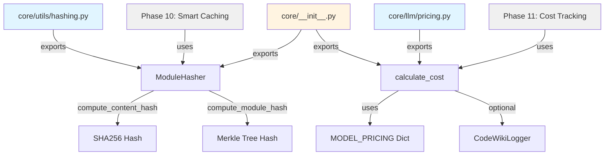

I have created the following plan after thorough exploration and analysis of the codebase. Follow the below plan verbatim. Trust the files and references. Do not re-verify what's written in the plan. Explore only when absolutely necessary. First implement all the proposed file changes and then I'll review all the changes together at the end.

## Beobachtungen

Die Codebase hat bereits eine vollständige Cost-Tracking-Implementierung in `file:codewiki/core/llm/pricing.py` mit `ModelPricing` Dataclass, `PRICING` Dictionary und `calculate_cost()` Funktion. Es fehlt jedoch die Hashing-Utility für Smart Caching (Plan 08) und die Logger-Integration für unbekannte Modelle. Die `core/` Struktur folgt einem klaren Pattern: Dataclasses für Datenstrukturen, Type Hints, Google-Style Docstrings, und explizite Exports via `__init__.py`. Kein `utils/` Verzeichnis existiert bisher unter `core/`.

## Ansatz

Erstelle neue `core/utils/` Package-Struktur mit `ModuleHasher` für deterministische SHA256-Hashing (Content + Merkle-Tree für Parent-Child-Dependencies). Die bestehende `pricing.py` wird um Logger-Integration erweitert, um Warnungen bei unbekannten Modellen zu loggen (aktuell silent fallback zu DEFAULT_PRICING). Beide Utilities werden in `core/__init__.py` exportiert für einfachen Import. Dies ermöglicht Smart Caching in Phase 10 (Hash-basiertes Skip von unveränderten Modulen) und transparente Kostenberechnung mit Feedback bei fehlenden Preisen.

## Implementierungsschritte

### 1. Erstelle `core/utils/` Package-Struktur

**Neue Dateien:**
- `file:codewiki/core/utils/__init__.py` (leeres Package-Init)
- `file:codewiki/core/utils/hashing.py`

**Struktur:**
```
codewiki/core/
├── utils/
│   ├── __init__.py
│   └── hashing.py
```

### 2. Implementiere `ModuleHasher` in `hashing.py`

**Datei:** `file:codewiki/core/utils/hashing.py`

**Klasse:** `ModuleHasher`

**Methoden:**

| Methode | Signatur | Beschreibung |
|---------|----------|--------------|
| `compute_content_hash` | `(content: str) -> str` | SHA256 Hash des Code-Contents (UTF-8 encoded) |
| `compute_module_hash` | `(component_hashes: List[str], child_hashes: List[str]) -> str` | Merkle-Tree Hash: kombiniert sortierte Component + Child Hashes |

**Implementierungsdetails:**

```python
import hashlib
from typing import List

class ModuleHasher:
    """Deterministic hashing for module content and dependency trees.
    
    Uses SHA-256 for cryptographic-quality hashing with UTF-8 encoding.
    Implements Merkle-tree style hashing where parent hashes depend on
    child hashes, ensuring changes propagate up the tree.
    """
    
    @staticmethod
    def compute_content_hash(content: str) -> str:
        """Compute SHA-256 hash of code content.
        
        Args:
            content: Source code or text content to hash
            
        Returns:
            Hexadecimal SHA-256 hash string (64 characters)
            
        Example:
            >>> hasher = ModuleHasher()
            >>> hasher.compute_content_hash("def foo(): pass")
            'a3c5...'  # 64-char hex string
        """
        return hashlib.sha256(content.encode('utf-8')).hexdigest()
    
    @staticmethod
    def compute_module_hash(
        component_hashes: List[str],
        child_hashes: List[str]
    ) -> str:
        """Compute Merkle-tree style hash for a module.
        
        Combines component hashes (code in this module) with child module
        hashes (sub-modules). Sorting ensures deterministic output regardless
        of input order. If a child changes, parent hash changes too.
        
        Args:
            component_hashes: Hashes of code components in this module
            child_hashes: Hashes of child modules (from their compute_module_hash)
            
        Returns:
            Hexadecimal SHA-256 hash string (64 characters)
            
        Example:
            >>> hasher = ModuleHasher()
            >>> comp_hashes = ["abc123...", "def456..."]
            >>> child_hashes = ["789ghi..."]
            >>> hasher.compute_module_hash(comp_hashes, child_hashes)
            'f4e2...'  # Combined hash
        """
        # Sort to ensure deterministic ordering
        all_hashes = sorted(component_hashes) + sorted(child_hashes)
        combined = "".join(all_hashes)
        return hashlib.sha256(combined.encode('utf-8')).hexdigest()
```

**Wichtig:** Sortierung der Hashes garantiert Determinismus unabhängig von Verarbeitungsreihenfolge.

### 3. Erweitere `pricing.py` um Logger-Integration

**Datei:** `file:codewiki/core/llm/pricing.py`

**Änderungen:**

1. **Import hinzufügen:**
```python
from typing import Dict, TYPE_CHECKING

if TYPE_CHECKING:
    from codewiki.core.logging import CodeWikiLogger
```

2. **`calculate_cost()` Signatur erweitern:**
```python
def calculate_cost(
    model: str, 
    input_tokens: int, 
    output_tokens: int,
    logger: "CodeWikiLogger | None" = None
) -> float:
```

3. **Warning Log bei unbekanntem Modell:**
```python
def calculate_cost(
    model: str,
    input_tokens: int,
    output_tokens: int,
    logger: "CodeWikiLogger | None" = None
) -> float:
    """Calculate the cost of an LLM API call.
    
    Args:
        model: Model identifier
        input_tokens: Number of input/prompt tokens
        output_tokens: Number of output/completion tokens
        logger: Optional logger for warnings (unknown models)
        
    Returns:
        Total cost in USD
    """
    if input_tokens < 0 or output_tokens < 0:
        raise ValueError("Token counts cannot be negative")
    
    pricing = MODEL_PRICING.get(model)
    
    if pricing is None:
        if logger:
            logger.warning(
                f"Unknown model pricing for '{model}', using default rates",
                model=model,
                default_input=DEFAULT_PRICING["input"],
                default_output=DEFAULT_PRICING["output"]
            )
        pricing = DEFAULT_PRICING
    
    # Calculate cost...
    input_cost = (input_tokens / 1_000_000) * pricing["input"]
    output_cost = (output_tokens / 1_000_000) * pricing["output"]
    
    return input_cost + output_cost
```

**Hinweis:** `logger` ist optional (default `None`) für Backward-Compatibility. Wenn kein Logger übergeben wird, erfolgt silent fallback wie bisher.

### 4. Update `core/__init__.py` Exports

**Datei:** `file:codewiki/core/__init__.py`

**Neue Imports:**
```python
from codewiki.core.utils.hashing import ModuleHasher
```

**Erweitere `__all__`:**
```python
__all__ = [
    # ... existing exports ...
    "ModuleHasher",  # NEU
]
```

**Hinweis:** `calculate_cost` und `ModelPricing` sind bereits via `codewiki.core.llm` exportiert (siehe `file:codewiki/core/llm/__init__.py`), keine Änderung nötig.

### 5. Verifikation und Testing

**Manuelle Tests:**

1. **Hashing-Test:**
```python
from codewiki.core import ModuleHasher

hasher = ModuleHasher()

# Content hash
code = "def hello(): return 'world'"
hash1 = hasher.compute_content_hash(code)
hash2 = hasher.compute_content_hash(code)
assert hash1 == hash2  # Deterministic

# Module hash
comp_hashes = ["abc123", "def456"]
child_hashes = ["789ghi"]
module_hash = hasher.compute_module_hash(comp_hashes, child_hashes)
print(f"Module hash: {module_hash}")
```

2. **Cost Tracking mit Logger:**
```python
from codewiki.core import Settings, get_logger
from codewiki.core.llm import calculate_cost

settings = Settings(log_level="INFO")
logger = get_logger(settings)

# Known model (no warning)
cost1 = calculate_cost("gpt-4o", 1000, 500, logger)
print(f"Cost: ${cost1:.4f}")

# Unknown model (warning logged)
cost2 = calculate_cost("my-custom-model", 1000, 500, logger)
print(f"Cost: ${cost2:.4f}")
```

**Erwartetes Verhalten:**
- Hashes sind 64-Zeichen Hex-Strings
- Gleicher Input → gleicher Hash
- Unknown model → Yellow ⚠ Warning in Console + JSON Log Entry

### 6. Integration mit nachfolgenden Phasen

**Phase 10 (Smart Caching):**
- `ModuleHasher` wird in `file:codewiki/src/be/documentation_generator.py` verwendet
- Lade old `module_tree.json` Hashes
- Berechne new Hashes mit `compute_content_hash()` für Components
- Berechne `compute_module_hash()` für Module (inkl. Child-Hashes)
- Skip LLM-Call wenn Hash unverändert

**Phase 11 (Cost Tracking):**
- `calculate_cost()` wird in `ResilientLLMClient` integriert
- Track total costs über alle LLM-Calls
- Logge "Total estimated cost: $X.XX" am Ende von `codewiki generate`

## Architektur-Diagramm



## Zusammenfassung

| Komponente | Datei | Status | LOC |
|------------|-------|--------|-----|
| `ModuleHasher` | `core/utils/hashing.py` | NEU | ~60 |
| `utils/__init__.py` | `core/utils/__init__.py` | NEU | ~5 |
| Logger-Integration | `core/llm/pricing.py` | UPDATE | +15 |
| Exports | `core/__init__.py` | UPDATE | +2 |
| **Total** | | | **~82** |

**Trade-offs:**
- Logger ist optional in `calculate_cost()` für Backward-Compatibility (bestehende Calls ohne Logger funktionieren weiter)
- `TYPE_CHECKING` Import verhindert zirkuläre Dependencies zwischen `pricing.py` und `logging.py`
- Sortierung in `compute_module_hash()` garantiert Determinismus, kostet aber O(n log n) statt O(n) - akzeptabel für kleine Listen (<100 Hashes)