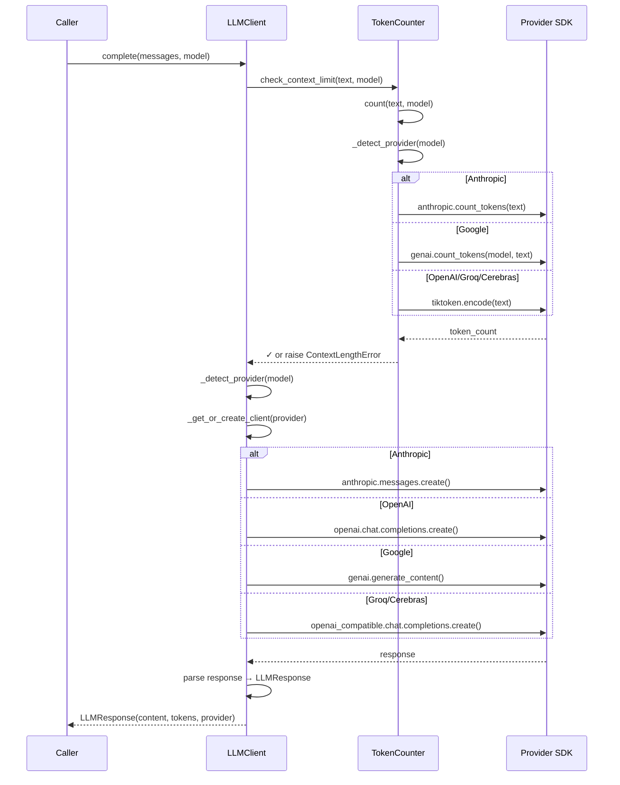

I have created the following plan after thorough exploration and analysis of the codebase. Follow the below plan verbatim. Trust the files and references. Do not re-verify what's written in the plan. Explore only when absolutely necessary. First implement all the proposed file changes and then I'll review all the changes together at the end.

## Beobachtungen

Die Codebase nutzt aktuell einen OpenAI-kompatiblen Proxy-Ansatz (`pydantic_ai` mit `FallbackModel`) für alle LLM-Calls. Alle Aufrufe sind **synchron** (`call_llm()` in `llm_services.py`), obwohl die Agent-Orchestrierung bereits async ist. Token-Counting erfolgt ausschließlich via `tiktoken` für GPT-4, was für Claude/Gemini ungenau ist. Die benötigten Provider-SDKs (`anthropic`, `google-genai`, `groq`) sind in `requirements.txt` vorhanden, aber nicht in `pyproject.toml` deklariert. Der `cerebras_cloud_sdk` fehlt komplett.

## Ansatz

Erstelle `core/llm/client.py` mit einem **direkten Multi-Provider-Client** ohne Abstraktion: `LLMClient` erkennt Provider via Model-Name-Präfix (`claude-*`, `gpt-*`, `gemini-*`, etc.), initialisiert Clients lazy und ruft provider-spezifische async Methoden auf. Erstelle `core/llm/tokenizers.py` mit `TokenCounter`, der native Tokenizer nutzt (Anthropic SDK, Google SDK, tiktoken) und Context-Limits vor API-Calls prüft. Beide Komponenten verwenden `Settings` aus `core/config.py` und werfen `LLMError`-Subklassen aus `core/errors.py`. Dies ermöglicht präzises Token-Counting, async-first Design und direkten Zugriff auf Provider-Features via `**kwargs`.

---

## Implementierungsschritte

### 1. Erstelle `core/llm/` Package-Struktur

Erstelle folgende Dateien:
- `file:codewiki/core/llm/__init__.py`
- `file:codewiki/core/llm/client.py`
- `file:codewiki/core/llm/tokenizers.py`

Aktualisiere `file:pyproject.toml`:
- Füge `"codewiki.core"` und `"codewiki.core.llm"` zu `tool.setuptools.packages` hinzu
- Füge zu `dependencies` hinzu: `"anthropic>=0.67.0"`, `"google-genai>=1.36.0"`, `"groq>=0.30.0"`, `"cerebras-cloud-sdk>=1.0.0"`

---

### 2. Implementiere `TokenCounter` in `tokenizers.py`

Erstelle `TokenCounter` Klasse mit:

**Attribute:**
- `_tiktoken_enc: tiktoken.Encoding | None` (lazy-initialisiert)
- `_anthropic_client: anthropic.Anthropic | None` (lazy-initialisiert)
- `_google_client: genai.Client | None` (lazy-initialisiert)

**Methoden:**
- `count(text: str, model: str) -> int`: Hauptmethode, delegiert an provider-spezifische Methoden
- `_detect_provider(model: str) -> str`: Erkennt Provider via Model-Name (gleiche Logik wie in Design-Doc)
- `_count_anthropic(text: str, model: str) -> int`: Nutzt `anthropic.Anthropic().count_tokens(text)`
- `_count_google(text: str, model: str) -> int`: Nutzt `genai.Client().models.count_tokens(model=model, contents=text).total_tokens`
- `_count_tiktoken(text: str, model: str) -> int`: Nutzt `tiktoken.get_encoding("cl100k_base")` (für OpenAI, Groq, Cerebras)
- `_count_fallback(text: str) -> int`: Fallback mit 10% Buffer (`tiktoken * 1.1`)

**Konstanten:**
```python
MODEL_CONTEXT_LIMITS = {
    "claude-sonnet-4-20250514": 200_000,
    "claude-3-5-sonnet-20241022": 200_000,
    "gpt-4o": 128_000,
    "gpt-4o-mini": 128_000,
    "gemini-1.5-pro": 1_000_000,
    "gemini-2.0-flash-exp": 1_000_000,
    "groq/llama-3.3-70b-versatile": 128_000,
    "cerebras/llama3.1-70b": 128_000,
}
```

**Hilfsmethode:**
- `check_context_limit(text: str, model: str, threshold: float = 0.95) -> None`: Wirft `ContextLengthError` wenn `count(text, model) > limit * threshold`

---

### 3. Implementiere `LLMResponse` Dataclass in `client.py`

Erstelle `LLMResponse` Dataclass:
```python
@dataclass
class LLMResponse:
    content: str
    input_tokens: int
    output_tokens: int
    model: str
    provider: str
```

---

### 4. Implementiere `LLMClient` Klasse in `client.py`

**Initialisierung:**
- `__init__(self, settings: Settings, token_counter: TokenCounter | None = None)`
- Speichere `settings` und erstelle `token_counter` falls nicht übergeben
- Initialisiere alle Provider-Clients als `None` (lazy loading):
  - `_anthropic: AsyncAnthropic | None`
  - `_openai: AsyncOpenAI | None`
  - `_groq: AsyncOpenAI | None` (nutzt OpenAI-kompatible API)
  - `_cerebras: AsyncOpenAI | None` (nutzt OpenAI-kompatible API)
  - `_google: genai.Client | None`

**Hauptmethode:**
- `async def complete(messages: list[dict], model: str, temperature: float = 0.0, max_tokens: int = 4096, **kwargs) -> LLMResponse`
  1. Konvertiere `messages` zu Text via `_messages_to_text(messages)`
  2. Prüfe Context-Limit: `self.token_counter.check_context_limit(text, model)`
  3. Erkenne Provider: `provider = self._detect_provider(model)`
  4. Delegiere an provider-spezifische Methode via `match provider`
  5. Wrappe alle Exceptions in `LLMError`-Subklassen

**Provider-Detection:**
- `_detect_provider(model: str) -> str`: Wie im Design-Doc (Präfix-Matching)

**Provider-spezifische Methoden:**

1. **`_call_anthropic(messages, model, temperature, max_tokens, **kwargs)`:**
   - Lazy-init: `if not self._anthropic: self._anthropic = AsyncAnthropic(api_key=self.settings.get_api_key("anthropic"))`
   - Call: `response = await self._anthropic.messages.create(model=model, messages=messages, temperature=temperature, max_tokens=max_tokens, **kwargs)`
   - Parse: `content = response.content[0].text`, `input_tokens = response.usage.input_tokens`, `output_tokens = response.usage.output_tokens`
   - Return `LLMResponse(...)`
   - Error-Handling: Wrappe `anthropic.RateLimitError` → `RateLimitError`, `anthropic.APIError` → `ProviderUnavailableError`, `anthropic.AuthenticationError` → `AuthenticationError`

2. **`_call_openai(messages, model, temperature, max_tokens, **kwargs)`:**
   - Lazy-init: `if not self._openai: self._openai = AsyncOpenAI(api_key=self.settings.get_api_key("openai"))`
   - Call: `response = await self._openai.chat.completions.create(model=model, messages=messages, temperature=temperature, max_tokens=max_tokens, **kwargs)`
   - Parse: `content = response.choices[0].message.content`, `input_tokens = response.usage.prompt_tokens`, `output_tokens = response.usage.completion_tokens`
   - Return `LLMResponse(...)`
   - Error-Handling: Wrappe `openai.RateLimitError` → `RateLimitError`, `openai.APIError` → `ProviderUnavailableError`, `openai.AuthenticationError` → `AuthenticationError`

3. **`_call_google(messages, model, temperature, max_tokens, **kwargs)`:**
   - Lazy-init: `if not self._google: self._google = genai.Client(api_key=self.settings.get_api_key("google"))`
   - Konvertiere Messages zu Google-Format (System-Message → `system_instruction`, User/Assistant → `contents`)
   - Call: `response = await self._google.aio.models.generate_content(model=model, contents=contents, config=genai.GenerateContentConfig(temperature=temperature, max_output_tokens=max_tokens, **kwargs))`
   - Parse: `content = response.text`, Token-Counts aus `response.usage_metadata`
   - Return `LLMResponse(...)`
   - Error-Handling: Wrappe Google-spezifische Exceptions

4. **`_call_groq(messages, model, temperature, max_tokens, **kwargs)`:**
   - Lazy-init: `if not self._groq: self._groq = AsyncOpenAI(base_url="https://api.groq.com/openai/v1", api_key=self.settings.get_api_key("groq"))`
   - Entferne `groq/` Präfix aus Model-Name
   - Nutze gleiche Logik wie `_call_openai()`

5. **`_call_cerebras(messages, model, temperature, max_tokens, **kwargs)`:**
   - Lazy-init: `if not self._cerebras: self._cerebras = AsyncOpenAI(base_url="https://api.cerebras.ai/v1", api_key=self.settings.get_api_key("cerebras"))`
   - Entferne `cerebras/` Präfix aus Model-Name
   - Nutze gleiche Logik wie `_call_openai()`

**Hilfsmethoden:**
- `_messages_to_text(messages: list[dict]) -> str`: Konkateniert alle Message-Contents zu einem String für Token-Counting

---

### 5. Implementiere `__init__.py` Exports

In `file:codewiki/core/llm/__init__.py`:
```python
from .client import LLMClient, LLMResponse
from .tokenizers import TokenCounter, MODEL_CONTEXT_LIMITS

__all__ = ["LLMClient", "LLMResponse", "TokenCounter", "MODEL_CONTEXT_LIMITS"]
```

---

### 6. Error-Handling Integration

Alle Provider-spezifischen Exceptions müssen in `core/errors.py` Exceptions gemappt werden:

**Mapping-Tabelle:**

| Provider | Exception | CodeWiki Exception |
|----------|-----------|-------------------|
| Anthropic | `anthropic.RateLimitError` | `RateLimitError` (extrahiere `retry_after` aus Header) |
| Anthropic | `anthropic.AuthenticationError` | `AuthenticationError` |
| Anthropic | `anthropic.APIError` | `ProviderUnavailableError` |
| OpenAI | `openai.RateLimitError` | `RateLimitError` |
| OpenAI | `openai.AuthenticationError` | `AuthenticationError` |
| OpenAI | `openai.APIError` | `ProviderUnavailableError` |
| Google | `google.api_core.exceptions.ResourceExhausted` | `RateLimitError` |
| Google | `google.api_core.exceptions.Unauthenticated` | `AuthenticationError` |
| Google | `google.api_core.exceptions.GoogleAPIError` | `ProviderUnavailableError` |

Jede `_call_*()` Methode muss ein `try/except` Block haben, der diese Mappings durchführt und `provider` und `model` Attribute setzt.

---

### 7. Testing-Hinweise

**Manuelle Tests:**
1. Erstelle Test-Script `test_llm_client.py`:
   - Lade `Settings` aus `.env`
   - Erstelle `LLMClient(settings)`
   - Teste `complete()` mit verschiedenen Modellen (Claude, GPT-4, Gemini)
   - Verifiziere Token-Counts in Response
   - Teste Context-Limit Check mit zu langem Text

2. Teste Token-Counter separat:
   - Vergleiche `count()` Ergebnisse für gleichen Text mit verschiedenen Modellen
   - Verifiziere dass Anthropic/Google native Tokenizer genutzt werden (via Logging)

**Integration:**
- Noch keine Integration in Backend (kommt in REFACTOR-3 mit `ResilientLLMClient`)
- Stelle sicher dass `LLMClient` und `TokenCounter` unabhängig testbar sind

---

## Architektur-Diagramm



---

## Abhängigkeiten

| Komponente | Benötigt | Status |
|------------|----------|--------|
| `TokenCounter` | `core/config.py` (Settings), `core/errors.py` (ContextLengthError) | ✓ REFACTOR-1 |
| `LLMClient` | `core/config.py` (Settings), `core/errors.py` (alle LLM-Errors), `TokenCounter` | ✓ REFACTOR-1, ✓ Schritt 2 |
| Provider SDKs | `anthropic`, `google-genai`, `groq`, `cerebras-cloud-sdk`, `openai`, `tiktoken` | ⚠ Cerebras fehlt |

---

## Datei-Übersicht

| Datei | Zeilen (ca.) | Hauptkomponenten |
|-------|--------------|------------------|
| `file:codewiki/core/llm/tokenizers.py` | ~120 | `TokenCounter`, `MODEL_CONTEXT_LIMITS` |
| `file:codewiki/core/llm/client.py` | ~250 | `LLMClient`, `LLMResponse`, 5× `_call_*()` Methoden |
| `file:codewiki/core/llm/__init__.py` | ~5 | Exports |
| `file:pyproject.toml` | +4 Zeilen | Dependency-Updates |