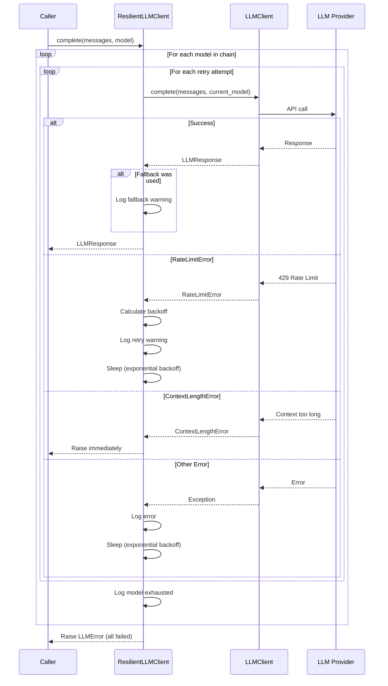

I have created the following plan after thorough exploration and analysis of the codebase. Follow the below plan verbatim. Trust the files and references. Do not re-verify what's written in the plan. Explore only when absolutely necessary. First implement all the proposed file changes and then I'll review all the changes together at the end.

## Observations

The existing codebase uses `pydantic_ai.FallbackModel` for basic retry logic with a single fallback model, synchronous `call_llm()` function, and standard Python logging. The design document specifies a more sophisticated retry system with exponential backoff, multiple fallback models, user notifications, and special error handling. The new `core/` structure (from REFACTOR-1 and REFACTOR-2) provides `Settings`, exception hierarchy (`RateLimitError`, `ContextLengthError`, etc.), `LLMClient`, and `LLMResponse` as building blocks. The subsequent phase (REFACTOR-4) will introduce a Rich-based logger, so the retry module must accept any logger interface.

## Approach

Create `file:codewiki/core/llm/retry.py` with two main components: `RetryConfig` dataclass for configuration and `ResilientLLMClient` wrapper class. The client implements a nested retry loop (outer: fallback models, inner: retry attempts per model) with exponential backoff for rate limits, immediate propagation of `ContextLengthError`, and user notifications via logger when fallbacks activate. This design separates retry logic from provider-specific code, enables flexible configuration, and maintains compatibility with both standard logging (current) and the future Rich logger (REFACTOR-4) through duck typing.

## Implementation Steps

### 1. Create `RetryConfig` Dataclass

**File:** `file:codewiki/core/llm/retry.py`

Define a configuration dataclass with:
- `max_retries: int = 3` - Maximum retry attempts per model
- `base_delay: float = 1.0` - Base delay in seconds for exponential backoff
- `fallback_models: list[str] = field(default_factory=list)` - Ordered list of fallback model names

Use `@dataclass` from Python's standard library with `field(default_factory=list)` for the mutable default.

### 2. Create `ResilientLLMClient` Class Structure

**File:** `file:codewiki/core/llm/retry.py`

Define the class with:
- Constructor accepting `client: LLMClient`, `config: RetryConfig`, and `logger: Any` (duck-typed for compatibility)
- Store these as instance attributes
- Import `LLMClient` and `LLMResponse` from `file:codewiki/core/llm/client.py`
- Import all error classes from `file:codewiki/core/errors.py`

The logger parameter uses `Any` type hint to accept both `logging.Logger` (current) and the future `CodeWikiLogger` from REFACTOR-4.

### 3. Implement Main `complete()` Method

**File:** `file:codewiki/core/llm/retry.py`

Create async method signature:
```
async def complete(
    self,
    messages: list[dict],
    model: str,
    temperature: float = 0.0,
    max_tokens: int = 4096,
    **kwargs
) -> LLMResponse
```

Build the model chain: `models_to_try = [model] + self.config.fallback_models`

Initialize `last_error = None` to track the final error if all models fail.

### 4. Implement Outer Loop (Fallback Models)

**File:** `file:codewiki/core/llm/retry.py`

Iterate over `models_to_try` with `for current_model in models_to_try:`.

After the inner retry loop exhausts all attempts for a model:
- Log warning: `self.logger.warning(f"Model {current_model} exhausted, trying fallback...")`
- Continue to next model in chain

If all models fail, raise `LLMError` with message including `last_error`.

### 5. Implement Inner Loop (Retry Attempts)

**File:** `file:codewiki/core/llm/retry.py`

Inside the outer loop, iterate: `for attempt in range(self.config.max_retries):`.

Wrap the LLM call in try-except with these handlers:

**Success case:**
- If `current_model != model`, log: `self.logger.warning(f"Used fallback model: {current_model}")`
- Return the `LLMResponse` immediately

**Error handlers:**
- `RateLimitError`: Extract `retry_after` or calculate `base_delay * 2 ** attempt`, log warning with delay, `await asyncio.sleep(delay)`, continue loop
- `ContextLengthError`: Raise immediately (not retryable)
- `AuthenticationError`: Raise immediately (not retryable)
- `ProviderUnavailableError` and generic `Exception`: Store in `last_error`, log warning with attempt number, `await asyncio.sleep(base_delay * 2 ** attempt)`, continue loop

### 6. Add Helper Method for Exponential Backoff Calculation

**File:** `file:codewiki/core/llm/retry.py`

Create private method:
```
def _calculate_backoff(self, attempt: int, retry_after: float | None = None) -> float
```

Return `retry_after` if provided (from `RateLimitError.retry_after`), otherwise return `self.config.base_delay * (2 ** attempt)`.

This centralizes backoff logic and makes it easier to test/modify.

### 7. Add Imports and Module Docstring

**File:** `file:codewiki/core/llm/retry.py`

Add imports:
- `import asyncio`
- `from dataclasses import dataclass, field`
- `from typing import Any`
- `from codewiki.core.llm.client import LLMClient, LLMResponse`
- `from codewiki.core.errors import (RateLimitError, ContextLengthError, ProviderUnavailableError, AuthenticationError, LLMError)`

Add module docstring explaining the retry and fallback strategy, exponential backoff, and special error handling.

### 8. Update `core/llm/__init__.py`

**File:** `file:codewiki/core/llm/__init__.py`

Export the new classes:
```python
from codewiki.core.llm.retry import ResilientLLMClient, RetryConfig
```

This makes them available via `from codewiki.core.llm import ResilientLLMClient, RetryConfig`.

### 9. Add Type Hints and Documentation

**File:** `file:codewiki/core/llm/retry.py`

Add comprehensive docstrings to:
- `RetryConfig` class: Explain each field and typical usage
- `ResilientLLMClient` class: Explain the retry/fallback strategy
- `complete()` method: Document parameters, return value, and raised exceptions
- `_calculate_backoff()` method: Explain the exponential backoff formula

Use Google-style docstrings with Args, Returns, and Raises sections.

### 10. Error Message Formatting

**File:** `file:codewiki/core/llm/retry.py`

When raising the final `LLMError` after all models fail:
- Include the original model name
- Include the list of attempted models
- Include the last error message
- Format as: `f"All models failed ({model} → {', '.join(self.config.fallback_models)}). Last error: {last_error}"`

This provides clear debugging information about what was attempted.

## Architecture Diagram



## Configuration Example

| Parameter | Default | Description |
|-----------|---------|-------------|
| `max_retries` | 3 | Retry attempts per model before fallback |
| `base_delay` | 1.0s | Base delay for exponential backoff (1s, 2s, 4s, 8s...) |
| `fallback_models` | `[]` | Ordered list of fallback models (e.g., `["gpt-4o", "gpt-4o-mini"]`) |

## Error Handling Strategy

| Error Type | Behavior | Rationale |
|------------|----------|-----------|
| `RateLimitError` | Retry with exponential backoff, respect `retry_after` | Temporary, provider will accept requests later |
| `ContextLengthError` | Raise immediately | Not fixable by retry, requires input reduction |
| `AuthenticationError` | Raise immediately | Configuration issue, retry won't help |
| `ProviderUnavailableError` | Retry, then fallback | Temporary outage, different provider may work |
| Generic `Exception` | Retry, then fallback | Unknown error, retry may succeed |

## Integration Points

- **Input:** Receives `LLMClient` instance from `file:codewiki/core/llm/client.py`
- **Configuration:** Uses `Settings` from `file:codewiki/core/config.py` to populate `RetryConfig`
- **Errors:** Catches exceptions from `file:codewiki/core/errors.py`
- **Logging:** Accepts any logger (standard `logging.Logger` now, `CodeWikiLogger` from REFACTOR-4 later)
- **Output:** Returns `LLMResponse` dataclass from `file:codewiki/core/llm/client.py`