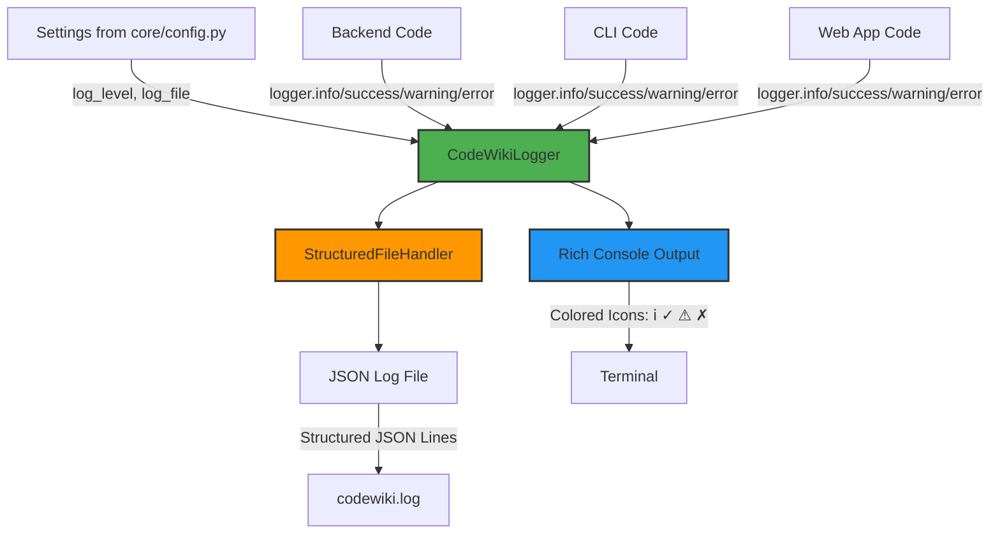

I have created the following plan after thorough exploration and analysis of the codebase. Follow the below plan verbatim. Trust the files and references. Do not re-verify what's written in the plan. Explore only when absolutely necessary. First implement all the proposed file changes and then I'll review all the changes together at the end.

## Observations

The codebase currently uses three different logging approaches: Python's standard `logging` module in the backend (file:`codewiki/src/be/agent_orchestrator.py`, file:`codewiki/src/be/documentation_generator.py`), a custom `CLILogger` with `click` in the CLI (file:`codewiki/cli/utils/logging.py`), and plain `print()` statements in the web app (file:`codewiki/src/fe/background_worker.py`). Rich is already declared as a dependency (`rich>=14.1.0` in file:`pyproject.toml`) but not yet used. The design document specifies a unified `CodeWikiLogger` with Rich console output and structured JSON file logging, integrated with the new `Settings` class from `core/config.py`.

## Approach

Create a unified logging system in file:`codewiki/core/logging.py` that provides both Rich-based console output (with colored icons ℹ/✓/⚠/✗) and structured JSON file logging. The `CodeWikiLogger` class will accept a `Settings` instance (from REFACTOR-1's file:`codewiki/core/config.py`) to configure log level and optional file output. The logger will be designed as a drop-in replacement for both standard logging and the existing CLI logger, with a duck-typed interface that works seamlessly with the `ResilientLLMClient` from REFACTOR-3. This approach maintains backward compatibility while enabling gradual migration in subsequent phases (REFACTOR-6 and REFACTOR-7).

## Implementation Steps

### 1. Create Core Logging Module Structure

Create file:`codewiki/core/logging.py` with the following components:

**Import Dependencies:**
- `logging` (standard library for log levels)
- `json` (for structured file output)
- `datetime` and `timezone` from `datetime` (for timezone-aware UTC timestamps)
- `pathlib.Path` (for file handling)
- `rich.console.Console` (for colored console output)
- `typing` (for type hints)

**Expected Settings Interface:**
The logger will expect `Settings` (from file:`codewiki/core/config.py`) to have:
- `log_level: str` (e.g., "INFO", "DEBUG", "WARNING", "ERROR")
- `log_file: str | None` (optional path for JSON log file)

### 2. Implement StructuredFileHandler Class

Create `StructuredFileHandler` class extending `logging.Handler`:

**Constructor:**
- Accept `filepath: Path` parameter
- Call `super().__init__()`
- Store filepath and ensure parent directory exists using `filepath.parent.mkdir(parents=True, exist_ok=True)`

**emit() Method:**
- Extract log record data into a dictionary with keys:
  - `timestamp`: UTC ISO format using `datetime.now(tz=timezone.utc).isoformat()`
  - `level`: `record.levelname`
  - `message`: `record.getMessage()`
  - `module`: `record.module`
  - Merge any extra fields from `getattr(record, "extra", {})`
- Append JSON line to file using `json.dumps(log_entry) + "\n"`
- Handle file I/O errors gracefully (silent fail to avoid breaking application)

**Design Rationale:**
- JSON Lines format (one JSON object per line) enables easy parsing and streaming
- UTC timestamps ensure consistency across timezones
- Extra fields support rich context (e.g., `tokens`, `duration`, `provider` from design doc example)

### 3. Implement CodeWikiLogger Class

Create `CodeWikiLogger` class with the following structure:

**Constructor:**
- Accept `settings: Settings` parameter (or duck-typed object with `log_level` and `log_file` attributes)
- Initialize `self.console = Console()` from Rich
- Parse `settings.log_level` to Python logging level (default to `logging.INFO` if invalid)
- If `settings.log_file` is provided:
  - Create `StructuredFileHandler(Path(settings.log_file))`
  - Store as `self.file_handler`
  - Set handler's log level
- Otherwise set `self.file_handler = None`

**Public Methods (Console + File):**

Each method should:
1. Print to console with Rich formatting and colored icon
2. Call `_log_to_file()` with appropriate level

**info(msg: str, **extra):**
- Console: `self.console.print(f"[blue]ℹ[/blue] {msg}")`
- File: Log at INFO level

**success(msg: str, **extra):**
- Console: `self.console.print(f"[green]✓[/green] {msg}")`
- File: Log at INFO level (success is a semantic variant of info)

**warning(msg: str, **extra):**
- Console: `self.console.print(f"[yellow]⚠[/yellow] {msg}")`
- File: Log at WARNING level

**error(msg: str, **extra):**
- Console: `self.console.print(f"[red]✗[/red] {msg}")`
- File: Log at ERROR level

**Private Helper Method:**

**_log_to_file(level: str, msg: str, extra: dict):**
- Return early if `self.file_handler` is None
- Create a `logging.LogRecord` with:
  - `name="codewiki"`
  - `level=getattr(logging, level)` (e.g., `logging.INFO`)
  - `pathname=""`, `lineno=0` (not relevant for manual logging)
  - `msg=msg`, `args=()`, `exc_info=None`
- Attach `extra` dict as `record.extra = extra`
- Call `self.file_handler.emit(record)`

**Design Rationale:**
- Duck-typed `settings` parameter ensures compatibility even if REFACTOR-1's `Settings` class isn't fully implemented
- Separate console and file logging allows independent control
- Extra kwargs enable rich context (e.g., `logger.success("Completed", tokens=1247, duration=12.3)`)
- Icons match design doc specification exactly

### 4. Add Module-Level Factory Function

Create `get_logger(settings: Settings) -> CodeWikiLogger`:
- Simple factory that returns `CodeWikiLogger(settings)`
- Provides consistent API for logger creation
- Enables future enhancements (e.g., logger caching, singleton pattern)

### 5. Update core/__init__.py Exports

Add to file:`codewiki/core/__init__.py`:
```python
from codewiki.core.logging import CodeWikiLogger, get_logger
```

This makes the logger available via `from codewiki.core import CodeWikiLogger, get_logger`.

### 6. Verify Rich Dependency

Confirm file:`pyproject.toml` includes `rich>=14.1.0` in dependencies (already present based on observations). No changes needed.

### 7. Create Example Usage Documentation

Add docstring to `CodeWikiLogger` class demonstrating:

**Console Output Example:**
```
ℹ Processing: auth
✓ Completed: auth (1,247 tokens, 12.3s)
⚠ Rate limit on database, retrying...
✗ Failed to process module
```

**File Output Example (codewiki.log):**
```json
{"timestamp": "2025-12-08T10:23:45.123456", "level": "INFO", "message": "Processing: auth", "module": "logging"}
{"timestamp": "2025-12-08T10:23:57.456789", "level": "INFO", "message": "Completed: auth", "module": "logging", "tokens": 1247, "duration": 12.3, "provider": "anthropic"}
```

**Integration Example:**
```python
from codewiki.core import Settings, get_logger

settings = Settings(log_level="INFO", log_file="codewiki.log")
logger = get_logger(settings)

logger.info("Starting process")
logger.success("Task completed", tokens=1500, duration=8.2)
logger.warning("Rate limit approaching")
logger.error("Operation failed", error_code="E001")
```

### 8. Design Considerations for Future Integration

**Backward Compatibility:**
- The logger's method signatures (`info()`, `warning()`, `error()`) match both standard logging and the existing `CLILogger`
- Duck-typed `settings` parameter allows gradual migration
- No breaking changes to existing code until REFACTOR-6

**ResilientLLMClient Integration (REFACTOR-3):**
- The logger interface is already compatible with REFACTOR-3's requirements
- Methods like `logger.warning(f"Rate limit, retry in {delay}s...")` work as-is
- Extra kwargs support rich context for LLM operations

**CLI Migration (REFACTOR-7):**
- `CLILogger` methods map directly: `info()` → `info()`, `success()` → `success()`, etc.
- `step()` method can be emulated with `info()` and string formatting
- `elapsed_time()` functionality can be added later if needed

**Web App Migration (REFACTOR-7):**
- Replace `print()` statements with `logger.info()` or `logger.success()`
- Structured file logging enables better debugging and monitoring

## Architecture Diagram



## File Structure Summary

| File | Purpose |
|------|---------|
| file:`codewiki/core/logging.py` | Main logger implementation with `CodeWikiLogger` and `StructuredFileHandler` |
| file:`codewiki/core/__init__.py` | Export `CodeWikiLogger` and `get_logger` for public API |
| file:`pyproject.toml` | Already contains `rich>=14.1.0` dependency (no changes) |

## Testing Strategy

**Manual Testing Approach:**
1. Create a test script that instantiates `Settings` with various log levels and file paths
2. Call all logger methods (`info()`, `success()`, `warning()`, `error()`) with and without extra kwargs
3. Verify console output shows correct colors and icons
4. Verify JSON log file contains properly formatted entries with timestamps and extra fields
5. Test with `log_file=None` to ensure file logging is optional
6. Test with invalid log levels to ensure graceful fallback to INFO

**Integration Testing (in REFACTOR-6):**
- Replace `logger.info()` calls in file:`codewiki/src/be/agent_orchestrator.py` with new logger
- Verify output matches expected format
- Test with async operations to ensure thread safety