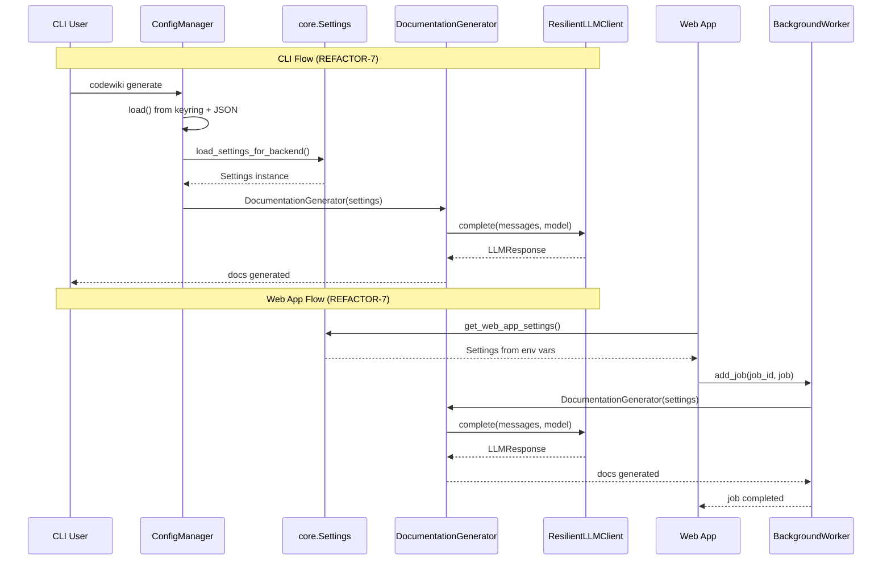

I have created the following plan after thorough exploration and analysis of the codebase. Follow the below plan verbatim. Trust the files and references. Do not re-verify what's written in the plan. Explore only when absolutely necessary. First implement all the proposed file changes and then I'll review all the changes together at the end.

## Observations

The codebase has completed REFACTOR-1 (`core/config.py` with Pydantic `Settings`, `core/errors.py` with LLM exception hierarchy), but `core/__init__.py` lacks exports and `Settings` is missing the `get_api_key()` helper method from the design. The CLI currently uses a separate `Configuration` dataclass with keyring storage (`file:codewiki/cli/config_manager.py`), while the backend uses the old `Config` dataclass (`file:codewiki/src/config.py`) with `from_cli()` and `from_args()` factory methods. The web app's `BackgroundWorker` (`file:codewiki/src/fe/background_worker.py`) runs async doc generation but instantiates the old `Config` via `from_args()`. Dependencies in `file:pyproject.toml` include `openai`, `pydantic-ai`, and `litellm` but lack native SDKs (`anthropic`, `google-generativeai`, `groq`, `cerebras-cloud-sdk`) required by the new `core/llm/client.py` (assumed implemented in REFACTOR-2). The default model `claude-sonnet-4` in `file:codewiki/src/config.py` line 34 is invalid per the design doc (should be `claude-sonnet-4-20250514`).

## Approach

This plan finalizes the refactoring by bridging CLI/web app configurations to the new `core.Settings`, eliminating the old `Config` dataclass while preserving backward compatibility during migration, and cleaning up deprecated modules. The strategy uses **adapter functions** to convert CLI's keyring+JSON and web app's env vars into `core.Settings` instances, avoiding breaking changes to CLI UX or web app deployment. For the CLI, a new `load_settings_from_cli()` function in `file:codewiki/cli/config_manager.py` will merge keyring API keys with JSON settings into `Settings(**dict)`. For the web app, `file:codewiki/src/fe/config.py` will instantiate `Settings()` directly from `CODEWIKI_*` env vars (Pydantic auto-loads). The backend adapter (`file:codewiki/src/config.py`) gains a `to_core_settings()` method for gradual migration, then gets deprecated post-integration. The CLI doc generator adapter (`file:codewiki/cli/adapters/doc_generator.py`) will pass `Settings` to the async backend, and the web app worker will use `asyncio.run()` for the refactored async `DocumentationGenerator.run()`. Dependencies are updated in `file:pyproject.toml` to add missing SDKs, the invalid default model is corrected, and `file:codewiki/src/be/llm_services.py` is deleted after verifying no imports remain. Testing validates CLI `codewiki generate` and web app job processing end-to-end.

**Trade-offs:** Adapter functions add ~50 LOC but enable zero-downtime migration; CLI users see no UX changes (keyring still works), and web app deployments only need `CODEWIKI_*` env var renames (e.g., `LLM_API_KEY` → `CODEWIKI_ANTHROPIC_API_KEY`). The old `Config` dataclass remains temporarily for CLI backward compat but is marked deprecated. This incremental approach prioritizes stability over immediate cleanup, deferring full `Config` removal to a future phase once all callsites migrate.

---

## Implementation Steps

### 1. Complete `core/config.py` and `core/__init__.py` Exports

**File:** `file:codewiki/core/config.py`

Add the missing `get_api_key()` method to the `Settings` class (per design doc section 6):

```python
def get_api_key(self, provider: str) -> str:
    """
    Get API key for a specific provider.
    
    Args:
        provider: Provider name ("anthropic", "openai", "google", "groq", "cerebras")
        
    Returns:
        API key string
        
    Raises:
        AuthenticationError: If no API key configured for provider
    """
    from codewiki.core.errors import AuthenticationError
    
    key_map = {
        "anthropic": self.anthropic_api_key,
        "openai": self.openai_api_key,
        "google": self.google_api_key,
        "groq": self.groq_api_key,
        "cerebras": self.cerebras_api_key,
    }
    key = key_map.get(provider)
    if not key:
        raise AuthenticationError(
            provider=provider,
            model="unknown",
            message=f"No API key configured for provider '{provider}'. "
                    f"Set CODEWIKI_{provider.upper()}_API_KEY environment variable."
        )
    return key
```

**File:** `file:codewiki/core/__init__.py`

Add public API exports for clean imports (`from codewiki.core import Settings, LLMError, ...`):

```python
"""CodeWiki Core - Centralized configuration, errors, LLM clients, and utilities."""

from codewiki.core.config import Settings
from codewiki.core.errors import (
    CodeWikiError,
    LLMError,
    RateLimitError,
    ContextLengthError,
    ProviderUnavailableError,
    AuthenticationError,
)

# These will be available after REFACTOR-2-5 are implemented:
# from codewiki.core.llm import LLMClient, ResilientLLMClient, TokenCounter, LLMResponse
# from codewiki.core.logging import CodeWikiLogger, get_logger
# from codewiki.core.async_utils import ParallelModuleProcessor

__all__ = [
    "Settings",
    "CodeWikiError",
    "LLMError",
    "RateLimitError",
    "ContextLengthError",
    "ProviderUnavailableError",
    "AuthenticationError",
    # Uncomment after REFACTOR-2-5:
    # "LLMClient",
    # "ResilientLLMClient",
    # "TokenCounter",
    # "LLMResponse",
    # "CodeWikiLogger",
    # "get_logger",
    # "ParallelModuleProcessor",
]
```

---

### 2. CLI Integration: Load Settings from Keyring + JSON

**File:** `file:codewiki/cli/config_manager.py`

Add a new method `load_settings_for_backend()` that converts CLI config (keyring + JSON) into `core.Settings`:

```python
def load_settings_for_backend(self, repo_path: str, output_dir: str) -> 'Settings':
    """
    Load CLI configuration and convert to core.Settings for backend.
    
    Args:
        repo_path: Repository path (for context, not stored in Settings)
        output_dir: Output directory for docs
        
    Returns:
        Settings instance ready for backend use
        
    Raises:
        ConfigurationError: If configuration incomplete or invalid
    """
    from codewiki.core import Settings
    
    if not self.is_configured():
        raise ConfigurationError(
            "Configuration incomplete. Run 'codewiki config validate' to check."
        )
    
    config = self.get_config()
    api_key = self.get_api_key()
    
    # Map CLI config to Settings fields
    # Detect provider from base_url or model name
    provider = self._detect_provider(config.main_model, config.base_url)
    
    settings_dict = {
        "main_model": config.main_model,
        "cluster_model": config.cluster_model or config.main_model,
        "output_dir": output_dir,
        "log_level": "INFO",  # CLI default
    }
    
    # Set API key for detected provider
    if provider == "anthropic":
        settings_dict["anthropic_api_key"] = api_key
    elif provider == "openai":
        settings_dict["openai_api_key"] = api_key
    elif provider == "google":
        settings_dict["google_api_key"] = api_key
    # Add groq/cerebras if needed
    
    return Settings(**settings_dict)

def _detect_provider(self, model: str, base_url: str) -> str:
    """Detect provider from model name or base URL."""
    if model.startswith("claude"):
        return "anthropic"
    elif model.startswith(("gpt", "o1", "o3")):
        return "openai"
    elif model.startswith("gemini"):
        return "google"
    elif "groq" in base_url.lower():
        return "groq"
    elif "cerebras" in base_url.lower():
        return "cerebras"
    else:
        # Default to OpenAI for custom base URLs
        return "openai"
```

**Rationale:** This adapter preserves CLI's keyring-based UX while feeding the new `Settings` class. Users don't need to change workflows; the CLI internally maps their stored config to the new format.

---

### 3. Update CLI Doc Generator Adapter

**File:** `file:codewiki/cli/adapters/doc_generator.py`

Refactor `_run_backend_generation()` to use `core.Settings` instead of `BackendConfig`:

**Changes:**
1. Replace `BackendConfig.from_cli()` call (lines 132-139) with `ConfigManager.load_settings_for_backend()`
2. Pass `Settings` to `DocumentationGenerator` constructor
3. Remove `set_cli_context()` call (deprecated with new Settings)

```python
async def _run_backend_generation(self, settings: 'Settings'):
    """Run the backend documentation generation with progress tracking."""
    
    # Stage 1: Dependency Analysis
    self.progress_tracker.start_stage(1, "Dependency Analysis")
    # ... existing code ...
    
    # Create documentation generator with new Settings
    doc_generator = DocumentationGenerator(settings, repo_path=str(self.repo_path))
    
    # ... rest of existing code ...
```

Update `generate()` method (line 114):

```python
def generate(self) -> DocumentationJob:
    # ... existing pre-checks ...
    
    try:
        # Load settings from CLI config
        settings = self.config_manager.load_settings_for_backend(
            repo_path=str(self.repo_path),
            output_dir=str(self.output_dir)
        )
        
        # Run backend documentation generation
        asyncio.run(self._run_backend_generation(settings))
        
        # ... rest of existing code ...
```

**Note:** Assumes `DocumentationGenerator` constructor signature changed in REFACTOR-6 to accept `Settings` instead of `Config`.

---

### 4. Update CLI Generate Command

**File:** `file:codewiki/cli/commands/generate.py`

Minimal changes needed since `ConfigManager` already handles the conversion:

1. Remove the manual config dict creation (lines 200-205)
2. Pass `ConfigManager` instance to `CLIDocumentationGenerator` instead of config dict

```python
# Create generator
generator = CLIDocumentationGenerator(
    repo_path=repo_path,
    output_dir=output_dir,
    config_manager=config_manager,  # Pass manager instead of dict
    verbose=verbose,
    generate_html=github_pages
)
```

Update `CLIDocumentationGenerator.__init__()` signature in `file:codewiki/cli/adapters/doc_generator.py`:

```python
def __init__(
    self,
    repo_path: Path,
    output_dir: Path,
    config_manager: ConfigManager,  # Changed from config dict
    verbose: bool = False,
    generate_html: bool = False
):
    self.repo_path = repo_path
    self.output_dir = output_dir
    self.config_manager = config_manager  # Store manager
    self.verbose = verbose
    self.generate_html = generate_html
    # ... rest of init ...
```

---

### 5. Web App Integration: Use `core.Settings` with Env Vars

**File:** `file:codewiki/src/fe/config.py`

Replace the static `WebAppConfig` class with a function that returns `core.Settings` loaded from env vars:

```python
"""
Configuration settings for the CodeWiki web application.
"""

import os
from pathlib import Path
from codewiki.core import Settings


def get_web_app_settings() -> Settings:
    """
    Load web app settings from environment variables.
    
    Environment variables should use CODEWIKI_ prefix:
    - CODEWIKI_ANTHROPIC_API_KEY
    - CODEWIKI_OPENAI_API_KEY
    - CODEWIKI_MAIN_MODEL (default: claude-sonnet-4-20250514)
    - CODEWIKI_OUTPUT_DIR (default: ./output/docs)
    - CODEWIKI_LOG_LEVEL (default: INFO)
    - CODEWIKI_LOG_FILE (optional)
    
    Returns:
        Settings instance configured for web app
    """
    # Pydantic Settings auto-loads from CODEWIKI_* env vars
    settings = Settings()
    
    # Override output_dir for web app if not set
    if settings.output_dir == "./docs":
        settings.output_dir = os.getenv("CODEWIKI_OUTPUT_DIR", "./output/docs")
    
    return settings


# Legacy constants for backward compatibility (deprecated)
class WebAppConfig:
    """DEPRECATED: Use get_web_app_settings() instead."""
    
    CACHE_DIR = "./output/cache"
    TEMP_DIR = "./output/temp"
    OUTPUT_DIR = "./output"
    QUEUE_SIZE = 100
    CACHE_EXPIRY_DAYS = 365
    JOB_CLEANUP_HOURS = 24000
    RETRY_COOLDOWN_MINUTES = 3
    DEFAULT_HOST = "127.0.0.1"
    DEFAULT_PORT = 8000
    CLONE_TIMEOUT = 300
    CLONE_DEPTH = 1
    
    @classmethod
    def ensure_directories(cls):
        """Ensure all required directories exist."""
        for directory in [cls.CACHE_DIR, cls.TEMP_DIR, cls.OUTPUT_DIR]:
            Path(directory).mkdir(parents=True, exist_ok=True)
    
    @classmethod
    def get_absolute_path(cls, path: str) -> str:
        """Get absolute path for a given relative path."""
        return os.path.abspath(path)
```

**Deployment Note:** Web app deployments must rename env vars:
- `LLM_API_KEY` → `CODEWIKI_ANTHROPIC_API_KEY` (or appropriate provider)
- `MAIN_MODEL` → `CODEWIKI_MAIN_MODEL`
- `CLUSTER_MODEL` → `CODEWIKI_CLUSTER_MODEL` (optional, defaults to main_model)

---

### 6. Update Web App Background Worker

**File:** `file:codewiki/src/fe/background_worker.py`

Refactor `_process_job()` to use `core.Settings` and async backend:

**Changes:**
1. Replace `Config.from_args()` (lines 207-211) with `get_web_app_settings()`
2. Update `DocumentationGenerator` instantiation to pass `Settings` + `repo_path`
3. Ensure async event loop handling (already present, lines 219-224)

```python
def _process_job(self, job_id: str):
    """Process a single documentation generation job."""
    # ... existing code up to line 205 ...
    
    # Generate documentation
    job.progress = "Analyzing repository structure..."
    
    # Load settings from environment
    from codewiki.src.fe.config import get_web_app_settings
    settings = get_web_app_settings()
    
    # Override output_dir for this job
    settings.output_dir = os.path.join("output", "docs", f"{job_id}-docs")
    
    job.progress = "Generating documentation..."
    
    # Generate documentation with new Settings
    doc_generator = DocumentationGenerator(
        settings=settings,
        repo_path=temp_repo_dir,
        commit_id=job.commit_id
    )
    
    # Run the async documentation generation (already async-aware)
    loop = asyncio.new_event_loop()
    asyncio.set_event_loop(loop)
    try:
        loop.run_until_complete(doc_generator.run())
    finally:
        loop.close()
    
    # ... rest of existing code ...
```

Remove the `MAIN_MODEL` global import (line 175) since it's now in `Settings`.

---

### 7. Add Backward Compatibility Adapter to `src/config.py`

**File:** `file:codewiki/src/config.py`

Add a `to_core_settings()` method to the old `Config` dataclass for gradual migration, then mark the class as deprecated:

```python
import warnings
from codewiki.core import Settings

# Mark module as deprecated
warnings.warn(
    "codewiki.src.config.Config is deprecated. Use codewiki.core.Settings instead.",
    DeprecationWarning,
    stacklevel=2
)

@dataclass
class Config:
    """DEPRECATED: Use codewiki.core.Settings instead."""
    # ... existing fields ...
    
    def to_core_settings(self) -> Settings:
        """
        Convert old Config to new core.Settings.
        
        Returns:
            Settings instance
        """
        # Detect provider from model name
        provider_key_map = {}
        if self.main_model.startswith("claude"):
            provider_key_map["anthropic_api_key"] = self.llm_api_key
        elif self.main_model.startswith(("gpt", "o1", "o3")):
            provider_key_map["openai_api_key"] = self.llm_api_key
        elif self.main_model.startswith("gemini"):
            provider_key_map["google_api_key"] = self.llm_api_key
        else:
            # Default to OpenAI
            provider_key_map["openai_api_key"] = self.llm_api_key
        
        return Settings(
            main_model=self.main_model,
            cluster_model=self.cluster_model,
            fallback_models=[self.fallback_model] if self.fallback_model else [],
            output_dir=self.docs_dir,
            max_tokens_per_module=self.max_depth,  # Approximate mapping
            **provider_key_map
        )
```

**Note:** This adapter is temporary. Once all callsites migrate to `core.Settings`, delete `file:codewiki/src/config.py` entirely.

---

### 8. Update `pyproject.toml` Dependencies

**File:** `file:pyproject.toml`

Add missing native SDK dependencies (lines 26-53):

```toml
dependencies = [
    # ... existing deps ...
    "openai>=1.107.0",
    "anthropic>=0.40.0",              # NEW: For Claude models
    "google-generativeai>=0.8.3",     # NEW: For Gemini models
    "groq>=0.11.0",                   # NEW: For Groq models
    "cerebras-cloud-sdk>=1.5.0",      # NEW: For Cerebras models
    "litellm>=1.77.0",                # Keep for fallback/testing
    "pydantic>=2.11.7",
    "pydantic-settings>=2.10.1",
    "pydantic-ai>=1.0.6",
    # ... rest of deps ...
]
```

Update the `packages` list to include `codewiki.core` and its subpackages (lines 81-97):

```toml
[tool.setuptools]
packages = [
    "codewiki",
    "codewiki.core",                                    # NEW
    "codewiki.core.llm",                                # NEW (after REFACTOR-2)
    "codewiki.cli",
    # ... existing packages ...
]
```

---

### 9. Fix Invalid Default Model Name

**File:** `file:codewiki/src/config.py`

Update line 34 to use the correct model identifier:

```python
# OLD:
MAIN_MODEL = os.getenv('MAIN_MODEL', 'claude-sonnet-4')

# NEW:
MAIN_MODEL = os.getenv('MAIN_MODEL', 'claude-sonnet-4-20250514')
```

**File:** `file:codewiki/core/config.py`

Verify line 15 already has the correct default (it does):

```python
main_model: str = "claude-sonnet-4-20250514"  # ✓ Already correct
```

---

### 10. Cleanup: Remove Old `llm_services.py`

**File:** `file:codewiki/src/be/llm_services.py`

**Action:** DELETE this file after verifying no imports remain.

**Verification Steps:**
1. Search for imports: `grep -r "from codewiki.src.be.llm_services import" codewiki/`
2. Expected results after REFACTOR-6:
   - `file:codewiki/src/be/agent_orchestrator.py` line 42: REMOVED (replaced with `ResilientLLMClient`)
   - `file:codewiki/src/be/documentation_generator.py` line 13: REMOVED (replaced with async client)
   - `file:codewiki/src/be/cluster_modules.py` line 7: REMOVED (replaced with async client)
3. If no matches, delete: `rm codewiki/src/be/llm_services.py`

---

### 11. Update All Imports Across Codebase

**Files to Update:**

| File | Old Import | New Import |
|------|-----------|-----------|
| `file:codewiki/cli/adapters/doc_generator.py` | `from codewiki.src.config import Config` | `from codewiki.core import Settings` |
| `file:codewiki/src/fe/background_worker.py` | `from codewiki.src.config import Config` | `from codewiki.core import Settings` |
| `file:codewiki/src/be/agent_orchestrator.py` | `from codewiki.src.config import Config` | `from codewiki.core import Settings` |
| `file:codewiki/src/be/documentation_generator.py` | `from codewiki.src.config import Config` | `from codewiki.core import Settings` |
| `file:codewiki/src/be/cluster_modules.py` | `from codewiki.src.config import Config` | `from codewiki.core import Settings` |
| `file:codewiki/src/be/agent_tools/deps.py` | `from codewiki.src.config import Config` | `from codewiki.core import Settings` |

**Search Command:**
```bash
grep -r "from codewiki.src.config import Config" codewiki/ --include="*.py"
```

**Replace Pattern:**
```python
# OLD:
from codewiki.src.config import Config

# NEW:
from codewiki.core import Settings
```

**Update `CodeWikiDeps` dataclass** in `file:codewiki/src/be/agent_tools/deps.py` (line 16):

```python
@dataclass
class CodeWikiDeps:
    # ... existing fields ...
    config: Settings  # Changed from Config
```

---

### 12. Testing and Verification

#### CLI Testing

**Test Case 1: Basic Generation**
```bash
# Ensure config is set
codewiki config validate

# Run generation on a test repo
cd /path/to/test-repo
codewiki generate --verbose

# Verify:
# - No import errors
# - Settings loaded from keyring + JSON
# - Documentation generated in ./docs/
# - Logs show correct model (claude-sonnet-4-20250514)
```

**Test Case 2: GitHub Pages Generation**
```bash
codewiki generate --github-pages --verbose

# Verify:
# - index.html created
# - No errors with new Settings
```

#### Web App Testing

**Test Case 1: Environment Variable Loading**
```bash
# Set required env vars
export CODEWIKI_ANTHROPIC_API_KEY="sk-ant-..."
export CODEWIKI_MAIN_MODEL="claude-sonnet-4-20250514"
export CODEWIKI_OUTPUT_DIR="./output/docs"

# Start web app
python -m codewiki.run_web_app

# Verify:
# - App starts without errors
# - Settings loaded from env vars
# - Check logs for correct model
```

**Test Case 2: Job Processing**
```bash
# Submit a job via web UI
# Monitor logs for:
# - Settings instantiation
# - Async doc generation
# - No Config-related errors
```

#### Integration Testing

**Test Case 3: End-to-End with New Core Modules**

Assumes REFACTOR-2-6 are complete:

```bash
# Test with ResilientLLMClient fallback
export CODEWIKI_ANTHROPIC_API_KEY="invalid-key"  # Force fallback
export CODEWIKI_OPENAI_API_KEY="sk-..."
export CODEWIKI_MAIN_MODEL="claude-sonnet-4-20250514"
export CODEWIKI_FALLBACK_MODELS='["gpt-4o"]'

codewiki generate --verbose

# Verify:
# - Fallback to gpt-4o after Claude auth error
# - User notification in logs
# - Documentation still generated
```

#### Verification Checklist

- [ ] CLI `codewiki generate` works with keyring config
- [ ] Web app starts and loads `Settings` from env vars
- [ ] No imports of old `Config` dataclass remain
- [ ] `file:codewiki/src/be/llm_services.py` deleted
- [ ] Default model is `claude-sonnet-4-20250514`
- [ ] `pyproject.toml` includes all SDK dependencies
- [ ] `core/__init__.py` exports all public APIs
- [ ] Async backend runs without blocking
- [ ] Logs show correct provider/model info
- [ ] Error handling uses new exception hierarchy

---

## Migration Diagram



---

## Summary Table

| Component | File | Action | Lines Changed |
|-----------|------|--------|---------------|
| Core Config | `file:codewiki/core/config.py` | Add `get_api_key()` method | +25 |
| Core Exports | `file:codewiki/core/__init__.py` | Add public API exports | +30 |
| CLI Config Manager | `file:codewiki/cli/config_manager.py` | Add `load_settings_for_backend()` | +40 |
| CLI Doc Adapter | `file:codewiki/cli/adapters/doc_generator.py` | Use `Settings` instead of `Config` | ~30 |
| CLI Generate Cmd | `file:codewiki/cli/commands/generate.py` | Pass `ConfigManager` to adapter | ~10 |
| Web App Config | `file:codewiki/src/fe/config.py` | Add `get_web_app_settings()` | +30 |
| Web App Worker | `file:codewiki/src/fe/background_worker.py` | Use `Settings` from env vars | ~20 |
| Backend Config | `file:codewiki/src/config.py` | Add `to_core_settings()`, deprecate | +30 |
| Dependencies | `file:pyproject.toml` | Add SDK deps, update packages | +10 |
| Default Model | `file:codewiki/src/config.py` | Fix invalid model name | 1 |
| Cleanup | `file:codewiki/src/be/llm_services.py` | DELETE file | -86 |
| Import Updates | Multiple files | Replace `Config` with `Settings` | ~20 |
| **Total** | **12 files** | **Add/Modify/Delete** | **~250 LOC** |