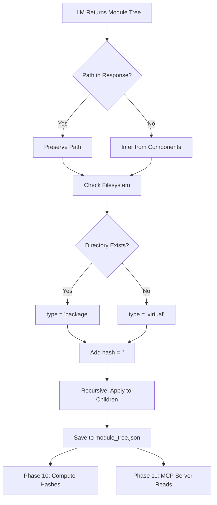

I have created the following plan after thorough exploration and analysis of the codebase. Follow the below plan verbatim. Trust the files and references. Do not re-verify what's written in the plan. Explore only when absolutely necessary. First implement all the proposed file changes and then I'll review all the changes together at the end.

# Implementation Plan: MCP-Vorbereitung Module Tree

## Beobachtungen

Nach Analyse der Codebase:

1. **Aktuelle Struktur**: Der `module_tree` wird in `cluster_modules.py` erstellt und enthält `components` (Liste) und `children` (Dict). Das LLM gibt bereits ein `path`-Feld zurück (siehe `prompt_template.py` Zeilen 140, 148, 179, 188), das aber explizit in Zeile 120 von `cluster_modules.py` gelöscht wird.

2. **Persistierung**: Der `module_tree` wird in `documentation_generator.py` als `module_tree.json` (Zeile 458) und `first_module_tree.json` (Zeile 456) gespeichert und von mehreren Komponenten gelesen (CLI HTML Generator, Web-App Routes, Visualizer).

3. **Fehlende MCP-Metadaten**: Aktuell fehlen die für MCP-Server benötigten Felder `path` (wird gelöscht), `type` (existiert nicht), und `hash` (existiert nicht). Diese sind essentiell für Phase 11 (MCP Server), wo externe Agents die Codebase-Struktur navigieren müssen.

## Ansatz

**Strategie**: Erweitere die `cluster_modules.py` Funktion um MCP-Metadaten-Anreicherung, ohne die bestehende Clustering-Logik zu verändern. Die Metadaten werden nach dem LLM-Parsing hinzugefügt und rekursiv auf alle Module (inkl. Kinder) angewendet.

**Kernänderungen**:
1. **Path-Preservation**: Entferne die `del module_info["path"]` Zeile und füge Fallback-Logik hinzu falls LLM keinen Path zurückgibt
2. **Type-Detection**: Implementiere Filesystem-Check um "package" (existierendes Verzeichnis) vs. "virtual" (logische Gruppierung) zu unterscheiden
3. **Hash-Initialization**: Füge leeres `hash`-Feld hinzu (wird in Phase 10 mit `ModuleHasher` befüllt)
4. **Recursive Enrichment**: Stelle sicher dass alle Nested-Module die gleichen Felder erhalten

**Warum dieser Ansatz**:
- Minimale Änderungen an bestehender Logik (nur Metadaten-Anreicherung)
- Backward-kompatibel: Bestehende Consumers (HTML Generator, Web-App) ignorieren neue Felder
- Vorbereitung für Merkle-Tree in Phase 10: `hash`-Feld bereits vorhanden
- MCP-Server in Phase 11 kann direkt auf `path`/`type` zugreifen

## Implementierungsschritte

### 1. Erweitere `cluster_modules.py` um Metadaten-Anreicherung

**Datei**: `codewiki/src/be/cluster_modules.py`

**Änderungen**:

1. **Importiere `os` und `Path`** (oben in der Datei):
   ```python
   import os
   from pathlib import Path
   ```

2. **Erstelle Helper-Funktion `_enrich_module_metadata()`** (nach `format_potential_core_components`, vor `cluster_modules`):
   ```python
   def _enrich_module_metadata(
       module_info: Dict[str, Any],
       components: Dict[str, Node],
       repo_path: str,
       logger: CodeWikiLogger
   ) -> None:
       """
       Enrich module with MCP-required metadata: path, type, hash.
       
       Args:
           module_info: Module dict to enrich (modified in-place)
           components: All code components for path inference
           repo_path: Repository root path for filesystem checks
           logger: Logger instance
       """
       # 1. Preserve or infer path
       if "path" not in module_info or not module_info["path"]:
           # Fallback: Infer from first component's directory
           module_components = module_info.get("components", [])
           if module_components and module_components[0] in components:
               first_component = components[module_components[0]]
               # Extract directory from relative_path (e.g., "src/be/utils.py" -> "src/be")
               module_info["path"] = str(Path(first_component.relative_path).parent)
           else:
               # No components or invalid: use empty path (virtual module)
               module_info["path"] = ""
               logger.debug(f"Module has no valid path, marking as virtual")
       
       # 2. Determine type: "package" (real directory) or "virtual" (logical grouping)
       # Resolve paths to prevent directory traversal attacks (e.g., "../../etc/passwd")
       if module_info["path"]:
           repo_root = Path(repo_path).resolve()
           full_path = (repo_root / module_info["path"]).resolve()

           # Security check: ensure resolved path is inside repository root
           try:
               full_path.relative_to(repo_root)
               module_info["type"] = "package" if full_path.is_dir() else "virtual"
           except ValueError:
               # Path escapes repo root - treat as virtual and log warning
               logger.warning(
                   f"Module path '{module_info['path']}' resolves outside repository root, "
                   f"marking as virtual"
               )
               module_info["type"] = "virtual"
       else:
           module_info["type"] = "virtual"

       # 3. Initialize hash (empty for now, will be computed in Phase 10)
       module_info["hash"] = ""
   ```

3. **Entferne die `del module_info["path"]` Zeile** (Zeile 120):
   - **Vorher**: `del module_info["path"]`
   - **Nachher**: Zeile komplett löschen

4. **Füge Metadaten-Anreicherung nach LLM-Parsing hinzu** (nach Zeile 122, vor der `for`-Schleife):
   ```python
   # Enrich all modules with MCP metadata
   for module_name, module_info in module_tree.items():
       _enrich_module_metadata(module_info, components, settings.repo_path, logger)
   ```

5. **Füge rekursive Anreicherung für Kinder hinzu** (in der bestehenden `for`-Schleife, nach Zeile 135 `module_info["children"] = {}`):
   ```python
   # Recursively enrich child modules after they're created
   if sub_module_tree is not None:
       for child_name, child_info in sub_module_tree.items():
           _enrich_module_metadata(child_info, components, settings.repo_path, logger)
   ```

6. **Update Funktionssignatur** um `settings` zu akzeptieren (Zeile 45):
   - **Vorher**: `async def cluster_modules(leaf_nodes, components, settings, resilient_client, logger, ...)`
   - **Nachher**: Keine Änderung nötig, `settings` ist bereits vorhanden und enthält `repo_path`

### 2. Validiere Metadaten-Struktur in `documentation_generator.py`

**Datei**: `codewiki/src/be/documentation_generator.py`

**Änderungen**:

1. **Füge Validierungs-Log nach dem Clustering hinzu** (nach Zeile 456, vor `file_manager.save_json`):
   ```python
   # Validate MCP metadata presence
   def _validate_mcp_metadata(tree: Dict[str, Any], path: List[str] = []) -> None:
       for name, info in tree.items():
           current_path = "/".join(path + [name])
           required_fields = ["path", "type", "hash", "components", "children"]
           missing = [f for f in required_fields if f not in info]
           if missing:
               self.logger.warning(f"Module {current_path} missing MCP fields: {missing}")
           if info.get("children"):
               _validate_mcp_metadata(info["children"], path + [name])
   
   _validate_mcp_metadata(module_tree)
   self.logger.debug(f"Module tree validated with MCP metadata (path, type, hash)")
   ```

### 3. Update Prompt Template (Optional - für bessere LLM-Guidance)

**Datei**: `codewiki/src/be/prompt_template.py`

**Änderungen**:

1. **Erweitere `CLUSTER_REPO_PROMPT` und `CLUSTER_MODULE_PROMPT`** um explizite Path-Anweisung (Zeilen 138-156 und 176-195):
   - Füge nach der `"path"` Zeile einen Kommentar hinzu:
   ```python
   "path": <path_to_the_module_1>, # REQUIRED: relative path to module directory or file (e.g., "src/auth" or "utils/helpers.py")
   ```

### 4. Teste die Änderungen

**Testplan**:

1. **Unit-Test für `_enrich_module_metadata()`**:
   - Erstelle Mock-Module mit/ohne `path` vom LLM
   - Verifiziere `type` = "package" für existierende Verzeichnisse
   - Verifiziere `type` = "virtual" für nicht-existierende Pfade
   - Verifiziere `hash` = "" initial

2. **Integration-Test**:
   - Führe `codewiki generate` auf kleinem Repo aus
   - Inspiziere `module_tree.json`:
     ```json
     {
       "auth": {
         "path": "src/auth",
         "type": "package",
         "hash": "",
         "components": ["AuthService", "TokenManager"],
         "children": {}
       },
       "utilities": {
         "path": "",
         "type": "virtual",
         "hash": "",
         "components": ["helper_func", "validator"],
         "children": {}
       }
     }
     ```

3. **Backward-Compatibility-Test**:
   - Verifiziere HTML Generator und Web-App funktionieren weiterhin
   - Neue Felder sollten ignoriert werden

## Visuelle Darstellung



## Metadaten-Felder Übersicht

| Feld | Typ | Quelle | Zweck |
|------|-----|--------|-------|
| `path` | `str` | LLM oder inferiert | Relativer Pfad zum Modul-Ordner/Datei |
| `type` | `"package"` \| `"virtual"` | Filesystem-Check | Unterscheidung reale vs. logische Module |
| `hash` | `str` | Initial `""` | Merkle-Tree Hash (Phase 10), Cache-Invalidierung |
| `components` | `List[str]` | Bestehend | Code-Komponenten im Modul |
| `children` | `Dict` | Bestehend | Nested Sub-Module |

## Guardrails

**Kritische Punkte für sichere Umsetzung**:

1. **Path-Sicherheit**: Verwende `Path().resolve()` um Directory-Traversal zu verhindern (z.B. `../../etc/passwd`)
2. **Fallback-Robustheit**: Wenn LLM keinen Path zurückgibt UND keine Components existieren, setze `path=""` und `type="virtual"`
3. **Rekursive Konsistenz**: Stelle sicher dass ALLE Module (inkl. tief verschachtelte Kinder) die Metadaten erhalten
4. **Logging**: Logge Warnungen für Module ohne validen Path, aber breche nicht ab
5. **Backward-Compatibility**: Alte `module_tree.json` Dateien ohne neue Felder sollten weiterhin funktionieren (nur neue Generierungen haben Metadaten)

## Ausblick

Nach dieser Phase:
- **Phase 10** (Smart Caching): `ModuleHasher` berechnet Hashes basierend auf Code + Child-Hashes, speichert in `hash`-Feld
- **Phase 11** (MCP Server): Liest `module_tree.json`, exponiert `path`/`type` als Resources, ermöglicht Navigation via `list_modules()` Tool