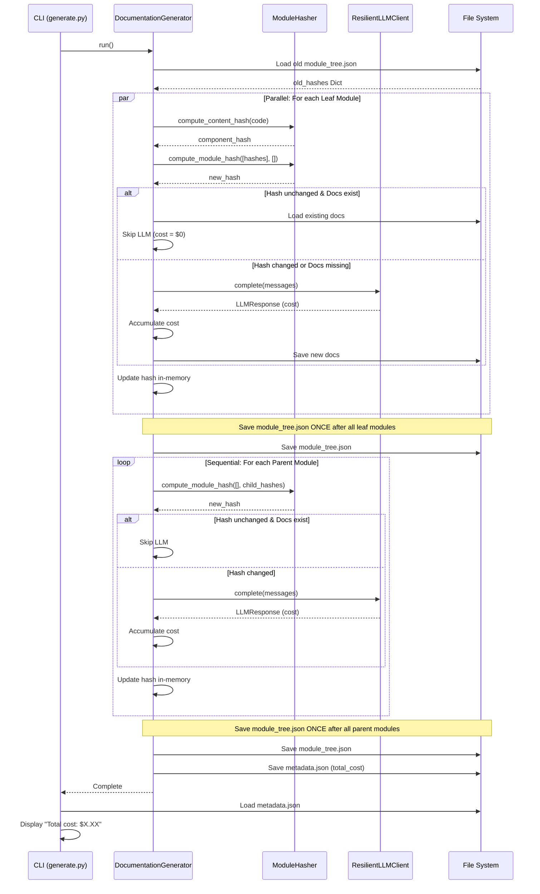

I have created the following plan after thorough exploration and analysis of the codebase. Follow the below plan verbatim. Trust the files and references. Do not re-verify what's written in the plan. Explore only when absolutely necessary. First implement all the proposed file changes and then I'll review all the changes together at the end.

## Beobachtungen

Nach Analyse der Codebase stelle ich fest:

1. **LLM-Kosten werden bereits berechnet**: `LLMResponse` enthält ein `cost`-Feld (via `calculate_cost()` in `core/llm/pricing.py`), aber diese Kosten werden nirgendwo akkumuliert
2. **Keine Hash-basierte Caching-Logik**: Module werden immer neu generiert, auch wenn sich der Code nicht geändert hat
3. **Module-Tree-Struktur ist vorbereitet**: Aus Phase 09 hat jeder Modul-Knoten bereits `path`, `type` und `hash` (initial leer) Felder
4. **Zwei LLM-Call-Pfade existieren**:
   - Leaf-Module: Via `AgentOrchestrator` → `CodeWikiModel` (pydantic_ai) → `ResilientLLMClient`
   - Parent-Module: Direkt via `ResilientLLMClient.complete()` in `generate_parent_module_docs()`
5. **Parallele Verarbeitung funktioniert**: `ParallelModuleProcessor` verarbeitet Leaf-Module bereits parallel, aber ohne Hash-Checks

## Ansatz

**Smart Caching mit Merkle-Tree-Hashing**: Implementiere eine Hashing-Logik, bei der der Hash eines Moduls aus seinem eigenen Code-Content plus den Hashes seiner Kind-Module berechnet wird. Wenn sich ein Kind ändert, propagiert die Änderung nach oben (Parent muss neu generiert werden, da er die Kind-Zusammenfassungen nutzt).

**Cost Tracking über alle LLM-Calls**: Akkumuliere Kosten von allen `LLMResponse`-Objekten (sowohl aus `ResilientLLMClient` als auch aus `CodeWikiModel`/pydantic_ai) in einem zentralen Counter im `DocumentationGenerator`, speichere in `metadata.json` und zeige am Ende im CLI.

**Inkrementelle Updates**: Lade alte `module_tree.json` vor der Verarbeitung, vergleiche Hashes, überspringe LLM-Calls für unveränderte Module (wenn Docs existieren), lade existierende Docs aus Dateien.

## Implementierungsschritte

### 1. Erstelle ModuleHasher Utility

**Datei**: `codewiki/core/utils/hashing.py`

Implementiere `ModuleHasher` Klasse mit:
- `compute_content_hash(content: str) -> str`: SHA256-Hash des Code-Contents (deterministisch, UTF-8 encoded)
- `compute_module_hash(component_hashes: List[str], child_hashes: List[str]) -> str`: Merkle-Tree-Style Hash durch Sortierung und Konkatenation aller Component- und Child-Hashes, dann SHA256

Erstelle `codewiki/core/utils/__init__.py` mit Export von `ModuleHasher`.

Update `codewiki/core/__init__.py`: Füge `ModuleHasher` zu `__all__` hinzu und importiere aus `core.utils`.

**Technische Details**:
- Nutze `hashlib.sha256()` für Hashing
- Sortiere Hashes vor Konkatenation für Determinismus (unabhängig von Reihenfolge)
- Leere Listen ergeben leeren String vor Hashing (für Leaf-Module ohne Children)

---

### 2. Erweitere Pricing-Modul um Logger-Support

**Datei**: `codewiki/core/llm/pricing.py`

Erweitere `calculate_cost()` Funktion:
- Füge optionalen `logger: Optional[CodeWikiLogger] = None` Parameter hinzu
- Wenn Model nicht in `MODEL_PRICING`: Logge Warning mit `logger.warning()` (falls logger vorhanden)
- Fallback auf `DEFAULT_PRICING` bleibt unverändert

**Technische Details**:
- Import `TYPE_CHECKING` und `CodeWikiLogger` für Type Hints
- Warning-Message: `f"Unknown model '{model}' - using default pricing (${DEFAULT_PRICING['input']:.2f}/${DEFAULT_PRICING['output']:.2f} per 1M tokens)"`

---

### 3. Implementiere Hash-Berechnung für Module

**Datei**: `codewiki/src/be/documentation_generator.py`

Füge neue Methode `_calculate_module_hash()` hinzu:
```python
def _calculate_module_hash(
    self,
    module_info: Dict[str, Any],
    components: Dict[str, Node],
) -> str:
    """Calculate Merkle-tree hash for a module.
    
    Hash = SHA256(sorted(component_hashes) + sorted(child_hashes))
    """
```

**Logik**:
1. Sammle Component-Hashes: Für jede Component-ID in `module_info["components"]`, lade `components[id].source_code`, berechne `ModuleHasher.compute_content_hash()`
2. Sammle Child-Hashes: Für jedes Child in `module_info.get("children", {})`, extrahiere `child["hash"]` (rekursiv bereits berechnet)
3. Kombiniere via `ModuleHasher.compute_module_hash(component_hashes, child_hashes)`

**Edge Cases**:
- Fehlende Components: **WICHTIG** - Nicht überspringen (würde false-positive Cache-Hits verursachen). Stattdessen:
  1. Nutze deterministischen Placeholder-Hash: `MISSING:<component_id>` als Hash-Input
  2. Logge auf ERROR-Level: `logger.error(f"Component {id} referenced but not found")`
  3. Setze Flag `module_info["hash_incomplete"] = True`
  4. Cache-Code prüft dieses Flag und ignoriert Caching für incomplete Module
  5. Resultat: Module mit fehlenden Components werden nie gecached, aber Hash ist deterministisch
- Leere Children: Nutze leere Liste für `child_hashes`
- Alternative: Return `"INCOMPLETE"` als Special-Hash der nie matcht (einfacher, aber weniger debuggable)

---

### 4. Lade alte Module-Tree-Hashes vor Verarbeitung

**Datei**: `codewiki/src/be/documentation_generator.py`

Update `generate_module_documentation()` Methode:

**Vor Parallel-Processing**:
1. Lade `old_module_tree` aus `module_tree.json` (falls existiert, sonst `{}`)
2. Erstelle `old_hashes: Dict[str, str]` Mapping von Modul-Pfad (z.B. `"auth/login"`) zu Hash
3. Traversiere `old_module_tree` rekursiv, sammle alle `hash`-Felder mit Pfaden

**Technische Details**:
- Nutze `file_manager.load_json()` mit Try-Except (FileNotFoundError, JSONDecodeError)
- Pfad-Format: `/`-separierte Modul-Namen (z.B. Root-Modul `"auth"`, Child `"auth/login"`)

---

### 5. Integriere Smart Caching in Leaf-Module-Verarbeitung

**Datei**: `codewiki/src/be/documentation_generator.py`

Update `process_leaf_module()` Closure in `generate_module_documentation()`:

**Vor Agent-Call**:
1. Berechne `new_hash` via `_calculate_module_hash(module_info, components)`
2. Hole `old_hash` aus `old_hashes` Dict (Key: Modul-Pfad)
3. Prüfe Docs-Existenz: `docs_path = os.path.join(working_dir, f"{module_name}.md")`
4. **Wenn `new_hash == old_hash AND os.path.exists(docs_path)`**:
   - Logge `logger.info(f"Skipping {module_name} (unchanged, hash: {new_hash[:8]}...)")`
   - Lade existierende Docs: `existing_docs = file_manager.load_text(docs_path)`
   - Update `module_info["hash"] = new_hash` im `module_tree` (in-memory only)
   - Return ohne Agent-Call (spare LLM-Kosten)
5. **Sonst**: Führe Agent-Call aus wie bisher

**Nach Agent-Call**:
- Update `module_info["hash"] = new_hash` im `module_tree` (in-memory only)
- **WICHTIG**: NICHT hier speichern - siehe "Nach Parallel-Processing" unten

**Nach Parallel-Processing (außerhalb der Closure)**:
- Speichere `module_tree` via `file_manager.save_json()` einmalig nach Abschluss aller Leaf-Module
- Dies vermeidet Race Conditions bei parallelen Writes auf die gleiche JSON-Datei

**Technische Details**:
- Hash-Vergleich: String-Equality (SHA256 ist deterministisch)
- Modul-Pfad: Nutze `"/".join(module_path)` für Lookup in `old_hashes`

**Concurrency-Modell & Thread-Safety**:
- Worker-Modell: `asyncio.TaskGroup` mit coroutines im **single-threaded event loop** (keine echten Threads)
- Keine Locks nötig weil:
  1. Jeder Worker modifiziert nur sein eigenes `module_info` Dict (keine shared mutable state)
  2. `old_hashes` Dict wird nur gelesen, nie geschrieben (immutable während Verarbeitung)
  3. `module_tree` wird erst **nach** `await processor.process_modules()` gespeichert (keine concurrent writes)
- **WARNUNG für zukünftige Änderungen**: Falls auf `ThreadPoolExecutor` oder `ProcessPoolExecutor` gewechselt wird:
  1. `module_info` Updates benötigen dann `asyncio.Lock` pro Modul oder atomic operations
  2. Alternativ: Copy-on-write pattern mit finalem merge
  3. Oder: Zentrale Manager-Klasse mit Lock-geschützten Updates

---

### 6. Integriere Smart Caching in Parent-Module-Verarbeitung

**Datei**: `codewiki/src/be/documentation_generator.py`

Update `generate_parent_module_docs()` Methode:

**Vor LLM-Call**:
1. Navigiere zu Modul-Info im `module_tree` via `module_path`
2. Berechne `new_hash` via `_calculate_module_hash(module_info, components)` (Components leer für Parents, nur Child-Hashes zählen)
3. Hole `old_hash` aus `old_hashes` Dict
4. Prüfe Docs-Existenz: `parent_docs_path`
5. **Wenn `new_hash == old_hash AND os.path.exists(parent_docs_path)`**:
   - Logge Skip-Message
   - Update Hash im Tree
   - Return früh
6. **Sonst**: Führe LLM-Call aus

**Nach LLM-Call**:
- Update `module_info["hash"] = new_hash` (in-memory only)

**Nach allen Parent-Modulen (in `generate_module_documentation()`)**:
- Speichere `module_tree` via `file_manager.save_json()` einmalig nach Abschluss aller Parent-Module
- Dies reduziert I/O und ist konsistent mit dem Leaf-Module-Pattern

**Technische Details**:
- Parent-Module haben leere `components`-Liste, Hash basiert nur auf Child-Hashes
- Overview-Docs (Root-Level): Behandle wie Parent-Modul mit leerem `module_path`
- Da Parent-Module sequentiell verarbeitet werden, wäre Speichern nach jedem Modul theoretisch sicher, aber einmaliger Save am Ende ist effizienter und konsistenter

---

### 7. Implementiere Cost Tracking im DocumentationGenerator

**Datei**: `codewiki/src/be/documentation_generator.py`

**In `__init__()`**:
- Initialisiere `self.total_cost: float = 0.0`

**In `process_leaf_module()` Closure**:
- Nach Agent-Call: Extrahiere Cost aus `result.usage.details.get('cost_usd', 0.0)` (pydantic_ai Result)
- Akkumuliere: `self.total_cost += cost`
- Logge: `logger.debug(f"Module {module_name} cost: ${cost:.4f}")`

**In `generate_parent_module_docs()`**:
- Nach `resilient_client.complete()`: Extrahiere `llm_response.cost`
- Akkumuliere: `self.total_cost += llm_response.cost`
- Logge Cost

**In `cluster_modules()` Call** (in `run()` Methode):
- Nach Clustering: Extrahiere Cost aus `llm_response.cost`
- Akkumuliere in `self.total_cost`

**Technische Details**:
- Thread-Safety nicht nötig (async, single-threaded event loop)
- Cost-Precision: 4 Dezimalstellen für Cents-Genauigkeit

---

### 8. Speichere Total Cost in Metadata

**Datei**: `codewiki/src/be/documentation_generator.py`

Update `create_documentation_metadata()` Methode:

Füge neues Feld zu `metadata` Dict hinzu:
```python
"cost_tracking": {
    "total_cost_usd": round(self.total_cost, 4),
    "currency": "USD",
    "pricing_date": "2025-12"
}
```

**Technische Details**:
- Runde auf 4 Dezimalstellen für Konsistenz
- Füge Disclaimer hinzu: Preise können sich ändern

---

### 9. Zeige Total Cost im CLI

**Datei**: `codewiki/cli/commands/generate.py`

**Nach `generator.generate()` Call**:
1. Lade `metadata.json` aus `output_dir`
2. Extrahiere `total_cost = metadata["cost_tracking"]["total_cost_usd"]`
3. Logge via `logger.success(f"Total estimated cost: ${total_cost:.2f}")`

**Fallback**: Wenn `cost_tracking` fehlt (alte Metadata), überspringe Cost-Anzeige.

**Technische Details**:
- Nutze `file_manager.load_json()` oder direktes JSON-Load
- Format: 2 Dezimalstellen für User-Freundlichkeit (z.B. `$0.15`)

---

### 10. Update Exports und Tests

**Dateien**: 
- `codewiki/core/__init__.py`: Füge `ModuleHasher` zu `__all__` hinzu
- `codewiki/core/utils/__init__.py`: Erstelle mit `from .hashing import ModuleHasher; __all__ = ["ModuleHasher"]`

**Manuelle Tests**:
1. **Hash-Determinismus**: Gleicher Code → gleicher Hash (mehrfache Runs)
2. **Merkle-Propagation**: Ändere Child-Code → Parent-Hash ändert sich
3. **Caching**: Zweiter Run ohne Code-Änderung → alle Module geskippt, $0.00 Cost
4. **Cost-Tracking**: Erster Run → Metadata enthält `total_cost_usd > 0`
5. **CLI-Output**: `codewiki generate` zeigt "Total estimated cost: $X.XX" am Ende

---

## Architektur-Diagramm



## Zusammenfassung

| Komponente | Änderungen | LOC |
|------------|-----------|-----|
| `core/utils/hashing.py` | Neu: `ModuleHasher` Klasse | ~40 |
| `core/llm/pricing.py` | Logger-Parameter in `calculate_cost()` | ~5 |
| `documentation_generator.py` | Hash-Berechnung, Caching-Logik, Cost-Tracking | ~120 |
| `generate.py` | Cost-Anzeige aus Metadata | ~10 |
| `core/__init__.py` | Export `ModuleHasher` | ~2 |
| **Total** | | **~177 LOC** |

**Erwartete Performance-Verbesserung**: Bei kleinen Änderungen (z.B. 1 Datei in 50-Modul-Projekt) werden ~98% der Module geskippt, Laufzeit sinkt von ~5 Minuten auf ~10 Sekunden, Kosten von ~$2.00 auf ~$0.04.