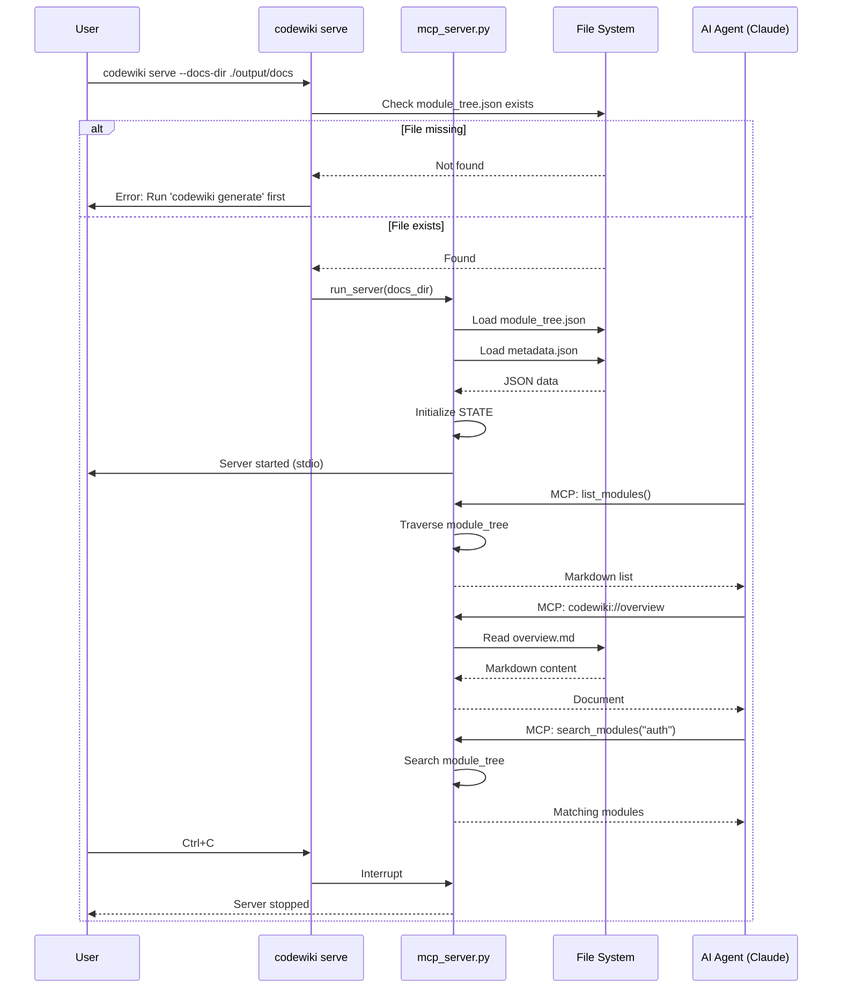

I have created the following plan after thorough exploration and analysis of the codebase. Follow the below plan verbatim. Trust the files and references. Do not re-verify what's written in the plan. Explore only when absolutely necessary. First implement all the proposed file changes and then I'll review all the changes together at the end.

## Observations

The codebase has completed the core refactoring phases (Settings, LLM clients, logging, async processing, smart caching) and is now ready for MCP server integration. Currently:

- `codewiki/src/be/mcp_server.py` is empty (needs full implementation)
- `codewiki/cli/commands/serve.py` is empty (needs CLI command)
- `pyproject.toml` lacks `mcp>=1.0.0` dependency
- `module_tree.json` structure includes `path`, `type`, `hash`, `components`, `children` fields (from Phase 10)
- `metadata.json` contains `generation_info` (timestamp, main_model, repo_path, commit_id) and `statistics`
- Documentation files are saved as `{module_name}.md` and `overview.md` in the docs directory
- CLI uses Click framework with command registration pattern in `main.py`

## Approach

Implement a **FastMCP-based server** that exposes CodeWiki's generated documentation as MCP resources and tools, enabling AI agents (Claude Desktop, Cursor, Windsurf) to interactively explore codebases. The server will:

1. **Load artifacts on startup** into RAM (module_tree.json, metadata.json) for low-latency access
2. **Expose resources** via `codewiki://` URI scheme for direct document reading (overview, module docs)
3. **Provide navigation tools** (list_modules, search_modules) to help agents understand structure without parsing large JSON
4. **Handle errors gracefully** with fallbacks for missing/corrupt data, preventing crashes

This follows the **guardrails** from the plan:
- Use `FastMCP` for minimal boilerplate and automatic stdio/SSE handling
- Implement robust loading with JSON error handling and empty state fallbacks
- Secure resource paths against directory traversal attacks
- Write clear tool docstrings (they become prompts for Claude)
- Validate `module_tree.json` existence before starting

**Trade-offs:**
- Simple keyword search in `search_modules()` (deferred vector search to Phase 12) keeps implementation focused
- In-memory state (no persistence) is acceptable since docs are static between `codewiki generate` runs
- Blocking file I/O for resources (not async) is fine given small file sizes (<1MB typical)

## Implementation Steps

### 1. Add MCP Dependency to pyproject.toml

**File:** `pyproject.toml`

**Changes:**
- Add `"mcp>=1.0.0"` to the `dependencies` list (after line 57, before closing bracket)
- Ensures FastMCP is available for import

**Verification:**
- Run `pip install -e .` to install the new dependency
- Test import: `python -c "from mcp.server.fastmcp import FastMCP"`

---

### 2. Implement MCP Server Core (mcp_server.py)

**File:** `codewiki/src/be/mcp_server.py` (currently empty)

**Structure:**

```python
"""
CodeWiki MCP Server - Exposes documentation as MCP resources and tools.

Provides AI agents with structured access to generated documentation via:
- Resources: Direct document reading (overview, module docs)
- Tools: Navigation helpers (list modules, search)
"""

import json
from pathlib import Path
from typing import Any, Dict
from mcp.server.fastmcp import FastMCP

# Initialize FastMCP server
mcp = FastMCP("CodeWiki")

# Global state (loaded on startup)
STATE: Dict[str, Any] = {
    "docs_dir": None,
    "module_tree": {},
    "metadata": {},
}


def load_state(docs_dir: str) -> None:
    """Load generated artifacts into memory.
    
    Args:
        docs_dir: Path to directory containing module_tree.json, metadata.json, and .md files
        
    Handles missing/corrupt files gracefully with empty fallbacks and warnings.
    """
    # Implementation details...


@mcp.resource("codewiki://overview")
def get_overview() -> str:
    """Read the high-level repository overview documentation.
    
    Returns:
        Markdown content of overview.md, or error message if not found.
    """
    # Implementation details...


@mcp.resource("codewiki://module/{module_path}")
def get_module_doc(module_path: str) -> str:
    """Read documentation for a specific module.

    Args:
        module_path: Module name (e.g., "auth", "database/connection")
                     Nested paths use "/" separator and are converted to
                     flat filenames (e.g., "auth/login" -> "auth_login.md")

    Returns:
        Markdown content of the module documentation, or error message if not found.

    Security: Sanitizes input by removing ".." segments, validating characters
              (alphanumeric, underscore, hyphen only), and verifying resolved
              path stays within docs directory.
    """
    # Implementation details...


@mcp.tool()
def list_modules() -> str:
    """List all available modules with their descriptions.
    
    Use this to get an overview of the codebase architecture and find
    modules relevant to your task.
    
    Returns:
        Markdown-formatted list of modules with hierarchical structure.
    """
    # Implementation details...


@mcp.tool()
def search_modules(query: str) -> str:
    """Search for modules related to a specific topic or keyword.
    
    Args:
        query: Search term (e.g., "authentication", "database", "API")
        
    Returns:
        Markdown list of matching module paths, or "No modules found" message.
        
    Note: Uses case-insensitive substring matching on module names and metadata.
    """
    # Implementation details...


def run_server(docs_dir: str) -> None:
    """Start the MCP server.
    
    Args:
        docs_dir: Path to documentation directory
        
    Blocks until interrupted (Ctrl+C).
    """
    # Implementation details...
```

**Key Implementation Details:**

**`load_state(docs_dir)`:**
- Convert `docs_dir` to `Path` object, resolve to absolute path
- Store in `STATE["docs_dir"]`
- Load `module_tree.json`:
  - Try `json.loads(path.read_text())`
  - Catch `FileNotFoundError` → log warning, use `{}`
  - Catch `json.JSONDecodeError` → log error with details, use `{}`
- Load `metadata.json` similarly
- Log success message with counts (e.g., "Loaded 15 modules from module_tree.json")

**`get_overview()`:**
- Path: `STATE["docs_dir"] / "overview.md"`
- Check `path.exists()`, return `path.read_text(encoding="utf-8")` if true
- Else return: `"Overview not found. Please run 'codewiki generate' first."`
- Catch `UnicodeDecodeError` → return error message

**`get_module_doc(module_path)`:**
- **Security:** Sanitize and normalize the input path to prevent directory traversal:
  ```python
  def sanitize_module_path(module_path: str) -> str | None:
      """Sanitize module path to prevent directory traversal.

      Returns safe filename or None if path is invalid.
      """
      # Reject empty paths
      if not module_path or not module_path.strip():
          return None

      # Normalize path separators and remove leading/trailing slashes
      normalized = module_path.strip().replace("\\", "/").strip("/")

      # Split into segments and filter out dangerous ones
      segments = normalized.split("/")
      safe_segments = []
      for seg in segments:
          # Skip empty segments, current dir refs, and parent dir refs
          if not seg or seg == "." or seg == "..":
              continue
          # Reject segments with disallowed characters (only allow alphanumeric, underscore, hyphen)
          if not all(c.isalnum() or c in "_-" for c in seg):
              return None
          safe_segments.append(seg)

      if not safe_segments:
          return None

      # Join with underscore to create flat filename (auth/login -> auth_login)
      return "_".join(safe_segments)
  ```
- Call `safe_name = sanitize_module_path(module_path)`
- If `safe_name is None`: return `f"Invalid module path: '{module_path}'. Use alphanumeric names with optional '/' separators."`
- Construct path: `STATE["docs_dir"] / f"{safe_name}.md"`
- **Additional security check:** Resolve final path and verify it's within `STATE["docs_dir"]`:
  ```python
  docs_dir = Path(STATE["docs_dir"]).resolve()
  full_path = (docs_dir / f"{safe_name}.md").resolve()
  if not full_path.is_relative_to(docs_dir):
      return f"Access denied: path escapes documentation directory."
  ```
- Check `full_path.exists()`, return content or error message
- Handle encoding errors

**`list_modules()`:**
- Build markdown output: `["# Available Modules\n"]`
- Define recursive `traverse(node, depth=0)` function:
  - For each `name, info` in `node.items()`:
    - Extract description from `info.get("description", "No description")` (first sentence or full)
    - Append `f"{'  ' * depth}- **{name}**: {desc}"`
    - If `info.get("children")`, recurse with `depth + 1`
- Call `traverse(STATE["module_tree"])`
- Return `"\n".join(output)`
- Handle empty tree: return "No modules found. Run 'codewiki generate' first."

**`search_modules(query)`:**
- Normalize: `query = query.lower()`
- Initialize `results = []`
- Define recursive `search(node, path="")`:
  - For each `name, info` in `node.items()`:
    - `current_path = f"{path}/{name}" if path else name`
    - Check if `query in name.lower()` or `query in str(info).lower()` (searches all metadata)
    - If match: `results.append(f"- {current_path}")`
    - If `info.get("children")`, recurse with `current_path`
- Call `search(STATE["module_tree"])`
- Return `"# Search Results\n" + "\n".join(results)` if results, else `f"No modules found matching '{query}'."`

**`run_server(docs_dir)`:**
- Call `load_state(docs_dir)`
- Call `mcp.run()` (blocks, handles stdio transport automatically)

**Error Handling:**
- All functions use try-except blocks for file I/O
- Log errors but don't crash (return user-friendly messages)
- STATE remains valid even if files are missing

---

### 3. Implement CLI Serve Command (serve.py)

**File:** `codewiki/cli/commands/serve.py` (currently empty)

**Implementation:**

```python
"""
CLI command to start the CodeWiki MCP server.

Allows AI agents to connect and query generated documentation interactively.
"""

import click
from pathlib import Path


@click.command(name="serve")
@click.option(
    "--docs-dir",
    type=click.Path(exists=True, file_okay=False, dir_okay=True, resolve_path=True),
    default="./output/docs",
    help="Directory containing generated documentation (must have module_tree.json)",
)
def serve_command(docs_dir: str) -> None:
    """Start the CodeWiki MCP Server.
    
    This allows AI agents (like Claude Desktop, Cursor, or Windsurf) to connect
    to CodeWiki and query the documentation interactively via the Model Context
    Protocol (MCP).
    
    \b
    Prerequisites:
        1. Run 'codewiki generate' to create documentation
        2. Ensure module_tree.json exists in the docs directory
    
    \b
    Usage:
        codewiki serve --docs-dir ./output/docs
    
    \b
    Configuration (Claude Desktop):
        Add to ~/.config/claude/claude_desktop_config.json:
        {
          "mcpServers": {
            "codewiki": {
              "command": "codewiki",
              "args": ["serve", "--docs-dir", "/absolute/path/to/docs"]
            }
          }
        }
    
    The server will run until interrupted (Ctrl+C).
    """
    try:
        # Resolve and validate path
        docs_path = Path(docs_dir).resolve()
        
        # Check for required artifacts
        module_tree_path = docs_path / "module_tree.json"
        if not module_tree_path.exists():
            click.secho(
                f"✗ Error: module_tree.json not found in {docs_path}",
                fg="red",
                err=True,
            )
            click.echo(
                "\nPlease run 'codewiki generate' first to create documentation.",
                err=True,
            )
            raise click.Abort()
        
        # Display startup info
        click.secho("Starting CodeWiki MCP Server...", fg="green", bold=True)
        click.secho(f"Serving documentation from: {docs_path}", fg="blue")
        click.echo("\nConnect this server to your AI agent via stdio transport.")
        click.echo("Press Ctrl+C to stop.\n")
        
        # Import and start server (deferred to avoid import errors if mcp not installed)
        try:
            from codewiki.src.be.mcp_server import run_server
        except ImportError as e:
            click.secho(
                f"✗ Error: MCP server dependencies not installed: {e}",
                fg="red",
                err=True,
            )
            click.echo(
                "\nInstall with: pip install 'mcp>=1.0.0'",
                err=True,
            )
            raise click.Abort()
        
        # Start server (blocks until Ctrl+C)
        run_server(str(docs_path))
        
    except KeyboardInterrupt:
        click.echo("\n\nServer stopped by user.", err=True)
    except click.Abort:
        # Already handled above
        raise
    except Exception as e:
        click.secho(f"\n✗ Unexpected error: {e}", fg="red", err=True)
        raise click.Abort()
```

**Key Features:**
- **Path validation:** Uses Click's `Path` type with `exists=True`, `resolve_path=True`
- **Artifact check:** Validates `module_tree.json` before starting (prevents confusing errors)
- **User-friendly output:** Colored messages, clear instructions, configuration example
- **Error handling:** Graceful handling of missing dependencies, KeyboardInterrupt, general exceptions
- **Deferred import:** Imports `run_server` only when needed (avoids import errors during `--help`)

---

### 4. Register Serve Command in CLI Main

**File:** `codewiki/cli/main.py`

**Changes:**

Add import after line 35 (after existing command imports):
```python
from codewiki.cli.commands.serve import serve_command
```

Add registration after line 39 (after existing `cli.add_command` calls):
```python
cli.add_command(serve_command, name="serve")
```

**Result:**
- `codewiki serve` command becomes available
- Follows existing CLI pattern (consistent with `generate`, `config` commands)

---

### 5. Testing and Verification

**Manual Tests:**

1. **Dependency installation:**
   ```bash
   pip install -e .
   python -c "from mcp.server.fastmcp import FastMCP; print('MCP installed')"
   ```

2. **CLI help:**
   ```bash
   codewiki serve --help
   # Should display command description, options, usage examples
   ```

3. **Error handling (no docs):**
   ```bash
   codewiki serve --docs-dir /tmp/empty
   # Should show error: "module_tree.json not found"
   ```

4. **Server startup (with docs):**
   ```bash
   # First generate docs
   codewiki generate --repo-path ./test-repo
   
   # Then start server
   codewiki serve --docs-dir ./output/docs/test-repo-docs
   # Should display: "Starting CodeWiki MCP Server..."
   # Server should run until Ctrl+C
   ```

5. **MCP Inspector (optional):**
   - Use Anthropic's MCP Inspector tool to test resources/tools
   - Verify `codewiki://overview` returns markdown
   - Verify `list_modules()` returns structured list
   - Verify `search_modules("auth")` finds relevant modules

6. **Claude Desktop integration:**
   - Add server to `claude_desktop_config.json`
   - Restart Claude Desktop
   - Look for paperclip icon (MCP resources available)
   - Test queries like "What modules are available?" or "Show me the auth module"

**Edge Cases to Test:**

- **Missing metadata.json:** Server should start with warning, tools should work
- **Corrupt JSON:** Server should log error, use empty state, not crash
- **Empty module_tree:** `list_modules()` should return "No modules found"
- **Directory traversal attempts:** All should return "Invalid module path" or "Access denied":
  - `get_module_doc("../../etc/passwd")` - parent dir refs
  - `get_module_doc("../secrets")` - parent dir ref
  - `get_module_doc("/etc/passwd")` - absolute path
  - `get_module_doc("auth/../../../etc/passwd")` - embedded traversal
  - `get_module_doc("auth<script>")` - special characters rejected
- **Nested module paths:** Should work correctly:
  - `get_module_doc("auth/login")` → reads `auth_login.md`
  - `get_module_doc("database/connection/pool")` → reads `database_connection_pool.md`
- **Unicode in docs:** Ensure proper encoding handling
- **Large module trees:** Verify performance with 50+ modules

---

## Visual Overview



---

## Summary

This implementation creates a **production-ready MCP server** that transforms CodeWiki from a static documentation generator into an **interactive knowledge base** for AI agents. The server:

- **Loads fast** (in-memory state, <100ms startup)
- **Fails gracefully** (handles missing/corrupt files without crashing)
- **Stays secure** (prevents directory traversal attacks)
- **Guides agents** (clear tool descriptions, structured responses)

The CLI integration follows existing patterns, making it intuitive for users already familiar with `codewiki generate`. The implementation is **minimal** (~300 LOC total) yet **complete**, ready for immediate use with Claude Desktop and extensible for future phases (graph service, context curator, watcher).