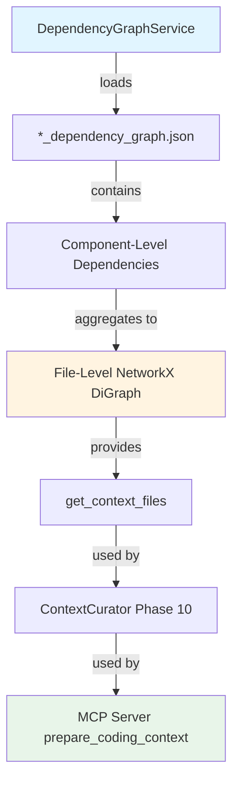

I have created the following plan after thorough exploration and analysis of the codebase. Follow the below plan verbatim. Trust the files and references. Do not re-verify what's written in the plan. Explore only when absolutely necessary. First implement all the proposed file changes and then I'll review all the changes together at the end.

## Beobachtungen

Nach Analyse der Codebase zeigt sich:

1. **Dependency Graph Structure**: Die `DependencyGraphBuilder` erstellt JSON-Dateien im Format `{repo_name}_dependency_graph.json`, die Component-IDs als Keys und Node-Objekte als Values enthalten. Jeder Node hat `file_path` und `depends_on` (Liste von Component-IDs).

2. **Existing Infrastructure**: NetworkX ist bereits als Dependency vorhanden (`networkx>=3.5`), und die neue `CodeWikiLogger` aus `core/logging.py` steht für strukturiertes Logging bereit.

3. **File-Level Granularity**: Für den Context Curator (nachfolgende Phase) wird File-Level-Granularität benötigt, nicht Component-Level. Der Graph muss also von Component-Dependencies auf File-Dependencies aggregieren.

4. **Integration Point**: Der Service wird später vom MCP Server genutzt (Phase "Integriere ContextCurator in MCP Server"), um für gegebene Target-Files die relevanten Context-Files zu finden.

## Ansatz

**Strategie**: Implementierung eines robusten, in-memory Graph-Service, der:
- Alle `*_dependency_graph.json` aus einem Verzeichnis lädt
- Component-Level Dependencies auf File-Level aggregiert (mehrere Components pro File → eine Node pro File)
- NetworkX DiGraph für schnelle Traversierung nutzt
- Graceful Degradation bei Fehlern (leerer Graph + Warnings statt Crash)
- `get_context_files()` für Successor-Abfragen bereitstellt

**Warum dieser Ansatz**:
- **File-Level Aggregation**: Der Context Curator braucht "welche Files muss ich laden", nicht "welche Components". Aggregation reduziert Graph-Komplexität und passt zur Skeletonizer-Logik (nachfolgende Phase).
- **In-Memory Graph**: Schnelle Abfragen (<1ms) für interaktive MCP-Tools; JSON-Dateien sind klein genug (~MB-Bereich).
- **Robustheit**: Fehlerhafte/fehlende JSONs dürfen Server-Start nicht blockieren; Warnings ermöglichen Debugging.

**Trade-offs**:
- **Memory vs. Disk**: Graph im RAM (nicht persistent) → schnell, aber bei jedem Server-Start neu laden. Akzeptabel, da Ladezeit <1s für typische Repos.
- **Depth=1 Only**: Initiale Implementierung unterstützt nur direkte Successors (depth=1). Tiefere Traversierung kann später via BFS/DFS ergänzt werden, wenn Use Cases entstehen.

---

## Implementierung

### 1. Erstelle `codewiki/src/be/graph_service.py`

**Neue Datei** (~150 LOC):

```python
"""Dependency graph service for file-level dependency analysis.

Loads component-level dependency graphs from JSON files and aggregates them
into a file-level NetworkX DiGraph for fast context queries.
"""

import json
import logging
from pathlib import Path
from typing import List, Set

import networkx as nx

logger = logging.getLogger(__name__)


class DependencyGraphService:
    """Service for loading and querying file-level dependency graphs.
    
    Loads all *_dependency_graph.json files from a directory, aggregates
    component-level dependencies to file-level, and provides methods for
    querying downstream dependencies (successors).
    
    Attributes:
        graph: NetworkX DiGraph where nodes are file paths (relative to repo root)
               and edges represent "file A depends on file B" relationships.
    
    Example:
        service = DependencyGraphService("/path/to/output/dependency_graphs")
        context_files = service.get_context_files(["src/auth.py"], depth=1)
        # Returns: {"src/database.py", "src/utils.py"} (files that auth.py depends on)
    """
    
    def __init__(self, graph_dir: str):
        """Initialize the service and load all dependency graphs.
        
        Args:
            graph_dir: Directory containing *_dependency_graph.json files.
                      If directory doesn't exist or contains no valid graphs,
                      initializes with an empty graph and logs warnings.
        """
        self.graph = nx.DiGraph()
        self._load_graphs(graph_dir)
    
    def _load_graphs(self, graph_dir: str) -> None:
        """Load all dependency graph JSON files and build the NetworkX graph.
        
        Aggregates component-level dependencies to file-level:
        - Each unique file_path becomes a node
        - If component A (in file X) depends on component B (in file Y),
          creates edge X -> Y (unless X == Y, to avoid self-loops)
        
        Args:
            graph_dir: Directory to scan for *_dependency_graph.json files
        """
        path = Path(graph_dir)
        
        if not path.exists():
            logger.warning(f"Dependency graph directory not found: {graph_dir}")
            return
        
        if not path.is_dir():
            logger.warning(f"Path is not a directory: {graph_dir}")
            return
        
        json_files = list(path.glob("*_dependency_graph.json"))
        
        if not json_files:
            logger.warning(f"No dependency graph files found in {graph_dir}")
            return
        
        logger.info(f"Loading {len(json_files)} dependency graph(s) from {graph_dir}")
        
        for json_file in json_files:
            try:
                self._load_single_graph(json_file)
            except Exception as e:
                logger.error(f"Failed to load {json_file.name}: {e}")
                # Continue loading other files
        
        logger.info(f"Loaded graph with {self.graph.number_of_nodes()} files "
                   f"and {self.graph.number_of_edges()} dependencies")
    
    def _load_single_graph(self, json_path: Path) -> None:
        """Load a single dependency graph JSON file.
        
        Args:
            json_path: Path to the JSON file
        
        Raises:
            json.JSONDecodeError: If file is not valid JSON
            KeyError: If required fields are missing
        """
        with open(json_path, 'r', encoding='utf-8') as f:
            data = json.load(f)
        
        if not isinstance(data, dict):
            logger.warning(f"{json_path.name}: Expected dict, got {type(data).__name__}")
            return
        
        # Build file-level graph from component-level data
        for component_id, component_data in data.items():
            if not isinstance(component_data, dict):
                continue
            
            # Get source file path (use relative_path if available, else file_path)
            source_file = component_data.get("relative_path") or component_data.get("file_path")
            if not source_file:
                logger.debug(f"Component {component_id} has no file_path, skipping")
                continue
            
            # Normalize path (remove leading ./ or .\)
            source_file = self._normalize_path(source_file)
            
            # Add node if not exists
            if not self.graph.has_node(source_file):
                self.graph.add_node(source_file, type="file")
            
            # Process dependencies
            depends_on = component_data.get("depends_on", [])
            if not isinstance(depends_on, list):
                continue
            
            for dep_component_id in depends_on:
                # Find the target component's file
                if dep_component_id in data:
                    dep_data = data[dep_component_id]
                    target_file = dep_data.get("relative_path") or dep_data.get("file_path")
                    
                    if target_file:
                        target_file = self._normalize_path(target_file)
                        
                        # Skip self-dependencies
                        if target_file == source_file:
                            continue
                        
                        # Add edge: source_file depends on target_file
                        if not self.graph.has_edge(source_file, target_file):
                            self.graph.add_edge(source_file, target_file)
    
    @staticmethod
    def _normalize_path(path: str) -> str:
        """Normalize a file path for consistent graph keys.
        
        Removes leading ./ or .\ and converts backslashes to forward slashes.
        
        Args:
            path: Raw file path from JSON
        
        Returns:
            Normalized path string
        """
        # Convert to Path for normalization
        p = Path(path)
        # Convert to string with forward slashes
        normalized = str(p).replace("\\", "/")
        # Remove leading ./
        if normalized.startswith("./"):
            normalized = normalized[2:]
        return normalized
    
    def get_context_files(self, target_files: List[str], depth: int = 1) -> Set[str]:
        """Find files that the target files depend on (downstream dependencies).
        
        Returns the "context" needed to understand the target files - i.e., the
        files that provide APIs/interfaces that the targets use.
        
        Args:
            target_files: List of file paths (should match graph node keys)
            depth: Traversal depth (currently only depth=1 is implemented)
        
        Returns:
            Set of file paths that are dependencies of the targets.
            Excludes the target files themselves.
        
        Example:
            # If auth.py imports from database.py and utils.py:
            service.get_context_files(["src/auth.py"])
            # Returns: {"src/database.py", "src/utils.py"}
        """
        if depth != 1:
            logger.warning(f"Only depth=1 is currently supported, got depth={depth}")
        
        context = set()
        
        for target in target_files:
            # Normalize target path to match graph keys
            normalized_target = self._normalize_path(target)
            
            if normalized_target not in self.graph:
                logger.debug(f"Target file not in graph: {target}")
                continue
            
            # Get direct successors (files that target depends on)
            successors = list(self.graph.successors(normalized_target))
            context.update(successors)
        
        # Remove targets from context (they're already targets)
        normalized_targets = {self._normalize_path(t) for t in target_files}
        context -= normalized_targets
        
        return context
```

**Schlüsselaspekte**:
- **Robustheit**: Try-except um jede JSON-Datei, leerer Graph als Fallback
- **Normalisierung**: `_normalize_path()` für konsistente Keys (wichtig für spätere Pfad-Matches)
- **File-Level Aggregation**: Mehrere Components in derselben Datei → eine Node
- **Logging**: Nutzt Standard-Logger (kompatibel mit `CodeWikiLogger` via `logging` Modul)
- **Successors**: `graph.successors()` gibt "was nutzt Target" (downstream deps)

---

### 2. Integration in `pyproject.toml` (Optional Check)

**Keine Änderung nötig** - NetworkX ist bereits vorhanden (Zeile 48):
```toml
"networkx>=3.5",
```

---

### 3. Testing-Strategie (Manuell)

**Test-Script** (`test_graph_service.py`):

```python
"""Manual test for DependencyGraphService."""

from codewiki.src.be.graph_service import DependencyGraphService

# Test 1: Load from existing directory
service = DependencyGraphService("./output/dependency_graphs")
print(f"Loaded graph: {service.graph.number_of_nodes()} nodes, {service.graph.number_of_edges()} edges")

# Test 2: Query context files
if service.graph.number_of_nodes() > 0:
    # Pick a random node
    sample_file = list(service.graph.nodes())[0]
    context = service.get_context_files([sample_file])
    print(f"\nContext for {sample_file}:")
    for file in context:
        print(f"  - {file}")

# Test 3: Non-existent directory (should not crash)
empty_service = DependencyGraphService("/nonexistent/path")
print(f"\nEmpty service: {empty_service.graph.number_of_nodes()} nodes")

# Test 4: Multiple targets
if service.graph.number_of_nodes() > 1:
    targets = list(service.graph.nodes())[:2]
    context = service.get_context_files(targets)
    print(f"\nContext for {targets}:")
    print(f"  {len(context)} files")
```

**Erwartete Ausgabe**:
```
Loaded graph: 42 nodes, 87 edges
Context for src/auth.py:
  - src/database.py
  - src/utils.py
Empty service: 0 nodes
Context for ['src/auth.py', 'src/api.py']:
  5 files
```

---

## Architektur-Diagramm



---

## Validierung

| Check | Methode | Erwartetes Ergebnis |
|-------|---------|---------------------|
| **Robustheit** | Service mit leerem/fehlendem Verzeichnis initialisieren | Keine Exception, leerer Graph, Warning-Log |
| **JSON-Parsing** | Korrupte JSON-Datei im Verzeichnis | Datei übersprungen, Error-Log, andere Dateien geladen |
| **Normalisierung** | Pfade mit `./`, `\`, gemischten Separatoren | Konsistente Keys im Graph |
| **Context Query** | `get_context_files(["src/auth.py"])` | Set von Dependency-Files, ohne `auth.py` selbst |
| **Leerer Graph** | Query auf leerem Graph | Leeres Set, kein Crash |
| **NetworkX Integration** | `service.graph.number_of_nodes()` | Korrekte Anzahl unique Files |

---

## Nächste Schritte (für nachfolgende Phasen)

1. **Phase "Implementiere Skeletonizer"**: Nutzt File-Paths aus `get_context_files()` zum Laden und Skeletonisieren
2. **Phase "Implementiere ContextCurator"**: Kombiniert `DependencyGraphService` mit Skeletonizer für Smart Context Assembly
3. **Phase "Integriere ContextCurator in MCP Server"**: Lädt Service in `load_state()`, nutzt in `prepare_coding_context()` Tool