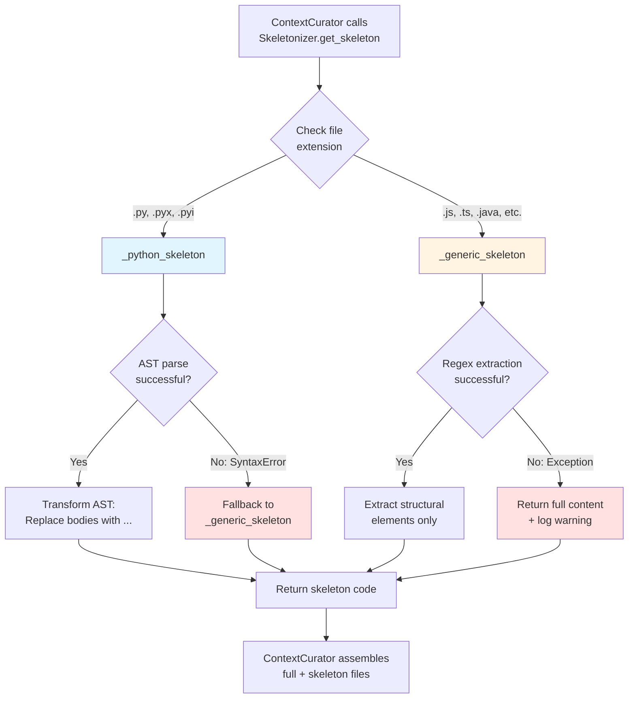

I have created the following plan after thorough exploration and analysis of the codebase. Follow the below plan verbatim. Trust the files and references. Do not re-verify what's written in the plan. Explore only when absolutely necessary. First implement all the proposed file changes and then I'll review all the changes together at the end.

## Observations

The codebase already has robust AST parsing infrastructure for Python (using `ast` module) and other languages (using tree-sitter) in `file:codewiki/src/be/dependency_analyzer/analyzers/`. The Python analyzer (`file:codewiki/src/be/dependency_analyzer/analyzers/python.py`) demonstrates patterns for extracting docstrings, function signatures, and handling syntax errors gracefully. Language detection is consistently done via file extensions across all analyzers. The empty `file:codewiki/src/be/code_utils.py` file awaits implementation, and the subsequent phase (ContextCurator) will consume the Skeletonizer to reduce token usage by showing only interfaces/signatures instead of full implementations.

## Approach

Implement a `Skeletonizer` class with a static `get_skeleton(file_path: str, content: str) -> str` method that dispatches to language-specific handlers based on file extension. For Python files, leverage Python's `ast` module with a custom `NodeTransformer` to replace function/method bodies with `...` while preserving signatures, decorators, and docstrings (similar to stub files). For non-Python files (JS/TS/Java/C#/etc.), use a simplified regex-based approach that extracts structural elements (imports, class/function declarations, type definitions) while omitting implementation blocks. All handlers must gracefully degrade on syntax errors—Python AST failures fall back to generic regex, and regex failures return the full content with a warning log. This ensures the ContextCurator always receives valid (if less optimized) output, preventing MCP server crashes.

## Implementation Steps

### 1. Create Skeletonizer Class Structure

**File:** `file:codewiki/src/be/code_utils.py`

- Import required modules: `ast`, `re`, `logging`, `pathlib.Path`, `typing.Optional`
- Initialize module-level logger: `logger = logging.getLogger(__name__)`
- Define `Skeletonizer` class with static methods only (no instance state needed)
- Add comprehensive module docstring explaining purpose (token reduction for LLM context)

### 2. Implement Main Dispatcher Method

**File:** `file:codewiki/src/be/code_utils.py`

- Create `get_skeleton(file_path: str, content: str) -> str` static method
- Extract file extension using `Path(file_path).suffix.lower()`
- Dispatch logic:
  - If `.py` or `.pyx`: call `_python_skeleton(content)`
  - Else: call `_generic_skeleton(content, file_path)` (pass path for logging context)
- Add type hints and docstring with Args/Returns sections
- Handle empty content edge case (return empty string immediately)

### 3. Implement Python AST-Based Skeletonizer

**File:** `file:codewiki/src/be/code_utils.py`

- Create `_python_skeleton(content: str) -> str` static method
- Wrap entire logic in try-except block catching `SyntaxError` and generic `Exception`
- On exception: log warning with `logger.warning(f"AST parsing failed, falling back to generic: {e}")`, return `_generic_skeleton(content, "python_fallback")`
- Inside try block:
  - Parse content with `ast.parse(content)`
  - Define nested `SkeletonTransformer(ast.NodeTransformer)` class
  - Override `visit_FunctionDef` and `visit_AsyncFunctionDef` methods:
    - Extract docstring using `ast.get_docstring(node)`
    - Create new body list: if docstring exists, add `ast.Expr(value=ast.Constant(value=docstring))`, then add `ast.Expr(value=ast.Constant(value="..."))`
    - Assign `node.body = new_body`
    - Return modified node
  - Apply transformer: `new_tree = SkeletonTransformer().visit(tree)`
  - Fix missing locations: `ast.fix_missing_locations(new_tree)`
  - Return unparsed code: `ast.unparse(new_tree)`
- Preserve all class definitions, imports, global variables, decorators, and type hints (AST transformer only modifies function bodies)

### 4. Implement Generic Regex-Based Skeletonizer

**File:** `file:codewiki/src/be/code_utils.py`

- Create `_generic_skeleton(content: str, file_path: str) -> str` static method
- Add docstring explaining heuristic approach (not language-aware, best-effort)
- Wrap in try-except catching all exceptions, returning full content on failure with error log
- Split content into lines: `lines = content.split('\n')`
- Initialize `skeleton_lines = []` list
- Define structural keywords to preserve (case-insensitive check):
  - Imports: `'import '`, `'from '`, `'require('`, `'#include'`, `'using '`
  - Declarations: `'class '`, `'interface '`, `'struct '`, `'enum '`, `'type '`, `'function '`, `'def '`, `'public '`, `'private '`, `'protected '`, `'abstract '`, `'export '`, `'const '`, `'let '`, `'var '`
- Iterate through lines with index:
  - Strip whitespace: `stripped = line.strip()`
  - If line starts with any keyword (case-insensitive): append to skeleton_lines
  - If line ends with `{` (opening brace): append line + `" /* ... */ }"` (collapse block), skip ahead until matching `}` found (track brace depth)
  - If line contains `=>` (arrow function): append line (keep signature)
- Return `'\n'.join(skeleton_lines)`
- Add comment in code: "Simplified heuristic - may include some implementation details"

### 5. Add Language-Specific Extension Mapping

**File:** `file:codewiki/src/be/code_utils.py`

- Define `PYTHON_EXTENSIONS` constant: `{'.py', '.pyx', '.pyi'}`
- Update dispatcher to use: `if Path(file_path).suffix.lower() in PYTHON_EXTENSIONS`
- Add comment explaining future extensibility (e.g., could add tree-sitter for JS/TS if needed)

### 6. Add Comprehensive Docstrings and Type Hints

**File:** `file:codewiki/src/be/code_utils.py`

- Class docstring: Explain purpose (reduce token usage for LLM context by showing interfaces only), mention use in ContextCurator
- `get_skeleton` docstring: Include example usage, note on fallback behavior
- `_python_skeleton` docstring: Explain AST transformation, what's preserved (signatures, docstrings, decorators, imports, classes)
- `_generic_skeleton` docstring: Explain regex heuristic, limitations (not syntax-aware), supported patterns
- All methods: Add `-> str` return type, parameter types

### 7. Add Unit Test Considerations (Documentation Only)

**File:** `file:codewiki/src/be/code_utils.py`

- Add module-level comment block suggesting test cases:
  - Python: function with docstring, async function, class with methods, nested functions, syntax error handling
  - Generic: JavaScript class, TypeScript interface, Java method, C++ function, malformed code
  - Edge cases: empty file, file with only comments, very large file
- Note: Actual tests deferred to separate test file (not in scope for this phase)

### 8. Integration Verification Points

**File:** `file:codewiki/src/be/code_utils.py`

- Add TODO comment referencing next phase: "Used by ContextCurator in curator.py to generate skeleton views of context files"
- Ensure logger uses same pattern as other backend files (module-level `logging.getLogger(__name__)`)
- Verify no new dependencies needed (all imports are stdlib: `ast`, `re`, `logging`, `pathlib`)

## Visual Architecture

## Key Design Decisions

| Decision | Rationale | Trade-off |
|----------|-----------|-----------|
| Static methods only | No state needed, simpler API | Less extensible if future needs instance config |
| AST for Python, regex for others | Python AST is robust; tree-sitter manipulation complex | Regex less accurate but sufficient for token reduction |
| Fallback chain (AST → regex → full) | Guarantees non-empty output, prevents MCP crashes | May return more tokens than optimal on errors |
| Preserve docstrings in Python | Critical for understanding interfaces | Slightly more tokens, but essential context |
| Collapse braces in generic | Simple heuristic for block detection | May miss nested structures, but good enough |
| No new dependencies | Keeps installation simple | Limits sophistication of generic skeletonizer |

## Files Modified

- **Created:** `file:codewiki/src/be/code_utils.py` (~200 lines)
  - `Skeletonizer` class with 4 static methods
  - Comprehensive error handling and logging
  - Type hints and docstrings throughout

## Testing Strategy

1. **Manual verification** (before next phase):
   - Test Python file with functions, classes, docstrings → verify bodies replaced with `...`
   - Test Python file with syntax error → verify fallback to generic
   - Test JavaScript file → verify imports/classes preserved, bodies collapsed
   - Test empty file → verify returns empty string
   
2. **Integration test** (in next phase):
   - ContextCurator calls `get_skeleton()` on real repo files
   - Verify token count reduction (expect ~70-90% reduction for implementation-heavy files)
   - Verify no crashes on malformed files

3. **Edge cases to validate**:
   - File with only imports (should return as-is)
   - File with no functions (should return structural elements)
   - Very large file (10k+ lines) → verify performance acceptable (<1s)