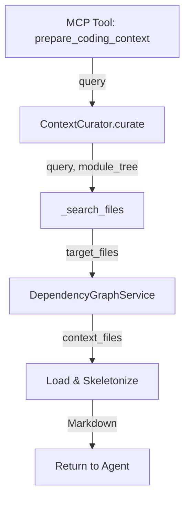

I have created the following plan after thorough exploration and analysis of the codebase. Follow the below plan verbatim. Trust the files and references. Do not re-verify what's written in the plan. Explore only when absolutely necessary. First implement all the proposed file changes and then I'll review all the changes together at the end.

# Implementation Plan: ContextCurator

## Observations

The codebase now has a complete refactored core with async LLM clients, smart caching, and MCP server foundations. The module tree structure is enriched with metadata (`path`, `type`, `hash`) from previous phases. The `DependencyGraphService` and `Skeletonizer` (to be implemented in prior phases) will provide the building blocks for intelligent context assembly. The curator needs to bridge the gap between natural language queries and precise file-level context packages.

**Key structural insights:**
- Module tree is a nested dict: `{module_name: {components: [...], children: {...}, path: str, type: str, hash: str}}`
- Components are `Node` objects with `file_path`, `relative_path`, `source_code`
- Dependency graphs map component IDs to dependencies, aggregated to file-level by `DependencyGraphService`
- Target files need full source; context files need skeletons (interfaces only)

## Approach

Implement `ContextCurator` as a stateful service that orchestrates three operations:

1. **Search**: Recursively traverse the module tree to find modules/components matching a query (case-insensitive substring on module names, component IDs, and file paths)
2. **Graph Expansion**: Use `DependencyGraphService.get_context_files()` to identify downstream dependencies (APIs/interfaces the targets consume)
3. **Assembly**: Load source code for targets (full) and context files (via `Skeletonizer.get_skeleton()`), format as structured Markdown with clear sections

**Design decisions:**
- **File-level granularity**: Aggregate component matches to unique file paths (multiple components in same file → single target)
- **Defensive programming**: Handle missing files, empty results, graph/skeletonizer failures gracefully
- **Path normalization**: All paths relative to `repo_root` for consistency with graph service
- **Markdown structure**: Clear sections (`TARGET FILES`, `CONTEXT FILES`) with language-tagged code blocks for syntax highlighting

**Trade-offs:**
- Simple substring search (MVP) vs. semantic/vector search (deferred to future)
- Depth=1 context (direct dependencies only) vs. configurable depth (simpler, sufficient for most cases)
- In-memory component loading vs. lazy loading (acceptable for typical repo sizes <10k files)

## Implementation Steps

### 1. Create `codewiki/src/be/curator.py` with Core Structure

**File:** `file:codewiki/src/be/curator.py`

Create the `ContextCurator` class with initialization and core dependencies:

```python
from typing import List, Dict, Any, Set
from pathlib import Path
from codewiki.src.be.graph_service import DependencyGraphService
from codewiki.src.be.code_utils import Skeletonizer
from codewiki.core.logging import CodeWikiLogger
```

**Class structure:**
- `__init__(self, repo_root: str, graph_service: DependencyGraphService, logger: CodeWikiLogger = None)`
  - Store `repo_root` as `Path` object
  - Store `graph_service` reference
  - Initialize `logger` (use `get_logger()` if None)
  - Initialize `Skeletonizer` instance

**Attributes:**
- `self.repo_root: Path` - Absolute path to repository root
- `self.graph_service: DependencyGraphService` - For dependency queries
- `self.skeletonizer: Skeletonizer` - For code reduction
- `self.logger: CodeWikiLogger` - For logging

### 2. Implement `_search_files()` - Module Tree Traversal

**Method signature:** `_search_files(self, query: str, module_tree: Dict[str, Any], components: Dict[str, Any]) -> List[str]`

**Logic:**
1. Normalize query to lowercase for case-insensitive matching
2. Initialize `matched_files: Set[str]` to collect unique file paths
3. Define recursive helper `traverse(node: Dict, path: List[str])`:
   - For each `module_name, module_info` in node:
     - Check if query matches module name (substring)
     - Check if query matches module path (if present)
     - For each component ID in `module_info.get("components", [])`:
       - If component exists in `components` dict:
         - Check if query matches component ID or component name
         - If match: add `components[component_id].relative_path` to `matched_files`
     - Recursively traverse `module_info.get("children", {})`
4. Call `traverse(module_tree, [])`
5. Return sorted list of matched file paths

**Edge cases:**
- Empty module_tree → return empty list
- Missing components → log warning, skip
- Query matches module but module has no components → continue to children

### 3. Implement `_load_file_content()` - Safe File Loading

**Method signature:** `_load_file_content(self, relative_path: str) -> str | None`

**Logic:**
1. Construct absolute path: `full_path = self.repo_root / relative_path`
2. **Path-Traversal Security Check** (CRITICAL):
   ```python
   resolved_path = full_path.resolve()
   resolved_root = self.repo_root.resolve()

   # Check resolved path starts with repo_root (blocks ../../../etc/passwd attacks)
   try:
       resolved_path.relative_to(resolved_root)
   except ValueError:
       self.logger.error(
           f"Path traversal attempt blocked: {relative_path!r} "
           f"resolves to {resolved_path} which is outside {resolved_root}"
       )
       return None
   ```
3. Try to read file with UTF-8 encoding
4. On `FileNotFoundError`: log warning, return None
5. On `UnicodeDecodeError`: try with `latin-1` encoding, log warning
6. On other exceptions: log error, return None

**Complete Implementation:**
```python
def _load_file_content(self, relative_path: str) -> str | None:
    """Load file content with path-traversal protection and encoding fallback."""
    full_path = self.repo_root / relative_path

    # Security: Block path traversal attacks
    try:
        resolved_path = full_path.resolve()
        resolved_root = self.repo_root.resolve()
        resolved_path.relative_to(resolved_root)
    except ValueError:
        self.logger.error(
            f"Path traversal attempt blocked: {relative_path!r} "
            f"resolves outside repo root"
        )
        return None

    # Read file with encoding fallback
    try:
        return resolved_path.read_text(encoding="utf-8")
    except FileNotFoundError:
        self.logger.warning(f"File not found: {relative_path}")
        return None
    except UnicodeDecodeError:
        self.logger.warning(f"UTF-8 decode failed for {relative_path}, trying latin-1")
        try:
            return resolved_path.read_text(encoding="latin-1")
        except Exception as e:
            self.logger.error(f"Failed to read {relative_path} with latin-1: {e}")
            return None
    except Exception as e:
        self.logger.error(f"Unexpected error reading {relative_path}: {e}")
        return None
```

**Returns:** File content as string, or None if failed

### 4. Implement `_format_code_block()` - Language Detection

**Method signature:** `_format_code_block(self, file_path: str, content: str) -> str`

**Logic:**
1. Extract file extension from `file_path`
2. Map extension to Markdown language tag:
   - `.py`, `.pyx`, `.pyi` → `python`
   - `.js`, `.jsx` → `javascript`
   - `.ts`, `.tsx` → `typescript`
   - `.java` → `java`
   - `.cpp`, `.cc`, `.cxx`, `.hpp` → `cpp`
   - `.c`, `.h` → `c`
   - `.cs` → `csharp`
   - Default → empty string (no highlighting)
3. Return formatted string: `` ```{language}\n{content}\n``` ``

### 5. Implement `curate()` - Main Orchestration Method

**Method signature:** `curate(self, query: str, module_tree: Dict[str, Any], components: Dict[str, Any]) -> str`

**Logic:**

**Step 1: Search for target files**
```python
target_files = self._search_files(query, module_tree, components)
if not target_files:
    return f"# CONTEXT FOR TASK: {query}\n\nNo relevant files found. Try a different search term."
self.logger.info(f"Found {len(target_files)} target files for query: '{query}'")
```

**Step 2: Get context files from graph**
```python
try:
    context_files = self.graph_service.get_context_files(target_files, depth=1)
    self.logger.info(f"Identified {len(context_files)} context files")
except Exception as e:
    self.logger.warning(f"Graph service failed: {e}, proceeding without context files")
    context_files = set()
```

**Step 3: Assemble Markdown output**
```python
output = [f"# CONTEXT FOR TASK: {query}\n"]

# Section 1: Target Files (Full Code)
output.append("## 1. TARGET FILES (Full Access - Edit These)\n")
output.append("These are the files most relevant to your task. You have full access to their implementation.\n")

for file_path in sorted(target_files):
    content = self._load_file_content(file_path)
    if content:
        output.append(f"\n### `{file_path}`\n")
        output.append(self._format_code_block(file_path, content))
    else:
        self.logger.warning(f"Could not load target file: {file_path}")

# Section 2: Context Files (Skeletons)
if context_files:
    output.append("\n## 2. CONTEXT FILES (Read-Only Interfaces)\n")
    output.append("These files are dependencies of your targets. Only interfaces/signatures are shown to save tokens.\n")
    
    for file_path in sorted(context_files):
        content = self._load_file_content(file_path)
        if content:
            try:
                skeleton = self.skeletonizer.get_skeleton(file_path, content)
                output.append(f"\n### `{file_path}` (Skeleton)\n")
                output.append(self._format_code_block(file_path, skeleton))
            except Exception as e:
                self.logger.warning(f"Skeletonization failed for {file_path}: {e}, using full content")
                output.append(f"\n### `{file_path}` (Full - Skeleton Failed)\n")
                output.append(self._format_code_block(file_path, content))
        else:
            self.logger.warning(f"Could not load context file: {file_path}")

return "\n".join(output)
```

**Error handling:**
- Wrap entire method in try-except to catch unexpected errors
- Return user-friendly error message on catastrophic failure
- Log all errors for debugging

### 6. Add Helper Method `_normalize_path()`

**Method signature:** `_normalize_path(self, path: str) -> str`

**Logic:**
1. Convert to `Path` object
2. Resolve relative to `repo_root` if not absolute
3. Use `Path.relative_to(repo_root)` to get relative path
4. Return as string with forward slashes (cross-platform)

**Purpose:** Ensure all paths are consistently relative to repo_root for graph service compatibility

### 7. Add Docstrings and Type Hints

Add comprehensive docstrings to all methods:
- Class docstring explaining purpose and usage
- Method docstrings with Args, Returns, Raises sections
- Example usage in class docstring

**Example class docstring:**
```python
"""
Intelligent context curator for AI-assisted coding tasks.

The ContextCurator analyzes a natural language query, searches the module tree
for relevant files, expands the context using the dependency graph, and assembles
a token-optimized package with full target code and skeleton dependencies.

Example:
    >>> curator = ContextCurator(
    ...     repo_root="/path/to/repo",
    ...     graph_service=graph_service,
    ...     logger=logger
    ... )
    >>> context = curator.curate(
    ...     query="authentication login",
    ...     module_tree=module_tree,
    ...     components=components
    ... )
    >>> print(context)  # Markdown with targets + skeletons
"""
```

### 8. Add Validation and Edge Case Handling

**Enhancements:**
- Validate `module_tree` is dict (not None/empty)
- Validate `components` is dict
- Handle circular dependencies gracefully (graph service should prevent, but log if detected)
- Limit output size (e.g., max 50 files total) to prevent token explosion
- Add `max_targets` and `max_context` parameters to `curate()` for configurability

**Validation in `curate()`:**
```python
if not isinstance(module_tree, dict) or not module_tree:
    self.logger.error("Invalid or empty module_tree")
    return "# ERROR\n\nModule tree is not available. Run 'codewiki generate' first."

if not isinstance(components, dict) or not components:
    self.logger.error("Invalid or empty components")
    return "# ERROR\n\nComponent data is not available."
```

### 9. Testing Considerations

**Manual testing approach:**
1. Create test module_tree with known structure
2. Create mock components dict with file paths
3. Test search with various queries:
   - Exact module name match
   - Partial substring match
   - Component ID match
   - No matches
4. Test with mock graph_service returning known dependencies
5. Test with mock skeletonizer
6. Verify Markdown output format

**Edge cases to test:**
- Empty query
- Query with special characters
- Very long query
- Module tree with deep nesting (>10 levels)
- Files that don't exist on disk
- Binary files (should fail gracefully)
- Very large files (>1MB)

### 10. Integration Points

**Dependencies (to be implemented in prior phases):**
- `file:codewiki/src/be/graph_service.py` - Must implement `get_context_files(targets: List[str], depth: int) -> Set[str]`
- `file:codewiki/src/be/code_utils.py` - Must implement `Skeletonizer.get_skeleton(file_path: str, content: str) -> str`

**Consumers (to be implemented in next phase):**
- `file:codewiki/src/be/mcp_server.py` - Will call `curator.curate()` in `prepare_coding_context()` tool

**Data flow:**


## Summary

This implementation creates a robust, defensive `ContextCurator` that:
- ✅ Searches module tree recursively with case-insensitive substring matching
- ✅ Aggregates component matches to unique file paths
- ✅ Expands context via dependency graph (depth=1)
- ✅ Loads full source for targets, skeletons for context
- ✅ Formats as structured Markdown with language-tagged code blocks
- ✅ Handles all edge cases gracefully (missing files, graph failures, etc.)
- ✅ Logs all operations for debugging
- ✅ Integrates cleanly with existing core infrastructure

**Total estimated LOC:** ~250-300 lines including docstrings and error handling

**Key files created:**
- `file:codewiki/src/be/curator.py` (new, ~280 LOC)

**Dependencies:**
- `file:codewiki/src/be/graph_service.py` (to be implemented)
- `file:codewiki/src/be/code_utils.py` (to be implemented)
- `file:codewiki/core/logging.py` (existing)