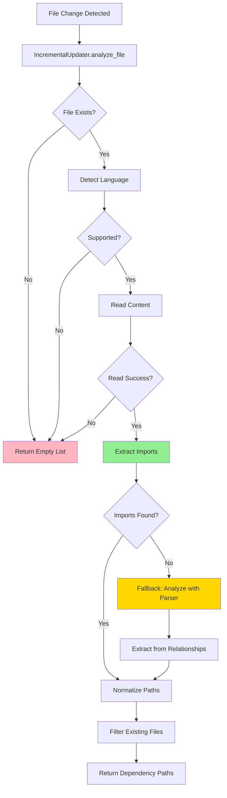

I have created the following plan after thorough exploration and analysis of the codebase. Follow the below plan verbatim. Trust the files and references. Do not re-verify what's written in the plan. Explore only when absolutely necessary. First implement all the proposed file changes and then I'll review all the changes together at the end.

# Implementation Plan: IncrementalUpdater for Real-Time Dependency Analysis

## Observations

The existing dependency analysis infrastructure (`DependencyParser`, `CallGraphAnalyzer`) is designed for full repository scans, processing all files at once and building a complete component graph. For the upcoming **Watcher Service** (Plan 11), we need **single-file incremental analysis** that can:

1. Analyze one changed file in isolation (<50ms target)
2. Extract its file-level dependencies (which files it imports/calls)
3. Return results suitable for hot-swapping graph edges in RAM
4. Handle syntax errors gracefully (files mid-edit)

Current analyzers already support single-file parsing (e.g., `analyze_python_file(file_path, content, repo_path)` returns `(List[Node], List[CallRelationship])`), but they:
- Return component-level data (function/class IDs like `src.auth.User.login`)
- Don't explicitly extract import statements
- Require post-processing to derive file-level dependencies

The `CallGraphAnalyzer` routes to language-specific analyzers based on file extension (via `CODE_EXTENSIONS` dict in `utils/patterns.py`), which we can reuse. However, relationships from single-file analysis often have **unresolved callees** (external functions not defined in the analyzed file), making direct file-path extraction challenging.

## Approach

**Create `codewiki/src/be/incremental.py`** with an `IncrementalUpdater` class that:

1. **Wraps existing analyzers** for single-file use (no repo-wide scan)
2. **Extracts file-level dependencies** via two strategies:
   - **Primary**: Parse import/include statements (language-specific, not currently extracted by analyzers)
   - **Fallback**: Infer file paths from resolved `CallRelationship` targets (component IDs → file paths)
3. **Normalizes paths** relative to `repo_root` for graph consistency
4. **Handles errors robustly** (syntax errors, missing files, unsupported languages) with logging but no crashes

**Why this approach**:
- **Reuses proven parsers**: Leverages existing tree-sitter/AST infrastructure instead of reimplementing
- **Pragmatic scope**: Focuses on imports (direct file deps) rather than deep call-graph traversal (which requires full repo context)
- **Fail-safe**: Returns empty list on errors, ensuring watcher doesn't crash on malformed code
- **Extensible**: Easy to add import extraction for new languages

**Trade-offs**:
- **Import-focused**: May miss dynamic dependencies (e.g., `importlib.import_module(var)` in Python), but these are rare and acceptable for incremental updates
- **Heuristic fallback**: Component ID → file path conversion uses naming conventions (e.g., `src.auth.User` → `src/auth.py`), which may fail for non-standard structures
- **No deep resolution**: Doesn't resolve transitive deps (A imports B, B imports C) — that's the graph service's job

## Implementation Steps

### 1. Create `IncrementalUpdater` Class Structure

**File**: `codewiki/src/be/incremental.py`

```python
import logging
from pathlib import Path
from typing import List, Set, Optional
import os

from codewiki.src.be.dependency_analyzer.utils.patterns import CODE_EXTENSIONS
from codewiki.src.be.dependency_analyzer.utils.security import safe_open_text

logger = logging.getLogger(__name__)

class IncrementalUpdater:
    """Analyzes single files to extract file-level dependencies for incremental graph updates."""
    
    def __init__(self, repo_root: str):
        """Initialize with repository root for path normalization."""
        self.repo_root = Path(repo_root).resolve()
    
    def analyze_file(self, file_path: str) -> List[str]:
        """
        Analyze a single file and return list of dependency file paths.
        
        Returns relative paths (to repo_root) of files this file depends on.
        Returns empty list on errors (logs warnings).
        """
```

**Rationale**: 
- `repo_root` as `Path` for robust path operations
- `analyze_file` returns `List[str]` (not `Set`) to match graph service expectations
- Logging via stdlib `logger` (not `CodeWikiLogger`) for consistency with existing analyzers

---

### 2. Implement Language Detection

**Method**: `_detect_language(file_path: str) -> Optional[str]`

```python
def _detect_language(self, file_path: str) -> Optional[str]:
    """Detect language from file extension using CODE_EXTENSIONS."""
    ext = Path(file_path).suffix.lower()
    return CODE_EXTENSIONS.get(ext)
```

**Rationale**: Reuses existing `CODE_EXTENSIONS` dict (maps `.py` → `"python"`, `.ts` → `"typescript"`, etc.) for consistency with `CallGraphAnalyzer`.

---

### 3. Implement File Reading with Error Handling

**Method**: `_read_file_content(file_path: Path) -> Optional[str]`

```python
def _read_file_content(self, file_path: Path) -> Optional[str]:
    """Read file content safely, handling encoding/permission errors."""
    try:
        return safe_open_text(self.repo_root, file_path)
    except Exception as e:
        logger.warning(f"Could not read {file_path}: {e}")
        return None
```

**Rationale**: Uses existing `safe_open_text` for security (prevents path traversal) and encoding handling.

---

### 4. Implement Import Extraction (Language-Specific)

**Method**: `_extract_imports(content: str, language: str, file_path: str) -> Optional[Set[str]]`

**Return Value Semantics** (IMPORTANT for fallback logic):
- `Set[str]` (even empty): Import extraction succeeded. Empty set = file has no imports (valid result!)
- `None`: Import extraction failed (unsupported language, parser error, etc.) → triggers fallback

This is the **core new functionality**. For each supported language, parse import/include statements and convert them to file paths.

**Python Example**:
```python
import ast

def _extract_python_imports(self, content: str, file_path: str) -> Set[str]:
    """Extract imports from Python file using AST."""
    imports = set()
    try:
        tree = ast.parse(content)
        for node in ast.walk(tree):
            if isinstance(node, ast.Import):
                for alias in node.names:
                    # e.g., "import os" → skip stdlib
                    # e.g., "import mypackage.auth" → "mypackage/auth.py"
                    imports.add(self._module_to_path(alias.name))
            elif isinstance(node, ast.ImportFrom):
                if node.module:
                    imports.add(self._module_to_path(node.module))
    except SyntaxError:
        logger.debug(f"Syntax error in {file_path}, skipping import extraction")
    return imports

def _module_to_path(self, module_name: str) -> str:
    """Convert Python module name to file path (e.g., 'src.auth' → 'src/auth.py')."""
    return module_name.replace('.', '/') + '.py'
```

**JavaScript/TypeScript Example** (regex-based, since tree-sitter is already used in analyzers):
```python
import re

def _extract_js_imports(self, content: str) -> Set[str]:
    """Extract imports from JS/TS using regex."""
    imports = set()
    # Match: import ... from './path' or require('./path')
    patterns = [
        r"import\s+.*?\s+from\s+['\"](.+?)['\"]",
        r"require\(['\"](.+?)['\"]\)"
    ]
    for pattern in patterns:
        for match in re.finditer(pattern, content):
            path = match.group(1)
            if path.startswith('.'):  # Relative import
                imports.add(self._resolve_relative_import(path, file_path))
    return imports
```

**Fallback for Unsupported Languages**: Return empty set, log debug message.

**Rationale**: 
- **AST for Python**: Robust, handles all import forms (`import`, `from ... import`)
- **Regex for JS/TS**: Simpler than integrating tree-sitter queries here (analyzers already use it for functions)
- **Relative path resolution**: Critical for JS/TS (e.g., `./auth` → `src/auth.ts`)

---

### 5. Implement Fallback: Component ID → File Path

**Method**: `_extract_deps_from_relationships(relationships: List[CallRelationship], components: Dict[str, Node]) -> Set[str]`

For relationships where `is_resolved=True`, extract the callee's file path. **Prefer direct lookup** in components dict over heuristics.

```python
# Language extension mapping (for fallback heuristic only)
LANGUAGE_EXTENSIONS = {
    'python': '.py',
    'javascript': '.js',
    'typescript': '.ts',
    'java': '.java',
    'c': '.c',
    'cpp': '.cpp',
    'csharp': '.cs',
}

# Extension detection from file path
EXTENSION_TO_LANGUAGE = {
    '.py': 'python', '.pyx': 'python', '.pyi': 'python',
    '.js': 'javascript', '.jsx': 'javascript', '.mjs': 'javascript', '.cjs': 'javascript',
    '.ts': 'typescript', '.tsx': 'typescript',
    '.java': 'java',
    '.c': 'c', '.h': 'c',
    '.cpp': 'cpp', '.cc': 'cpp', '.cxx': 'cpp', '.hpp': 'cpp',
    '.cs': 'csharp',
}

def _extract_deps_from_relationships(
    self,
    relationships: List[CallRelationship],
    components: Dict[str, Node]
) -> Set[str]:
    """Extract file paths from resolved call relationships.

    Strategy:
    1. Direct lookup: If callee component_id exists in components, use its file_path
    2. Fallback heuristic: Derive path from component_id with language-aware extension
    """
    deps = set()

    for rel in relationships:
        if not rel.is_resolved or '.' not in rel.callee:
            continue

        callee_id = rel.callee

        # Strategy 1: Direct lookup in components (preferred)
        if callee_id in components:
            component = components[callee_id]
            file_path = getattr(component, 'relative_path', None) or getattr(component, 'file_path', None)
            if file_path:
                deps.add(file_path)
                continue

        # Strategy 2: Fallback heuristic for unresolved component IDs
        # Try to find any component with matching prefix to determine language
        file_path = self._heuristic_component_id_to_path(callee_id, components)
        if file_path:
            deps.add(file_path)

    return deps

def _heuristic_component_id_to_path(
    self,
    component_id: str,
    components: Dict[str, Node]
) -> Optional[str]:
    """Fallback: Derive file path from component ID using language-aware heuristics.

    Component ID format: "path.to.module.ClassName.method_name"
    Need to determine: How many trailing parts are class/function/method names?
    """
    parts = component_id.split('.')
    if len(parts) < 2:
        return None

    # Try to detect language from existing components with same prefix
    detected_ext = self._detect_extension_from_siblings(parts, components)

    # Try progressively shorter prefixes until we find a valid file
    for trim in range(1, min(4, len(parts))):  # Try removing 1, 2, or 3 trailing parts
        module_parts = parts[:-trim]
        if not module_parts:
            continue

        base_path = '/'.join(module_parts)

        # If we detected extension from siblings, use it
        if detected_ext:
            candidate = base_path + detected_ext
            if self._file_might_exist(candidate):
                return candidate

        # Otherwise try common extensions
        for ext in ['.py', '.js', '.ts', '.java', '.cpp', '.cs']:
            candidate = base_path + ext
            if self._file_might_exist(candidate):
                return candidate

    return None

def _detect_extension_from_siblings(
    self,
    parts: List[str],
    components: Dict[str, Node]
) -> Optional[str]:
    """Detect file extension by looking at sibling components with same module prefix."""
    if len(parts) < 2:
        return None

    # Look for components that share the same module prefix
    prefix = '.'.join(parts[:-1])  # e.g., "src.auth.User"

    for comp_id, comp in components.items():
        if comp_id.startswith(prefix):
            file_path = getattr(comp, 'relative_path', '') or getattr(comp, 'file_path', '')
            if file_path:
                ext = Path(file_path).suffix
                if ext in EXTENSION_TO_LANGUAGE:
                    return ext
    return None

def _file_might_exist(self, relative_path: str) -> bool:
    """Check if file exists (can be optimized with caching)."""
    full_path = self.repo_root / relative_path
    return full_path.exists()
```

**Rationale**:
- **Direct lookup first**: Components store `file_path` and `relative_path` - use them!
- **Language-aware fallback**: Detects language from sibling components, not hardcoded `.py`
- **Progressive trimming**: Handles varying nesting depths (function, method, nested class)
- **No hardcoded part counts**: Tries multiple trim levels instead of assuming 1-2

**Test Cases Required**:
- Python: `src.auth.User.login` → `src/auth.py`
- JS/TS: `components.Button.render` → `components/Button.js` or `components/Button/index.js`
- Java: `com.example.service.UserService.findById` → `com/example/service/UserService.java`
- Mixed repo: Correctly uses different extensions for different modules

---

### 6. Orchestrate Analysis in `analyze_file`

**Main Logic**:
```python
def analyze_file(self, file_path: str) -> List[str]:
    try:
        # 1. Normalize path
        abs_path = (self.repo_root / file_path).resolve()
        if not abs_path.is_file():
            logger.warning(f"File not found: {file_path}")
            return []

        # 2. Detect language
        language = self._detect_language(str(abs_path))
        if not language:
            logger.debug(f"Unsupported file type: {file_path}")
            return []

        # 3. Read content
        content = self._read_file_content(abs_path)
        if content is None:
            return []

        # 4. Extract imports (primary strategy)
        # Returns: Set[str] on success (even if empty), None on failure
        imports = self._extract_imports(content, language, str(abs_path))

        # 5. Fallback: Only if import extraction FAILED (returned None)
        # IMPORTANT: Empty set is valid (file with no imports) - don't trigger fallback!
        # This preserves <50ms performance for files without imports
        if imports is None:
            logger.debug(f"Import extraction returned None, falling back to parser: {file_path}")
            nodes, relationships = self._analyze_with_parser(abs_path, content, language)
            imports = self._extract_deps_from_relationships(relationships, self.components)

        # 6. Normalize and filter
        deps = []
        for imp in imports:
            dep_path = self._normalize_path(imp)
            if dep_path and (self.repo_root / dep_path).exists():
                deps.append(dep_path)

        return deps

    except Exception as e:
        logger.error(f"Failed to analyze {file_path}: {e}", exc_info=True)
        return []
```

**Rationale**:
- **Layered fallback**: Imports first (fast, accurate), then relationships (slower, heuristic)
- **Path validation**: Only return deps that exist (avoids broken graph edges)
- **Catch-all exception**: Ensures watcher never crashes

---

### 7. Integrate Existing Analyzers

**Method**: `_analyze_with_parser(file_path, content, language) -> Tuple[List[Node], List[CallRelationship]]`

```python
def _analyze_with_parser(self, file_path, content, language):
    """Call language-specific analyzer from CallGraphAnalyzer."""
    if language == "python":
        from codewiki.src.be.dependency_analyzer.analyzers.python import analyze_python_file
        return analyze_python_file(str(file_path), content, str(self.repo_root))
    elif language == "javascript":
        from codewiki.src.be.dependency_analyzer.analyzers.javascript import analyze_javascript_file_treesitter
        return analyze_javascript_file_treesitter(str(file_path), content, str(self.repo_root))
    # ... (add other languages)
    else:
        return [], []
```

**Rationale**: Direct imports avoid instantiating `CallGraphAnalyzer` (lighter weight).

---

### 8. Add Path Normalization Helpers

**Methods**:
- `_normalize_path(path: str) -> str`: Convert to relative path from `repo_root`, forward slashes
- `_resolve_relative_import(import_path: str, source_file: str) -> str`: Handle `./` and `../` in JS/TS imports

```python
def _normalize_path(self, path: str) -> str:
    """Normalize path to be relative to repo_root with forward slashes."""
    try:
        abs_path = (self.repo_root / path).resolve()
        rel_path = abs_path.relative_to(self.repo_root)
        return str(rel_path).replace('\\', '/')
    except ValueError:
        return path.replace('\\', '/')
```

**Rationale**: Ensures consistency with graph service (which uses relative paths as node IDs).

---

### 9. Add Logging and Documentation

- **Module docstring**: Explain purpose (incremental analysis for watcher)
- **Method docstrings**: Document return types, error behavior
- **Log levels**:
  - `DEBUG`: Unsupported files, syntax errors (expected during editing)
  - `WARNING`: Missing files, read errors
  - `ERROR`: Unexpected exceptions (with traceback)

---

### 10. Testing Strategy

**Manual Tests** (no unit tests required per instructions):

1. **Python file with imports**:
   ```python
   # test_file.py
   import os
   from pathlib import Path
   from mypackage.auth import login
   ```
   Expected: `['mypackage/auth.py']` (os/pathlib are stdlib, filtered)

2. **JavaScript file with relative imports**:
   ```javascript
   // src/app.js
   import { auth } from './auth';
   const db = require('../db/connection');
   ```
   Expected: `['src/auth.js', 'db/connection.js']`

3. **Syntax error** (mid-edit):
   ```python
   # broken.py
   def foo(
   ```
   Expected: `[]` (no crash, warning logged)

4. **Unsupported file**: `README.md`
   Expected: `[]` (debug log)

5. **Non-existent file**: `fake.py`
   Expected: `[]` (warning logged)

---

## Integration with Subsequent Phases

- **Phase: Watcher Service** (`watcher.py`): Will call `IncrementalUpdater.analyze_file()` on file changes
- **Phase: GraphService Updates** (`graph_service.py`): Will use returned paths to update graph edges via `update_node(file_path, new_deps)`

---

## Files Modified/Created

| File | Action | Lines | Description |
|------|--------|-------|-------------|
| `codewiki/src/be/incremental.py` | **CREATE** | ~250 | New `IncrementalUpdater` class with import extraction |

**Dependencies**: No new packages (reuses `ast`, `re`, existing analyzers).

---

## Mermaid Diagram: Analysis Flow



**Legend**:
- **Green**: Primary strategy (import extraction)
- **Yellow**: Fallback strategy (relationship analysis)
- **Pink**: Error paths (return empty)

---

## Summary

This implementation creates a **lightweight, robust single-file analyzer** that bridges the gap between existing full-repo parsers and the real-time needs of the watcher service. By prioritizing import extraction (fast, accurate) with a relationship-based fallback (slower, heuristic), it balances performance and correctness while handling edge cases gracefully.