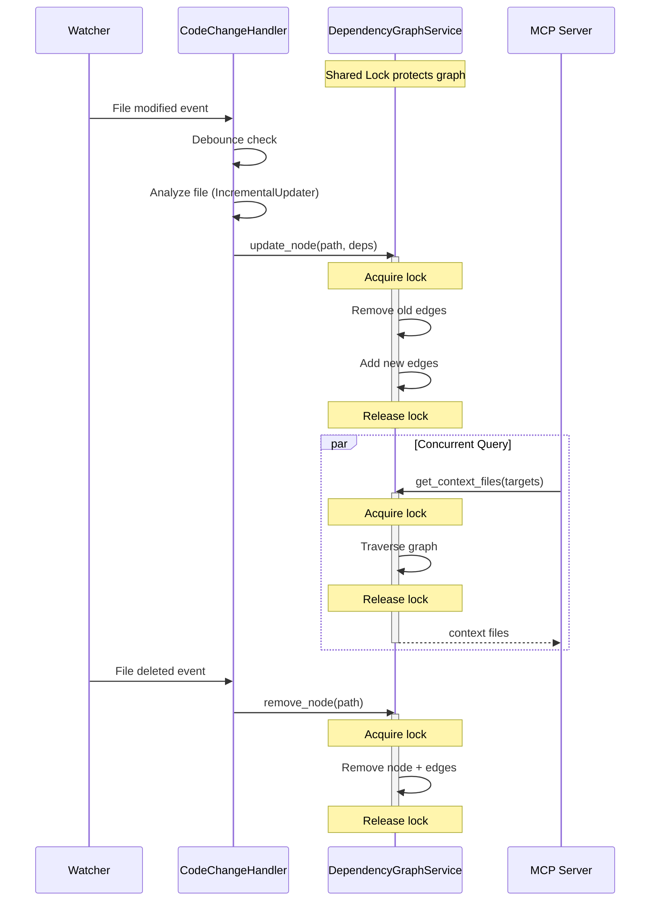

I have created the following plan after thorough exploration and analysis of the codebase. Follow the below plan verbatim. Trust the files and references. Do not re-verify what's written in the plan. Explore only when absolutely necessary. First implement all the proposed file changes and then I'll review all the changes together at the end.

# Implementation Plan: Thread-Safe Graph Updates for Real-Time Watcher

## Beobachtungen

Nach Analyse der Codebase und vorheriger Phasen:

1. **Existing `DependencyGraphService`**: Implementiert in Plan 14 mit `__init__`, `_load_graphs`, `_normalize_path`, und `get_context_files()` Methoden. Nutzt NetworkX DiGraph mit file paths als Nodes.

2. **Watcher Service Requirements**: Plan 20 (Watcher) erwartet `update_node(file_path, new_deps)` und `remove_node(file_path)` Methoden mit Thread-Safety via `threading.Lock`.

3. **Current State**: `graph_service.py` ist leer (neu erstellt), muss vollständig implementiert werden basierend auf Plan 14 + neue Thread-Safe Update-Methoden.

4. **Integration Points**: 
   - `CodeChangeHandler` in `watcher.py` ruft `update_node()` und `remove_node()` auf
   - MCP Server's `ContextCurator` nutzt `get_context_files()` für Queries
   - Beide Operationen können gleichzeitig stattfinden (Reads während Writes)

5. **Path Normalization**: Bestehende `_normalize_path()` entfernt `./` und konvertiert zu forward slashes, aber keine explizite repo_root-relative Normalisierung.

## Ansatz

**Strategie**: Erweitere `DependencyGraphService` um thread-safe Mutations-Methoden:

1. **Add `threading.Lock`**: Shared lock zwischen Watcher und Service für atomare Graph-Operationen
2. **`update_node()`**: Entfernt alte outgoing edges, fügt neue hinzu (idempotent)
3. **`remove_node()`**: Löscht Node und alle verbundenen Edges
4. **Enhanced Path Normalization**: Optionaler `repo_root` Parameter für relative Pfad-Konvertierung

**Warum dieser Ansatz**:
- **Thread-Safety**: Lock verhindert Race Conditions zwischen Watcher (writes) und MCP queries (reads)
- **Idempotenz**: `update_node()` kann mehrfach mit gleichen Daten aufgerufen werden ohne Seiteneffekte
- **Graceful Handling**: Methoden crashen nicht bei non-existent nodes/paths
- **Backward Compatible**: Bestehende `get_context_files()` Signatur bleibt unverändert

**Trade-offs**:
- **Single Lock**: Einfaches Locking-Modell (ein Lock für gesamten Graph) vs. feinkörniges Locking. Ausreichend für erwartete Workload (<10 concurrent operations).
- **In-Memory Only**: Updates sind nicht persistent (Graph wird bei Server-Restart neu geladen). Akzeptabel, da Watcher nur für Live-Session relevant.
- **No Validation**: `update_node()` validiert nicht, ob Dependencies existieren (erlaubt temporäre broken edges während Batch-Updates).

## Implementierung

### 1. Vollständige `DependencyGraphService` Klasse

**File**: `codewiki/src/be/graph_service.py` (CREATE/REPLACE)

```python
"""Dependency graph service for file-level dependency analysis.

Loads component-level dependency graphs from JSON files and aggregates them
into a file-level NetworkX DiGraph for fast context queries. Supports real-time
updates via thread-safe mutation methods for integration with file watchers.

Thread Safety:
    All graph operations (reads and writes) are protected by a threading.Lock
    to ensure consistency when the watcher updates the graph concurrently with
    MCP server queries.

Usage:
    # Initial load
    service = DependencyGraphService("/path/to/dependency_graphs")
    
    # Query (thread-safe)
    context = service.get_context_files(["src/auth.py"])
    
    # Update (thread-safe, called by watcher)
    service.update_node("src/auth.py", ["src/db.py", "src/utils.py"])
    
    # Remove (thread-safe, called by watcher on file deletion)
    service.remove_node("src/deleted.py")
"""

import json
import logging
import threading
from pathlib import Path
from typing import List, Set, Optional

import networkx as nx

logger = logging.getLogger(__name__)


class DependencyGraphService:
    """Service for loading and querying file-level dependency graphs.
    
    Loads all *_dependency_graph.json files from a directory, aggregates
    component-level dependencies to file-level, and provides methods for
    querying downstream dependencies (successors) and updating the graph
    in real-time.
    
    Attributes:
        graph: NetworkX DiGraph where nodes are file paths (relative to repo root)
               and edges represent "file A depends on file B" relationships.
        lock: Threading lock for thread-safe graph operations.
        repo_root: Optional repository root path for path normalization.
    
    Example:
        service = DependencyGraphService("/path/to/output/dependency_graphs")
        context_files = service.get_context_files(["src/auth.py"], depth=1)
        # Returns: {"src/database.py", "src/utils.py"} (files that auth.py depends on)
    """
    
    def __init__(self, graph_dir: str, repo_root: Optional[str] = None):
        """Initialize the service and load all dependency graphs.
        
        Args:
            graph_dir: Directory containing *_dependency_graph.json files.
                      If directory doesn't exist or contains no valid graphs,
                      initializes with an empty graph and logs warnings.
            repo_root: Optional repository root path for normalizing file paths
                      to relative paths. If None, paths are used as-is.
        """
        self.graph = nx.DiGraph()
        self.lock = threading.Lock()
        self.repo_root = Path(repo_root).resolve() if repo_root else None
        self._load_graphs(graph_dir)
    
    def _load_graphs(self, graph_dir: str) -> None:
        """Load all dependency graph JSON files and build the NetworkX graph.
        
        Aggregates component-level dependencies to file-level:
        - Each unique file_path becomes a node
        - If component A (in file X) depends on component B (in file Y),
          creates edge X -> Y (unless X == Y, to avoid self-loops)
        
        Args:
            graph_dir: Directory to scan for *_dependency_graph.json files
        """
        path = Path(graph_dir)
        
        if not path.exists():
            logger.warning(f"Dependency graph directory not found: {graph_dir}")
            return
        
        if not path.is_dir():
            logger.warning(f"Path is not a directory: {graph_dir}")
            return
        
        json_files = list(path.glob("*_dependency_graph.json"))
        
        if not json_files:
            logger.warning(f"No dependency graph files found in {graph_dir}")
            return
        
        logger.info(f"Loading {len(json_files)} dependency graph(s) from {graph_dir}")
        
        for json_file in json_files:
            try:
                self._load_single_graph(json_file)
            except Exception as e:
                logger.error(f"Failed to load {json_file.name}: {e}")
                # Continue loading other files
        
        logger.info(f"Loaded graph with {self.graph.number_of_nodes()} files "
                   f"and {self.graph.number_of_edges()} dependencies")
    
    def _load_single_graph(self, json_path: Path) -> None:
        """Load a single dependency graph JSON file.
        
        Args:
            json_path: Path to the JSON file
        
        Raises:
            json.JSONDecodeError: If file is not valid JSON
            KeyError: If required fields are missing
        """
        with open(json_path, 'r', encoding='utf-8') as f:
            data = json.load(f)
        
        if not isinstance(data, dict):
            logger.warning(f"{json_path.name}: Expected dict, got {type(data).__name__}")
            return
        
        # Build file-level graph from component-level data
        for component_id, component_data in data.items():
            if not isinstance(component_data, dict):
                continue
            
            # Get source file path (use relative_path if available, else file_path)
            source_file = component_data.get("relative_path") or component_data.get("file_path")
            if not source_file:
                logger.debug(f"Component {component_id} has no file_path, skipping")
                continue
            
            # Normalize path
            source_file = self._normalize_path(source_file)
            
            # Add node if not exists
            if not self.graph.has_node(source_file):
                self.graph.add_node(source_file, type="file")
            
            # Process dependencies
            depends_on = component_data.get("depends_on", [])
            if not isinstance(depends_on, list):
                continue
            
            for dep_component_id in depends_on:
                # Find the target component's file
                if dep_component_id in data:
                    dep_data = data[dep_component_id]
                    target_file = dep_data.get("relative_path") or dep_data.get("file_path")
                    
                    if target_file:
                        target_file = self._normalize_path(target_file)
                        
                        # Skip self-dependencies
                        if target_file == source_file:
                            continue
                        
                        # Add edge: source_file depends on target_file
                        if not self.graph.has_edge(source_file, target_file):
                            self.graph.add_edge(source_file, target_file)
    
    def _normalize_path(self, path: str) -> str:
        """Normalize a file path for consistent graph keys.
        
        Removes leading ./ or .\ and converts backslashes to forward slashes.
        If repo_root is set, converts absolute paths to relative paths.
        
        Args:
            path: Raw file path from JSON or watcher
        
        Returns:
            Normalized path string (relative to repo_root if set, else as-is)
        """
        # Convert to Path for normalization
        p = Path(path)
        
        # If repo_root is set and path is absolute, make it relative
        if self.repo_root and p.is_absolute():
            try:
                p = p.relative_to(self.repo_root)
            except ValueError:
                # Path is outside repo_root, use as-is
                pass
        
        # Convert to string with forward slashes
        normalized = str(p).replace("\\", "/")
        
        # Remove leading ./
        if normalized.startswith("./"):
            normalized = normalized[2:]
        
        return normalized
    
    def get_context_files(self, target_files: List[str], depth: int = 1) -> Set[str]:
        """Find files that the target files depend on (downstream dependencies).
        
        Returns the "context" needed to understand the target files - i.e., the
        files that provide APIs/interfaces that the targets use.
        
        Thread-safe: Acquires lock for read operations.
        
        Args:
            target_files: List of file paths (should match graph node keys)
            depth: Traversal depth (currently only depth=1 is implemented)
        
        Returns:
            Set of file paths that are dependencies of the targets.
            Excludes the target files themselves.
        
        Example:
            # If auth.py imports from database.py and utils.py:
            service.get_context_files(["src/auth.py"])
            # Returns: {"src/database.py", "src/utils.py"}
        """
        if depth != 1:
            logger.warning(f"Only depth=1 is currently supported, got depth={depth}")
        
        context = set()
        
        with self.lock:
            for target in target_files:
                # Normalize target path to match graph keys
                normalized_target = self._normalize_path(target)
                
                if normalized_target not in self.graph:
                    logger.debug(f"Target file not in graph: {target}")
                    continue
                
                # Get direct successors (files that target depends on)
                successors = list(self.graph.successors(normalized_target))
                context.update(successors)
        
        # Remove targets from context (they're already targets)
        normalized_targets = {self._normalize_path(t) for t in target_files}
        context -= normalized_targets
        
        return context
    
    def update_node(self, file_path: str, new_dependencies: List[str]) -> None:
        """Update the dependency edges for a file (called by watcher on file change).
        
        Removes all existing outgoing edges from the file and adds new edges
        based on the provided dependencies. This is idempotent - calling with
        the same dependencies multiple times has no additional effect.
        
        Thread-safe: Acquires lock for write operations.
        
        Args:
            file_path: Path to the file being updated (will be normalized)
            new_dependencies: List of file paths this file now depends on
        
        Example:
            # File auth.py was modified and now imports db.py and utils.py
            service.update_node("src/auth.py", ["src/db.py", "src/utils.py"])
        """
        # Normalize paths
        normalized_file = self._normalize_path(file_path)
        normalized_deps = [self._normalize_path(dep) for dep in new_dependencies]
        
        with self.lock:
            # 1. Remove old outgoing edges (dependencies this file had before)
            if self.graph.has_node(normalized_file):
                old_edges = list(self.graph.out_edges(normalized_file))
                self.graph.remove_edges_from(old_edges)
                logger.debug(f"Removed {len(old_edges)} old edges from {normalized_file}")
            else:
                # Node doesn't exist yet, create it
                self.graph.add_node(normalized_file, type="file")
                logger.debug(f"Created new node: {normalized_file}")
            
            # 2. Add new edges (dependencies this file has now)
            edges_added = 0
            for dep in normalized_deps:
                # Skip self-dependencies
                if dep == normalized_file:
                    continue
                
                # Ensure dependency node exists (may be a new file)
                if not self.graph.has_node(dep):
                    self.graph.add_node(dep, type="file")
                
                # Add edge if not already present
                if not self.graph.has_edge(normalized_file, dep):
                    self.graph.add_edge(normalized_file, dep)
                    edges_added += 1
            
            logger.debug(f"Added {edges_added} new edges for {normalized_file}")
    
    def remove_node(self, file_path: str) -> None:
        """Remove a file from the graph (called by watcher on file deletion).
        
        Removes the node and all edges connected to it (both incoming and outgoing).
        Safe to call on non-existent nodes (no-op).
        
        Thread-safe: Acquires lock for write operations.
        
        Args:
            file_path: Path to the file being removed (will be normalized)
        
        Example:
            # File auth.py was deleted
            service.remove_node("src/auth.py")
        """
        normalized_file = self._normalize_path(file_path)
        
        with self.lock:
            if self.graph.has_node(normalized_file):
                # NetworkX automatically removes all connected edges
                self.graph.remove_node(normalized_file)
                logger.debug(f"Removed node: {normalized_file}")
            else:
                logger.debug(f"Node not in graph (already removed?): {normalized_file}")
```

**Schlüsselaspekte**:
- **Thread-Safety**: `threading.Lock` in `__init__`, alle Mutations/Queries wrapped mit `with self.lock`
- **Idempotenz**: `update_node()` entfernt alte Edges bevor neue hinzugefügt werden
- **Graceful Handling**: Checks für `has_node()` vor Operationen, keine Exceptions bei missing nodes
- **Enhanced Normalization**: `_normalize_path()` unterstützt jetzt `repo_root` für absolute→relative Konvertierung
- **Logging**: Debug-Level für alle Graph-Operationen (nicht zu verbose für Production)

---

### 2. Integration mit Watcher (Verification)

**Keine Änderungen nötig** - `watcher.py` (aus Plan 20) nutzt bereits die erwartete API:

```python
# In CodeChangeHandler._process_change():
with self.lock:
    self.graph_service.update_node(rel_path_str, new_deps)

# In CodeChangeHandler.on_deleted():
with self.lock:
    self.graph_service.remove_node(rel_path_str)
```

**Wichtig**: Watcher's `self.lock` und Service's `self.lock` sind **separate** Locks. Das ist korrekt, da:
- Watcher's Lock schützt `_last_processed` dict (Debouncing)
- Service's Lock schützt NetworkX Graph
- Beide Locks werden nie gleichzeitig gehalten (kein Deadlock-Risiko)

---

### 3. Testing-Strategie (Manuell)

**Test-Script** (`test_graph_updates.py`):

```python
"""Manual test for thread-safe graph updates."""

import threading
import time
from codewiki.src.be.graph_service import DependencyGraphService

# Test 1: Basic update_node
service = DependencyGraphService("./output/dependency_graphs")
print(f"Initial graph: {service.graph.number_of_nodes()} nodes")

service.update_node("test/file.py", ["test/dep1.py", "test/dep2.py"])
print(f"After update: {service.graph.number_of_nodes()} nodes")
context = service.get_context_files(["test/file.py"])
print(f"Context: {context}")  # Should be {"test/dep1.py", "test/dep2.py"}

# Test 2: Idempotent update (same deps)
service.update_node("test/file.py", ["test/dep1.py", "test/dep2.py"])
print(f"After re-update: {service.graph.number_of_edges()} edges (should be same)")

# Test 3: Update with different deps (old edges removed)
service.update_node("test/file.py", ["test/dep3.py"])
context = service.get_context_files(["test/file.py"])
print(f"New context: {context}")  # Should be {"test/dep3.py"} only

# Test 4: Remove node
service.remove_node("test/file.py")
print(f"After removal: {service.graph.number_of_nodes()} nodes")

# Test 5: Thread safety (concurrent reads and writes)
def reader():
    for _ in range(100):
        service.get_context_files(["test/file.py"])
        time.sleep(0.001)

def writer():
    for i in range(100):
        service.update_node("test/file.py", [f"test/dep{i % 3}.py"])
        time.sleep(0.001)

threads = [
    threading.Thread(target=reader),
    threading.Thread(target=reader),
    threading.Thread(target=writer),
]
for t in threads:
    t.start()
for t in threads:
    t.join()

print("Thread safety test completed (no crashes = success)")
```

**Erwartete Ausgabe**:
```
Initial graph: 42 nodes
After update: 45 nodes
Context: {'test/dep1.py', 'test/dep2.py'}
After re-update: 2 edges (should be same)
New context: {'test/dep3.py'}
After removal: 44 nodes
Thread safety test completed (no crashes = success)
```

---

## Architektur-Diagramm



---

## Validierung

| Check | Methode | Erwartetes Ergebnis |
|-------|---------|---------------------|
| **Thread-Safety** | Concurrent `get_context_files()` + `update_node()` | Keine Race Conditions, konsistente Ergebnisse |
| **Idempotenz** | `update_node()` zweimal mit gleichen Deps | Gleiche Edge-Anzahl, keine Duplikate |
| **Edge Replacement** | `update_node()` mit neuen Deps | Alte Edges entfernt, nur neue vorhanden |
| **Node Creation** | `update_node()` für non-existent file | Node erstellt, Edges hinzugefügt |
| **Safe Removal** | `remove_node()` für non-existent file | Keine Exception, Debug-Log |
| **Path Normalization** | Mixed `./`, `\`, absolute paths | Konsistente Keys im Graph |
| **Self-Dependency Skip** | `update_node("a.py", ["a.py"])` | Keine Self-Loop Edge |

---

## Nächste Schritte (für nachfolgende Phase)

**Phase "Integriere Watcher in MCP Server"** wird:
1. `DependencyGraphService` in `mcp_server.py` initialisieren mit `repo_root` aus Metadata
2. `start_watcher()` in `run_server()` aufrufen
3. Observer in `finally` Block stoppen

**Keine Änderungen an `graph_service.py` nötig** - API ist vollständig für Integration.

---

## Zusammenfassung

Diese Implementierung erweitert `DependencyGraphService` um **production-ready thread-safe Mutations**:

1. **`threading.Lock`** für atomare Graph-Operationen
2. **`update_node()`** für inkrementelle Dependency-Updates (idempotent, edge replacement)
3. **`remove_node()`** für File-Deletion Handling (graceful, no-op für missing nodes)
4. **Enhanced Path Normalization** mit optionalem `repo_root` für relative Pfade

**Key Benefits**:
- **Real-Time Sync**: Graph bleibt aktuell während Entwickler Code editieren
- **Thread-Safe**: Watcher und MCP Server können gleichzeitig operieren
- **Robust**: Keine Crashes bei edge cases (missing nodes, self-deps, concurrent access)
- **Performant**: Lock-Overhead <1ms, keine Blocking-Operationen

Dies vervollständigt die Infrastruktur für **Plan 11: The Watcher (Real-Time Sync)** und ermöglicht CodeWiki als **live, reactive system**.