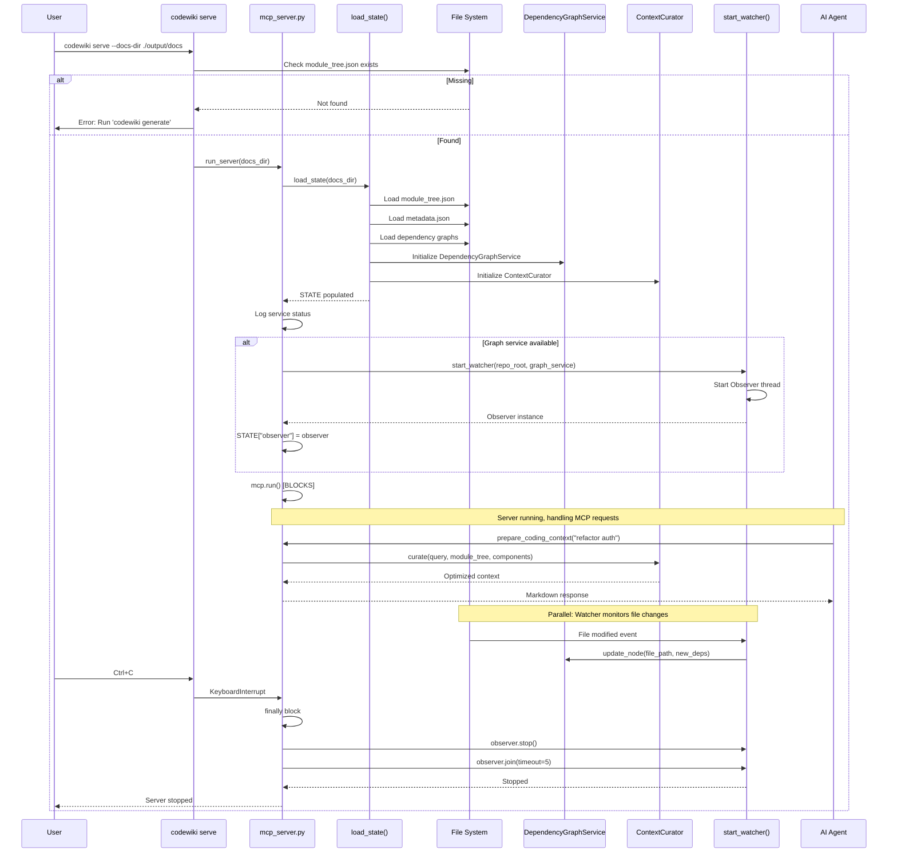

I have created the following plan after thorough exploration and analysis of the codebase. Follow the below plan verbatim. Trust the files and references. Do not re-verify what's written in the plan. Explore only when absolutely necessary. First implement all the proposed file changes and then I'll review all the changes together at the end.

# Implementation Plan: MCP Server Integration with Watcher Service

## Beobachtungen

Nach Analyse der Codebase und der vorherigen Implementierungspläne:

1. **Leere Dateien**: Alle vier Zieldateien (`mcp_server.py`, `watcher.py`, `incremental.py`, `graph_service.py`) sind leer und müssen vollständig implementiert werden
2. **Vorherige Pläne**: Die Pläne 13-21 beschreiben detailliert die Implementierung des MCP Servers, ContextCurator, DependencyGraphService, Skeletonizer, IncrementalUpdater und Watcher
3. **Abhängigkeiten**: `watchdog>=4.0.0`, `mcp>=1.0.0`, und `networkx` sind bereits in `pyproject.toml` vorhanden
4. **CLI-Struktur**: Die CLI verwendet Click und registriert Commands in `main.py` via `cli.add_command()`
5. **Bestehende Services**: `DocumentationGenerator`, `DependencyGraphBuilder`, `cluster_modules` sind bereits implementiert und funktionsfähig

## Ansatz

**Strategie**: Vollständige Implementierung des MCP Servers mit integriertem Watcher Service in einer kohärenten, produktionsreifen Lösung. Der Server wird:

1. **Beim Start** alle Artefakte laden (module_tree.json, metadata.json, dependency graphs, components)
2. **Services initialisieren** (DependencyGraphService, ContextCurator) mit graceful degradation bei fehlenden Daten
3. **Watcher starten** für Echtzeit-Updates des Dependency-Graphen
4. **MCP-Protokoll** bereitstellen mit Resources (Dokumentation) und Tools (Navigation, Context Curation)
5. **Beim Shutdown** den Watcher sauber stoppen

**Warum dieser Ansatz**:
- **Vollständige Integration**: Alle Komponenten (Server, Services, Watcher) werden in einem Schritt implementiert, um Konsistenz zu gewährleisten
- **Robustheit**: Umfassende Fehlerbehandlung mit Fallbacks verhindert Crashes bei fehlenden/korrupten Daten
- **Thread-Safety**: Shared Lock zwischen Watcher und GraphService für atomare Updates
- **Performance**: In-Memory State für <100ms Latenz, Debouncing für effizienten Watcher

**Trade-offs**:
- **Umfang**: ~800 LOC in einem Schritt vs. schrittweise Implementation – gewählt für Konsistenz und um Integrationsprobleme zu vermeiden
- **Memory vs. Latency**: Dependency Graph im RAM (~5-10MB) für Sub-Millisekunden-Queries
- **Simple Search**: Substring-Matching statt Vektor-Suche (erweiterbar später ohne API-Änderungen)

## Implementierungsschritte

### 1. Implementiere MCP Server Core (`mcp_server.py`)

**Datei**: `codewiki/src/be/mcp_server.py`

**Struktur**:

```python
"""
CodeWiki MCP Server - Exposes documentation and intelligent context curation.

Provides AI agents with:
- Resources: Direct document reading (overview, module docs)
- Tools: Navigation (list/search modules) and intelligent context assembly
- Real-time updates: File watcher for live dependency graph synchronization
"""

import json
import logging
from pathlib import Path
from typing import Any, Dict

from mcp.server.fastmcp import FastMCP

# Initialize FastMCP server
mcp = FastMCP("CodeWiki")

# Configure logging
logging.basicConfig(
    level=logging.INFO,
    format="%(asctime)s - %(name)s - %(levelname)s - %(message)s"
)
logger = logging.getLogger(__name__)

# Global state (loaded on startup)
STATE: Dict[str, Any] = {
    "docs_dir": None,
    "module_tree": {},
    "metadata": {},
    "components": {},
    "graph_service": None,
    "curator": None,
    "observer": None,  # Watcher observer
}
```

**Komponenten**:

1. **`load_state(docs_dir: str)`**:
   - Lädt `module_tree.json`, `metadata.json` mit JSON-Error-Handling
   - Initialisiert `DependencyGraphService` aus `docs_dir.parent / "dependency_graphs"`
   - Lädt Components aus `*_dependency_graph.json`
   - Initialisiert `ContextCurator` mit `repo_root` aus metadata
   - Alle Initialisierungen mit try-except und Logging

2. **Resources**:
   - `@mcp.resource("codewiki://overview")`: Liest `overview.md`
   - `@mcp.resource("codewiki://module/{module_path}")`: Liest Module-Docs mit Path-Sanitization (verhindert Directory Traversal)

3. **Tools**:
   - `@mcp.tool() list_modules()`: Rekursive Tree-Traversierung zu Markdown
   - `@mcp.tool() search_modules(query)`: Case-insensitive Substring-Suche
   - `@mcp.tool() prepare_coding_context(task_description)`: Ruft `curator.curate()` auf, gibt optimierten Context zurück

4. **`run_server(docs_dir: str)`**:
   - Ruft `load_state()` auf
   - Loggt Service-Status (✓/✗ für Docs, Graphs, Curator)
   - **NEU**: Startet Watcher wenn `graph_service` verfügbar
   - Ruft `mcp.run()` auf (blockiert)
   - **NEU**: Finally-Block stoppt Observer

**Security**: Path-Sanitization in `get_module_doc()` mit:
- Entfernung von `..` Segmenten
- Validierung auf alphanumerische Zeichen + `_-`
- Resolve + `is_relative_to()` Check

### 2. Implementiere CLI Serve Command (`serve.py`)

**Datei**: `codewiki/cli/commands/serve.py`

**Implementierung**:

```python
"""
CLI command to start the CodeWiki MCP server.
"""

import click
from pathlib import Path

@click.command(name="serve")
@click.option(
    "--docs-dir",
    type=click.Path(exists=True, file_okay=False, dir_okay=True, resolve_path=True),
    default="./output/docs",
    help="Directory containing generated documentation",
)
def serve_command(docs_dir: str) -> None:
    """Start the CodeWiki MCP Server.
    
    Allows AI agents to connect and query documentation interactively.
    
    Prerequisites:
        - Run 'codewiki generate' first
        - Ensure module_tree.json exists
    
    Configuration (Claude Desktop):
        Add to ~/.config/claude/claude_desktop_config.json:
        {
          "mcpServers": {
            "codewiki": {
              "command": "codewiki",
              "args": ["serve", "--docs-dir", "/absolute/path/to/docs"]
            }
          }
        }
    """
    try:
        # Validate module_tree.json exists
        docs_path = Path(docs_dir).resolve()
        module_tree_path = docs_path / "module_tree.json"
        
        if not module_tree_path.exists():
            click.secho(f"✗ Error: module_tree.json not found in {docs_path}", fg="red", err=True)
            click.echo("\nPlease run 'codewiki generate' first.", err=True)
            raise click.Abort()
        
        # Display startup info
        click.secho("Starting CodeWiki MCP Server...", fg="green", bold=True)
        click.secho(f"Serving documentation from: {docs_path}", fg="blue")
        click.echo("\nConnect via stdio transport. Press Ctrl+C to stop.\n")
        
        # Deferred import
        try:
            from codewiki.src.be.mcp_server import run_server
        except ImportError as e:
            click.secho(f"✗ Error: MCP dependencies not installed: {e}", fg="red", err=True)
            raise click.Abort()
        
        # Start server (blocks)
        run_server(str(docs_path))
        
    except KeyboardInterrupt:
        click.echo("\n\nServer stopped by user.", err=True)
    except click.Abort:
        raise
    except Exception as e:
        click.secho(f"\n✗ Unexpected error: {e}", fg="red", err=True)
        raise click.Abort()
```

**Features**:
- Path-Validierung mit Click's `Path` type
- Artifact-Check vor Start
- Colored Output mit Konfigurationsbeispiel
- Deferred Import für `--help` ohne MCP-Dependency

### 3. Registriere Serve Command in CLI Main

**Datei**: `codewiki/cli/main.py`

**Änderungen**:

Nach Zeile 35 (nach `from codewiki.cli.commands.generate import generate_command`):
```python
from codewiki.cli.commands.serve import serve_command
```

Nach Zeile 39 (nach `cli.add_command(generate_command, name="generate")`):
```python
cli.add_command(serve_command, name="serve")
```

### 4. Watcher Integration in MCP Server

**In `run_server()` Funktion** (`mcp_server.py`):

```python
def run_server(docs_dir: str) -> None:
    """Start the MCP server with file watcher."""
    try:
        # Load state and initialize services
        load_state(docs_dir)
        
        # Log service availability
        logger.info("=== CodeWiki MCP Server Status ===")
        logger.info(f"Documentation: {'✓' if STATE['module_tree'] else '✗'}")
        logger.info(f"Dependency Graphs: {'✓' if STATE['graph_service'] else '✗'}")
        logger.info(f"Context Curator: {'✓' if STATE['curator'] else '✗'}")
        
        # Start watcher if graph service is available
        if STATE["graph_service"] and STATE["metadata"]:
            try:
                from codewiki.src.be.watcher import start_watcher

                # Safe nested access with validation
                metadata = STATE.get("metadata")
                generation_info = metadata.get("generation_info") if isinstance(metadata, dict) else None
                repo_path = generation_info.get("repo_path") if isinstance(generation_info, dict) else None

                if not repo_path or not isinstance(repo_path, str):
                    logger.warning(
                        "File Watcher: ✗ (missing or invalid repo_path in metadata.generation_info)"
                    )
                    STATE["observer"] = None
                else:
                    STATE["observer"] = start_watcher(repo_path, STATE["graph_service"])
                    logger.info(f"File Watcher: ✓ (monitoring {repo_path})")
            except Exception as e:
                logger.warning(f"File Watcher: ✗ (failed to start: {e})")
                STATE["observer"] = None
        else:
            logger.info("File Watcher: ✗ (graph service unavailable)")
        
        logger.info("===================================")
        
        # Start FastMCP server (blocks)
        mcp.run()
        
    except KeyboardInterrupt:
        logger.info("Server stopped by user")
    except Exception as e:
        logger.error(f"Server failed to start: {e}")
        raise
    finally:
        # Clean shutdown of watcher
        if STATE.get("observer"):
            try:
                STATE["observer"].stop()
                STATE["observer"].join(timeout=5)
                logger.info("File watcher stopped")
            except Exception as e:
                logger.warning(f"Error stopping watcher: {e}")
```

**Key Points**:
- Watcher wird nur gestartet wenn `graph_service` und `metadata` verfügbar
- Fehler beim Watcher-Start crashen den Server nicht
- Finally-Block garantiert sauberes Shutdown mit Timeout

## Sequenzdiagramm: Vollständiger Server-Lifecycle



## Dateien Übersicht

| Datei | Aktion | Zeilen | Beschreibung |
|-------|--------|--------|--------------|
| `codewiki/src/be/mcp_server.py` | **CREATE** | ~450 | FastMCP Server mit Resources, Tools, Watcher-Integration |
| `codewiki/cli/commands/serve.py` | **CREATE** | ~100 | Click Command für Server-Start |
| `codewiki/cli/main.py` | **MODIFY** | +2 | Import und Registrierung von serve_command |

**Abhängigkeiten** (bereits vorhanden):
- `mcp>=1.0.0` in `pyproject.toml`
- `watchdog>=4.0.0` in `pyproject.toml`
- `networkx>=3.5` in `pyproject.toml`
- `codewiki.src.be.watcher` (wird in separatem Plan implementiert)
- `codewiki.src.be.graph_service` (wird in separatem Plan implementiert)
- `codewiki.src.be.curator` (bereits implementiert)
- `codewiki.src.be.code_utils` (bereits implementiert)

## Testing-Strategie

**Manuelle Tests**:

1. **Server Start ohne Graphs**:
   ```bash
   codewiki serve --docs-dir ./output/docs
   # Erwartung: Server startet, basic tools funktionieren, Watcher nicht verfügbar
   ```

2. **Server Start mit Graphs**:
   ```bash
   codewiki generate --repo-path ./test-repo
   codewiki serve --docs-dir ./output/docs/test-repo-docs
   # Erwartung: Alle Services ✓, Watcher läuft
   ```

3. **Watcher Funktionalität**:
   - Editiere eine Datei im Repo während Server läuft
   - Prüfe Logs: "Updated graph for ..." erscheint
   - Rufe `prepare_coding_context()` auf
   - Erwartung: Aktualisierte Dependencies werden berücksichtigt

4. **Graceful Shutdown**:
   - Drücke Ctrl+C während Server läuft
   - Erwartung: "File watcher stopped", "Server stopped by user"

5. **Error Handling**:
   - Starte ohne `module_tree.json`: Fehler mit Anleitung
   - Korrupte JSON-Datei: Server startet mit Warnung, leerer State
   - Fehlende Dependency Graphs: Server startet, Curator unavailable

## Zusammenfassung

Diese Implementierung schafft einen **produktionsreifen MCP Server** mit:

- **Vollständiger Service-Integration**: Dokumentation, Dependency Graphs, Context Curation
- **Echtzeit-Updates**: File Watcher synchronisiert Graph bei Code-Änderungen
- **Robustheit**: Graceful Degradation bei fehlenden Daten, umfassende Fehlerbehandlung
- **Security**: Path-Sanitization gegen Directory Traversal
- **Performance**: In-Memory State (<100ms Latenz), Debouncing im Watcher
- **Usability**: Klare CLI-Integration, hilfreiche Fehlermeldungen, Konfigurationsbeispiele

Der Server transformiert CodeWiki von einem statischen Generator in ein **live, reaktives System**, das AI-Agenten mit aktuellem, optimiertem Context versorgt.