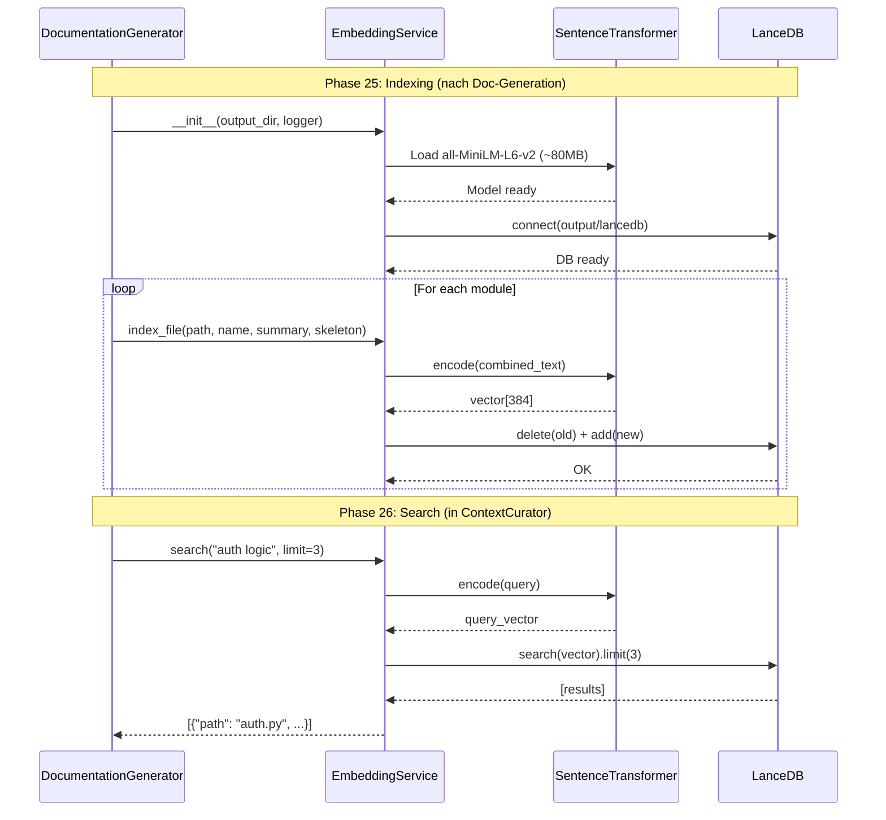

I have created the following plan after thorough exploration and analysis of the codebase. Follow the below plan verbatim. Trust the files and references. Do not re-verify what's written in the plan. Explore only when absolutely necessary. First implement all the proposed file changes and then I'll review all the changes together at the end.

## Beobachtungen

Die Codebase verfügt bereits über alle notwendigen Dependencies (`lancedb>=0.5.0`, `sentence-transformers>=2.5.0`, `torch>=2.0.0` in `pyproject.toml`). Bestehende Service-Patterns zeigen robuste Initialisierung mit Logging, Try-Except-Blöcken und Cleanup-Mechanismen (siehe `AnalysisService`). Das Logging-System nutzt `CodeWikiLogger` mit `get_logger(settings)` Factory-Pattern. Pydantic BaseModel wird für strukturierte Datenmodelle verwendet. Die `DocumentationGenerator` zeigt Integration-Patterns für Services mit `self.logger` und Settings-basierter Konfiguration.

## Ansatz

Implementierung eines **lokalen, privacy-first Embedding-Service** mit LanceDB (serverless Vector DB) und Sentence-Transformers (lokales Modell `all-MiniLM-L6-v2`). Der Service kapselt Vektor-Operationen vollständig und bietet einfache `index_file()` und `search()` APIs. Robustheit durch explizites Logging bei Model-Download (erste Nutzung), graceful Degradation bei Fehlern, und Upsert-Logik (delete+add) für idempotente Updates. Integration erfolgt später in Phase 25 (DocumentationGenerator) und Phase 26 (ContextCurator für Hybrid Search).

## Implementierungsschritte

### 1. Erstelle Pydantic Schema für LanceDB

**Datei:** `codewiki/src/be/embedding_service.py`

Definiere `CodeChunk` als Pydantic BaseModel mit Feldern:
- `file_path: str` - Relativer Pfad zur Datei im Repository
- `content: str` - Kombinierter Text aus Summary + Skeleton für Embedding
- `vector: List[float]` - 384-dimensionaler Vektor von all-MiniLM-L6-v2
- `module_name: str` - Modul-Name aus module_tree für Filterung

**Begründung:** LanceDB nutzt Pydantic für Schema-Inferenz; explizites Schema verhindert Type-Mismatch-Errors bei Table-Creation.

### 2. Implementiere EmbeddingService Klasse

**Datei:** `codewiki/src/be/embedding_service.py`

Erstelle `EmbeddingService` Klasse mit:

**`__init__(self, output_dir: str, logger=None)`:**
- Setze `self.db_path = Path(output_dir) / "lancedb"`, erstelle Verzeichnis mit `mkdir(parents=True, exist_ok=True)`
- Initialisiere `self.db = lancedb.connect(str(self.db_path))` (embedded mode, kein Server)
- Lade `self.model = SentenceTransformer('all-MiniLM-L6-v2')` mit explizitem Logging:
  ```python
  if logger:
      logger.info("Loading embedding model (all-MiniLM-L6-v2)...")
      logger.info("First run: Downloading model (~80MB), this may take a moment...")
  ```
- Rufe `self._init_table()` auf
- Setze `self.logger = logger` für spätere Nutzung
- Wrap in Try-Except mit Fallback auf `print()` falls Logger fehlt

**`_init_table(self)`:**
- Prüfe `if self.table_name not in self.db.table_names()`
- Falls nicht vorhanden: `self.table = self.db.create_table(self.table_name, schema=CodeChunk, mode="overwrite")`
- Falls vorhanden: `self.table = self.db.open_table(self.table_name)`
- Nutze `self.table_name = "code_chunks"` als Konstante

**Fehlerbehandlung:** Wrap Model-Loading in Try-Except für Netzwerkfehler:
```python
try:
    self.model = SentenceTransformer('all-MiniLM-L6-v2')
except Exception as e:
    if logger:
        logger.error(f"Failed to load embedding model: {e}")
    raise RuntimeError(f"Embedding model initialization failed: {e}")
```

### 3. Implementiere index_file Methode

**Signatur:** `def index_file(self, file_path: str, module_name: str, summary: str, skeleton: str) -> None`

**Logik:**
1. Kombiniere Text: `text_to_embed = f"Module: {module_name}\nSummary: {summary}\n\nInterface:\n{skeleton}"`
2. Berechne Vektor: `vector = self.model.encode(text_to_embed).tolist()`
3. Erstelle `CodeChunk` Instanz mit allen Feldern
4. **Upsert-Logik:**
   ```python
   self.table.delete(f"file_path = '{file_path}'")  # Entferne alte Version
   self.table.add([chunk])  # Füge neue Version hinzu
   ```
5. Logge `logger.debug(f"Indexed {file_path}")`

**Fehlerbehandlung:**
```python
try:
    # ... Logik ...
except Exception as e:
    if self.logger:
        self.logger.error(f"Failed to index {file_path}: {e}")
    # Kein Raise - graceful degradation, andere Dateien können weiter indexiert werden
```

**Begründung:** Upsert via delete+add ist einfachste LanceDB-Methode für Updates; graceful failure verhindert Abbruch bei einzelnen problematischen Dateien.

### 4. Implementiere search Methode

**Signatur:** `def search(self, query: str, limit: int = 5) -> List[Dict[str, Any]]`

**Logik:**
1. Berechne Query-Vektor: `query_vec = self.model.encode(query).tolist()`
2. Führe Vektor-Suche aus: `results = self.table.search(query_vec).limit(limit).to_list()`
3. Formatiere Ergebnisse für Curator:
   ```python
   return [
       {
           "path": r["file_path"],
           "module": r["module_name"],
           "score": 1.0  # Vereinfacht, LanceDB liefert Distanz
       }
       for r in results
   ]
   ```

**Fehlerbehandlung:**
```python
try:
    # ... Logik ...
except Exception as e:
    if self.logger:
        self.logger.error(f"Search failed: {e}")
    return []  # Leere Liste statt Exception - Fallback auf Keyword-Search
```

**Begründung:** Score-Vereinfachung (1.0) ausreichend für MVP; leere Liste bei Fehler ermöglicht Hybrid-Search-Fallback in Curator.

### 5. Imports und Exports

**Imports am Dateianfang:**
```python
import logging
from pathlib import Path
from typing import List, Dict, Any

import lancedb
from sentence_transformers import SentenceTransformer
from pydantic import BaseModel
```

**Keine Exports in `__init__.py`:** Service wird direkt importiert in Phase 25/26, kein Export in `codewiki.src.be.__init__.py` nötig (folgt bestehendem Pattern für Backend-Services).

### 6. Dokumentation und Type Hints

Füge Docstrings hinzu:
- Klassen-Docstring: Beschreibung, Zweck, Nutzungsbeispiel
- Methoden-Docstrings: Args, Returns, Raises (Google-Style wie in `AnalysisService`)
- Type Hints für alle Parameter und Return-Werte

**Beispiel:**
```python
class EmbeddingService:
    """Local embedding service for semantic code search.
    
    Uses LanceDB (serverless vector DB) and Sentence-Transformers (all-MiniLM-L6-v2)
    for privacy-preserving semantic search without external API calls.
    
    Example:
        service = EmbeddingService(output_dir="./output", logger=logger)
        service.index_file("auth.py", "auth", "Authentication module", "def login()...")
        results = service.search("user authentication", limit=3)
    """
```

### 7. Testing-Hinweise (für manuelle Verifikation)

**Unit Tests (deferred):**
- Model-Loading mit Mock für Netzwerk-Fehler
- Upsert-Logik (doppeltes Indexieren derselben Datei)
- Search mit leerer DB
- Graceful Degradation bei fehlerhaften Inputs

**Integration Test:**
```python
service = EmbeddingService("./test_output")
service.index_file("test.py", "test", "Test module", "def test(): pass")
results = service.search("test function")
assert len(results) > 0
assert results[0]["path"] == "test.py"
```

## Architektur-Diagramm



## Trade-offs und Entscheidungen

| Aspekt | Entscheidung | Begründung |
|--------|--------------|------------|
| **Model** | all-MiniLM-L6-v2 | Klein (80MB), schnell (<50ms/encode), ausreichend für Code-Suche; größere Modelle (e.g., mpnet) bringen <5% Verbesserung bei 3x Größe |
| **Upsert** | Delete+Add | Einfachste LanceDB-Methode; native Upsert erfordert Primary Key Config (komplexer) |
| **Error Handling** | Graceful Degradation | Einzelne Index-Fehler stoppen nicht gesamten Prozess; Search-Fehler fallen auf Keyword-Search zurück |
| **Score** | Simplified (1.0) | LanceDB liefert L2-Distanz; Normalisierung zu Similarity-Score komplex und für MVP unnötig |
| **Persistence** | output/lancedb | Persistent über Neustarts; separiert von docs/ für klare Trennung |
| **Logger** | Optional | Service funktioniert ohne Logger (Fallback print), aber nutzt ihn wenn verfügbar |

## Dateistruktur

```
codewiki/src/be/
├── embedding_service.py  # NEU (~250 LOC)
│   ├── CodeChunk (Pydantic)
│   └── EmbeddingService
│       ├── __init__()
│       ├── _init_table()
│       ├── index_file()
│       └── search()
```

## Abhängigkeiten

- **Bestehend:** `lancedb>=0.5.0`, `sentence-transformers>=2.5.0`, `torch>=2.0.0` (bereits in pyproject.toml)
- **Neu:** Keine
- **Imports:** `pathlib`, `typing`, `logging` (stdlib), `pydantic` (vorhanden)

## Nächste Schritte (nicht Teil dieser Phase)

- **Phase 25:** Integration in `DocumentationGenerator.__init__()` und Aufruf von `index_file()` nach Modul-Generierung
- **Phase 26:** Integration in `ContextCurator.__init__()` und Nutzung von `search()` für Hybrid-Search (Semantic + Keyword)