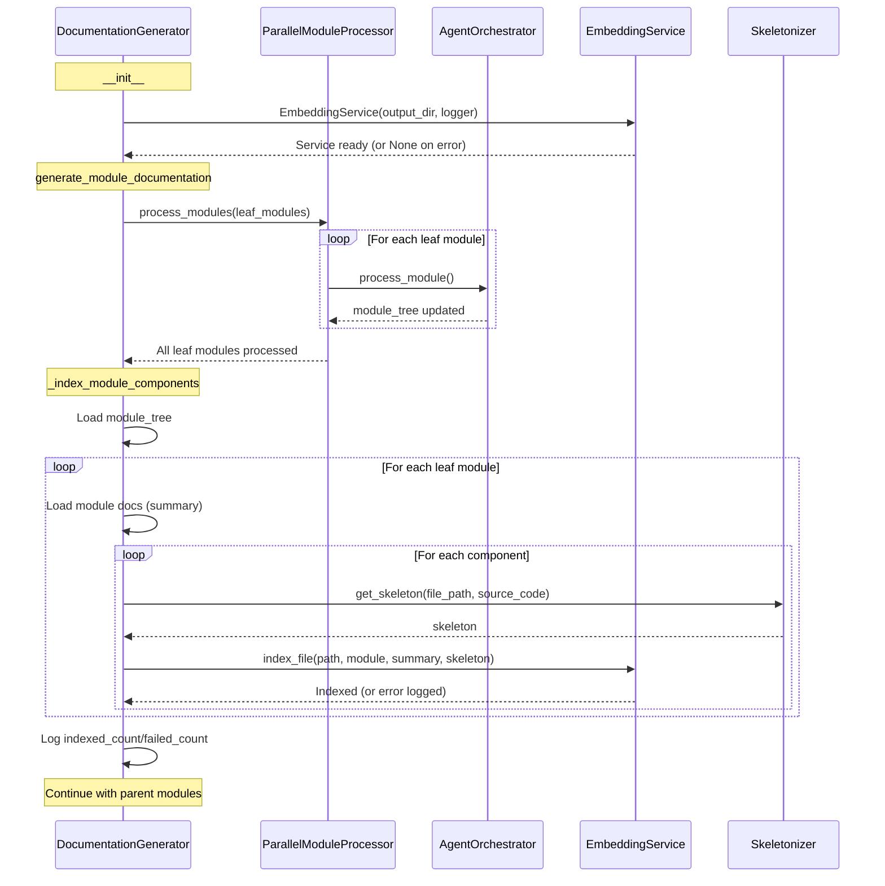

I have created the following plan after thorough exploration and analysis of the codebase. Follow the below plan verbatim. Trust the files and references. Do not re-verify what's written in the plan. Explore only when absolutely necessary. First implement all the proposed file changes and then I'll review all the changes together at the end.

# Integration von EmbeddingService in DocumentationGenerator

## Beobachtungen

Die `DocumentationGenerator` Klasse orchestriert die Dokumentationsgenerierung durch parallele Verarbeitung von Leaf-Modulen (via `ParallelModuleProcessor`) und sequentielle Verarbeitung von Parent-Modulen. Die Klasse hat bereits robuste Initialisierung mit `Settings`, `ResilientLLMClient`, und `CodeWikiLogger`. Die `Skeletonizer` Klasse (aus Phase 15) und `EmbeddingService` (aus Phase 24) sind implementiert aber noch nicht integriert. Die `Node` Struktur aus `dependency_analyzer.models.core` enthält `file_path`, `relative_path`, und `source_code` für jede Komponente. Nach der Modul-Verarbeitung werden Markdown-Dateien (z.B. `module_name.md`) im `working_dir` gespeichert, die als Summary für das Embedding dienen können.

## Ansatz

Integration des `EmbeddingService` in den Dokumentationsgenerierungs-Workflow durch:
1. Initialisierung des Service im `__init__` mit `output_dir` und Logger
2. Nach erfolgreicher Leaf-Modul-Verarbeitung: Iteration über alle verarbeiteten Module
3. Für jede Komponente (Datei) eines Moduls: Extraktion von `file_path` und `source_code` aus dem `components` Dict, Generierung des Skeletons via `Skeletonizer.get_skeleton()`, Laden der Modul-Dokumentation als Summary, und Aufruf von `embedding_service.index_file()`
4. Graceful Degradation bei Fehlern (einzelne Index-Fehler stoppen nicht den gesamten Prozess)
5. Progress-Logging für Transparenz

Die Integration erfolgt **nach** der parallelen Leaf-Verarbeitung (Zeile ~499) aber **vor** der Parent-Verarbeitung, da nur Leaf-Module tatsächliche Code-Dateien enthalten (Parent-Module sind Aggregationen). Dies stellt sicher, dass alle Dateien indexiert sind, bevor der MCP-Server gestartet wird.

## Implementierungsschritte

### 1. Imports hinzufügen

**Datei:** `file:codewiki/src/be/documentation_generator.py`

Füge am Anfang der Datei (nach den bestehenden Imports, ca. Zeile 58) hinzu:

```python
from codewiki.src.be.embedding_service import EmbeddingService
from codewiki.src.be.code_utils import Skeletonizer
```

**Begründung:** Beide Services werden für die Indexierung benötigt; Imports folgen bestehendem Pattern (lokale Backend-Imports nach Core-Imports).

---

### 2. EmbeddingService im __init__ initialisieren

**Datei:** `file:codewiki/src/be/documentation_generator.py`

Füge nach der Initialisierung von `self.agent_orchestrator` (Zeile ~114) hinzu:

```python
        # Initialize embedding service for semantic search
        try:
            self.embedding_service = EmbeddingService(
                output_dir=self.output_dir,
                logger=self.logger
            )
            self.logger.info("Embedding service initialized successfully")
        except Exception as e:
            self.logger.warning(f"Failed to initialize embedding service: {e}")
            self.logger.warning("Semantic search will be unavailable, but documentation generation will continue")
            self.embedding_service = None
```

**Begründung:** 
- Try-Except verhindert Abbruch bei Model-Download-Fehlern (z.B. Netzwerkprobleme)
- `None`-Fallback ermöglicht graceful degradation (Dokumentation funktioniert ohne Embeddings)
- Explizites Logging informiert User über Status

---

### 3. Indexierungs-Methode implementieren

**Datei:** `file:codewiki/src/be/documentation_generator.py`

Füge nach der `_collect_parent_modules` Methode (ca. Zeile 431) eine neue Methode hinzu:

```python
    def _index_module_components(
        self,
        module_tree: Dict[str, Any],
        components: Dict[str, Any],
        working_dir: str,
    ) -> None:
        """Index all components of processed modules for semantic search.
        
        Iterates through all leaf modules in the module tree, extracts their
        components' file paths and source code, generates skeletons, and indexes
        them with the module's documentation as summary.
        
        Args:
            module_tree: The hierarchical module tree
            components: All code components (component_id -> Node)
            working_dir: Output directory containing generated markdown files
        """
        if not self.embedding_service:
            self.logger.debug("Skipping indexing: embedding service not available")
            return
        
        indexed_count = 0
        failed_count = 0
        
        def traverse_and_index(node: Dict[str, Any], path: List[str]) -> None:
            nonlocal indexed_count, failed_count
            
            for module_name, module_info in node.items():
                current_path = path + [module_name]
                
                # Only index leaf modules (they contain actual code files)
                is_leaf = self.is_leaf_module(module_info)
                
                if is_leaf:
                    component_ids = module_info.get("components", [])
                    if not component_ids:
                        continue
                    
                    # Load module documentation as summary
                    docs_path = os.path.join(working_dir, f"{module_name}.md")
                    if os.path.exists(docs_path):
                        try:
                            summary = file_manager.load_text(docs_path)
                        except Exception as e:
                            self.logger.warning(f"Failed to load docs for {module_name}: {e}")
                            summary = f"Module: {module_name}"
                    else:
                        summary = f"Module: {module_name}"
                    
                    # Index each component file
                    for component_id in component_ids:
                        if component_id not in components:
                            self.logger.warning(f"Component {component_id} not found in components dict")
                            continue
                        
                        node_obj = components[component_id]
                        file_path = node_obj.relative_path  # Use relative path for consistency
                        source_code = node_obj.source_code or ""
                        
                        if not source_code:
                            self.logger.debug(f"Skipping {file_path}: no source code available")
                            continue
                        
                        try:
                            # Generate skeleton
                            skeleton = Skeletonizer.get_skeleton(file_path, source_code)
                            
                            # Index file
                            self.embedding_service.index_file(
                                file_path=file_path,
                                module_name=module_name,
                                summary=summary,
                                skeleton=skeleton
                            )
                            indexed_count += 1
                            
                        except Exception as e:
                            self.logger.warning(f"Failed to index {file_path}: {e}")
                            failed_count += 1
                
                # Recursively process children
                children = module_info.get("children", {})
                if children and isinstance(children, dict):
                    traverse_and_index(children, current_path)
        
        self.logger.info("Indexing module components for semantic search...")
        traverse_and_index(module_tree, [])
        
        if indexed_count > 0:
            self.logger.success(f"Indexed {indexed_count} files for semantic search")
        if failed_count > 0:
            self.logger.warning(f"Failed to index {failed_count} files")
```

**Begründung:**
- Separate Methode für Testbarkeit und Klarheit
- Rekursive Traversierung folgt bestehendem Pattern (`_collect_leaf_modules_for_processing`)
- Nur Leaf-Module werden indexiert (Parent-Module haben keine eigenen Dateien)
- `relative_path` statt `file_path` für Konsistenz mit MCP-Server (der relative Pfade nutzt)
- Try-Except pro Datei verhindert Abbruch bei einzelnen Fehlern
- Zähler für Transparenz im Logging

---

### 4. Indexierung in generate_module_documentation aufrufen

**Datei:** `file:codewiki/src/be/documentation_generator.py`

Füge nach der erfolgreichen Leaf-Modul-Verarbeitung (nach Zeile 499, vor der Parent-Verarbeitung) hinzu:

```python
            # Index all processed leaf modules for semantic search
            self._index_module_components(module_tree, components, working_dir)
```

**Kontext:** Einfügen zwischen:
```python
                self.logger.success(f"Completed processing {len(results)} leaf modules")
            except ExceptionGroup as eg:
                # ... error handling ...
                
            # INDEX HIER EINFÜGEN
            
            # Collect parent modules in bottom-up order (deepest first)
```

**Begründung:**
- Nach Leaf-Verarbeitung: Alle Markdown-Dateien existieren (für Summary)
- Vor Parent-Verarbeitung: Keine Abhängigkeit, aber logisch sinnvoll (Leafs zuerst)
- Async-sicher: `_index_module_components` ist synchron (Embedding-Berechnung ist CPU-bound, nicht I/O-bound)

---

### 5. Fehlerbehandlung und Logging

**Keine zusätzlichen Änderungen nötig** - bereits in Schritt 2 und 3 implementiert:
- `__init__`: Try-Except mit Fallback auf `None`
- `_index_module_components`: Early return wenn Service nicht verfügbar
- Pro-Datei Try-Except mit Warning-Logs
- Success/Failure-Zähler für Transparenz

---

## Architektur-Diagramm



---

## Trade-offs und Entscheidungen

| Aspekt | Entscheidung | Begründung | Alternative |
|--------|--------------|------------|-------------|
| **Initialisierung** | Im `__init__` mit Try-Except | Frühe Fehler-Erkennung, Service verfügbar für gesamten Lifecycle | Lazy Init (komplexer, kein Vorteil) |
| **Timing** | Nach Leaf-Verarbeitung, vor Parents | Alle Markdown-Dateien existieren, logische Reihenfolge | Nach Parents (unnötig verzögert) |
| **Granularität** | Pro Datei (nicht pro Modul) | Präzisere Suche, kleinere Chunks | Pro Modul (weniger präzise) |
| **Summary** | Modul-Dokumentation | Kontextualisiert die Dateien im Modul | Datei-Docstring (oft leer) |
| **Fehlerbehandlung** | Graceful Degradation | Dokumentation funktioniert ohne Embeddings | Hard Fail (User-feindlich) |
| **Async** | Synchron in async Kontext | Embedding ist CPU-bound, kein I/O-Benefit | Async (unnötige Komplexität) |
| **Path** | `relative_path` | Konsistenz mit MCP-Server, portabel | `file_path` (absolut, nicht portabel) |

---

## Dateien modifiziert

- **`file:codewiki/src/be/documentation_generator.py`** (~100 LOC hinzugefügt)
  - Imports: `EmbeddingService`, `Skeletonizer`
  - `__init__`: Initialisierung von `self.embedding_service`
  - Neue Methode: `_index_module_components()`
  - `generate_module_documentation`: Aufruf von `_index_module_components()`

---

## Testing-Strategie

### Manuelle Verifikation (vor Commit)

1. **Erfolgreicher Fall:**
   ```bash
   codewiki generate /path/to/repo
   # Erwartung: Logs zeigen "Indexed X files for semantic search"
   # Prüfe: output/lancedb/ Verzeichnis existiert
   ```

2. **Graceful Degradation:**
   - Simuliere Netzwerkfehler (z.B. offline): Service-Init schlägt fehl, aber Dokumentation wird generiert
   - Erwartung: Warning-Log "Semantic search will be unavailable"

3. **Fehlerhafte Datei:**
   - Füge Datei mit Syntax-Fehler hinzu
   - Erwartung: Skeletonizer fällt auf Generic zurück, Indexierung erfolgt

### Integration Test (später)

```python
# Test: Indexierung nach Dokumentationsgenerierung
result = await doc_gen.generate_module_documentation(components, leaf_nodes)
assert result.success
assert doc_gen.embedding_service is not None
# Prüfe: LanceDB enthält Einträge
results = doc_gen.embedding_service.search("authentication", limit=1)
assert len(results) > 0
```

---

## Abhängigkeiten

- **Voraussetzungen:** 
  - Phase 15 (Skeletonizer) implementiert
  - Phase 24 (EmbeddingService) implementiert
  - Dependencies in `pyproject.toml` vorhanden (`lancedb`, `sentence-transformers`, `torch`)

- **Nachfolgende Phasen:**
  - Phase 26: `ContextCurator` nutzt `EmbeddingService.search()` für Hybrid-Search

---

## Zusammenfassung

Diese Integration fügt semantische Such-Fähigkeiten zu CodeWiki hinzu, ohne die bestehende Dokumentationsgenerierung zu beeinträchtigen. Durch graceful degradation bleibt das System robust, auch wenn Embeddings fehlschlagen. Die Indexierung erfolgt automatisch nach der Leaf-Modul-Verarbeitung und bereitet die Daten für den MCP-Server vor, der in Phase 26 die Hybrid-Search (Semantic + Keyword) nutzen wird.