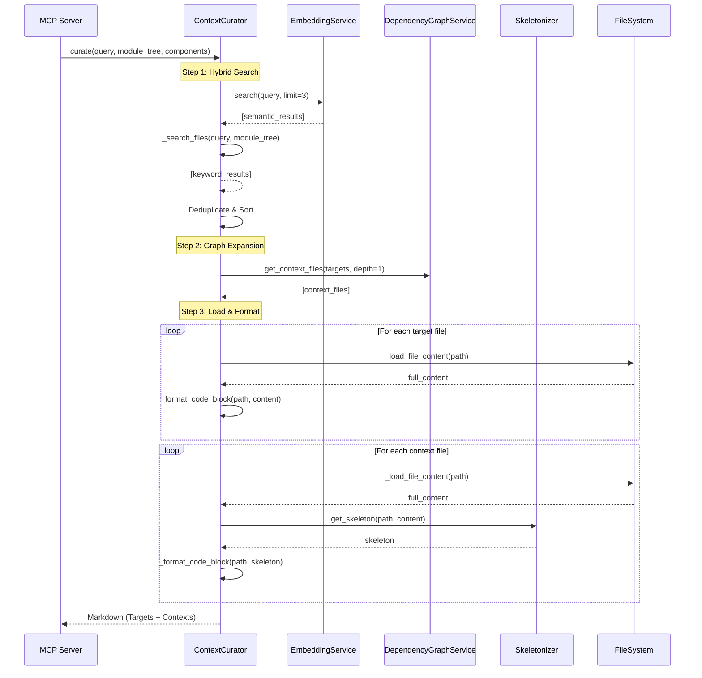

I have created the following plan after thorough exploration and analysis of the codebase. Follow the below plan verbatim. Trust the files and references. Do not re-verify what's written in the plan. Explore only when absolutely necessary. First implement all the proposed file changes and then I'll review all the changes together at the end.

## Beobachtungen

Die Codebase hat alle Voraussetzungen für die Hybrid-Search-Integration: `EmbeddingService` (Phase 24) und `ContextCurator` (Phase 16) sind als leere Dateien vorhanden. Die `DocumentationGenerator` zeigt bereits Integration-Patterns mit Services (`self.embedding_service`, `self.logger`). Die Module-Tree-Struktur aus `cluster_modules.py` enthält verschachtelte Dicts mit `components`, `children`, `path`, `type`, `hash` Feldern. Die `DependencyGraphService` und `Skeletonizer` (aus vorherigen Phasen) sind implementiert und bereit zur Nutzung. Der MCP-Server wird `curator.curate()` aufrufen und erwartet Markdown-Output mit Target-Files (Full Code) und Context-Files (Skeletons).

## Ansatz

**Vollständige Implementierung des ContextCurator mit Hybrid Search (Semantic + Keyword).** Der Curator orchestriert drei Operationen: (1) **Semantic Search** via `EmbeddingService.search()` für konzeptuelle Relevanz (z.B. "authentication" findet `auth.py` auch wenn Dateiname kryptisch ist), (2) **Keyword Search** via rekursive Module-Tree-Traversierung für exakte Matches (Dateinamen, Modul-Namen, Component-IDs), (3) **Graph Expansion** via `DependencyGraphService.get_context_files()` für Downstream-Dependencies. Die Ergebnisse werden dedupliziert, als Markdown formatiert (Target-Files mit Full Source, Context-Files mit Skeletons), und mit Language-Tagged Code-Blocks zurückgegeben.

**Design-Entscheidungen:**
- **Optional EmbeddingService**: `None`-Fallback ermöglicht Betrieb ohne Embeddings (z.B. bei Model-Download-Fehlern)
- **Union-Strategie**: Semantic + Keyword Results werden kombiniert (nicht intersected), um Recall zu maximieren
- **File-Level Granularität**: Component-Matches werden zu unique File-Paths aggregiert
- **Defensive Programming**: Alle externen Calls (Graph, Skeletonizer, File-Loading) in Try-Except mit Logging
- **Path Security**: Resolve-basierte Traversal-Protection gegen `../../etc/passwd` Attacks

**Trade-offs:**
- Semantic Search als Ergänzung (nicht Ersatz) für Keyword → Hybrid-Ansatz maximiert Precision + Recall
- Limit=3 für Semantic Results → Balance zwischen Relevanz und Token-Overhead
- Depth=1 für Graph Expansion → Ausreichend für meiste Use-Cases, vermeidet Explosion

## Implementierungsschritte

### 1. Erstelle vollständigen ContextCurator mit Hybrid Search

**Datei:** `file:codewiki/src/be/curator.py` (NEU, ~350 LOC)

**Imports:**
```python
from typing import List, Dict, Any, Set, Optional
from pathlib import Path
from codewiki.src.be.graph_service import DependencyGraphService
from codewiki.src.be.code_utils import Skeletonizer
from codewiki.src.be.embedding_service import EmbeddingService
from codewiki.core.logging import get_logger, CodeWikiLogger
```

**Klassen-Struktur:**

**`__init__(self, repo_root: str, graph_service: DependencyGraphService, embedding_service: Optional[EmbeddingService] = None, logger: Optional[CodeWikiLogger] = None)`:**
- Store `self.repo_root = Path(repo_root).resolve()` (absolute path)
- Store `self.graph_service = graph_service`
- Store `self.embedding_service = embedding_service` (kann None sein)
- Initialize `self.logger = logger or get_logger()` (Fallback auf default logger)
- Log Initialisierung: `logger.info(f"ContextCurator initialized (semantic search: {'enabled' if embedding_service else 'disabled'})")`

**Begründung:** Optional `embedding_service` ermöglicht graceful degradation; explizites Logging informiert User über verfügbare Features.

---

### 2. Implementiere `_search_files()` - Keyword Search via Module Tree

**Signatur:** `def _search_files(self, query: str, module_tree: Dict[str, Any], components: Dict[str, Any]) -> List[str]`

**Logik:**
1. Normalize query: `query_lower = query.lower().strip()`
2. Initialize `matched_files: Set[str] = set()`
3. Define recursive helper:
   ```python
   def traverse(node: Dict[str, Any], path: List[str]) -> None:
       for module_name, module_info in node.items():
           current_path = path + [module_name]
           
           # Match on module name
           if query_lower in module_name.lower():
               # Add all component files from this module
               for comp_id in module_info.get("components", []):
                   if comp_id in components:
                       matched_files.add(components[comp_id].relative_path)
           
           # Match on module path
           module_path = module_info.get("path", "")
           if module_path and query_lower in module_path.lower():
               for comp_id in module_info.get("components", []):
                   if comp_id in components:
                       matched_files.add(components[comp_id].relative_path)
           
           # Match on component IDs and file paths
           for comp_id in module_info.get("components", []):
               if comp_id in components:
                   node_obj = components[comp_id]
                   # Match on component ID
                   if query_lower in comp_id.lower():
                       matched_files.add(node_obj.relative_path)
                   # Match on file path
                   if query_lower in node_obj.relative_path.lower():
                       matched_files.add(node_obj.relative_path)
           
           # Recurse into children
           children = module_info.get("children", {})
           if children and isinstance(children, dict):
               traverse(children, current_path)
   ```
4. Call `traverse(module_tree, [])`
5. Return `sorted(list(matched_files))`

**Edge Cases:**
- Empty query → return empty list
- No matches → return empty list
- Missing components → log warning, skip

**Begründung:** Case-insensitive substring matching auf allen relevanten Feldern; Set verhindert Duplikate; sortierte Liste für deterministische Ausgabe.

---

### 3. Implementiere `_load_file_content()` - Sichere File-Loading

**Signatur:** `def _load_file_content(self, relative_path: str) -> Optional[str]`

**Logik:**
```python
def _load_file_content(self, relative_path: str) -> Optional[str]:
    """Load file content with path-traversal protection and encoding fallback."""
    full_path = self.repo_root / relative_path
    
    # Security: Block path traversal attacks
    try:
        resolved_path = full_path.resolve()
        resolved_root = self.repo_root.resolve()
        resolved_path.relative_to(resolved_root)
    except ValueError:
        self.logger.error(
            f"Path traversal attempt blocked: {relative_path!r} "
            f"resolves outside repo root"
        )
        return None
    
    # Read file with encoding fallback
    try:
        return resolved_path.read_text(encoding="utf-8")
    except FileNotFoundError:
        self.logger.warning(f"File not found: {relative_path}")
        return None
    except UnicodeDecodeError:
        self.logger.warning(f"UTF-8 decode failed for {relative_path}, trying latin-1")
        try:
            return resolved_path.read_text(encoding="latin-1")
        except Exception as e:
            self.logger.error(f"Failed to read {relative_path} with latin-1: {e}")
            return None
    except Exception as e:
        self.logger.error(f"Unexpected error reading {relative_path}: {e}")
        return None
```

**Begründung:** Path-Traversal-Protection ist kritisch für Security; Encoding-Fallback verhindert Abbruch bei Non-UTF8-Dateien.

---

### 4. Implementiere `_format_code_block()` - Language Detection

**Signatur:** `def _format_code_block(self, file_path: str, content: str) -> str`

**Logik:**
```python
def _format_code_block(self, file_path: str, content: str) -> str:
    """Format content as Markdown code block with language detection."""
    ext = Path(file_path).suffix.lower()
    
    # Map extensions to Markdown language tags
    lang_map = {
        ".py": "python", ".pyx": "python", ".pyi": "python",
        ".js": "javascript", ".jsx": "javascript",
        ".ts": "typescript", ".tsx": "typescript",
        ".java": "java",
        ".cpp": "cpp", ".cc": "cpp", ".cxx": "cpp", ".hpp": "cpp",
        ".c": "c", ".h": "c",
        ".cs": "csharp",
        ".go": "go",
        ".rs": "rust",
        ".rb": "ruby",
        ".php": "php",
        ".swift": "swift",
        ".kt": "kotlin",
    }
    
    language = lang_map.get(ext, "")
    return f"```{language}\n{content}\n```"
```

**Begründung:** Language-Tags ermöglichen Syntax-Highlighting in Markdown-Viewern; umfassende Extension-Map deckt gängige Sprachen ab.

---

### 5. Implementiere `curate()` - Hauptmethode mit Hybrid Search

**Signatur:** `def curate(self, query: str, module_tree: Dict[str, Any], components: Dict[str, Any]) -> str`

**Logik:**

**Step 1: Input Validation**
```python
if not isinstance(module_tree, dict) or not module_tree:
    self.logger.error("Invalid or empty module_tree")
    return "# ERROR\n\nModule tree is not available. Run 'codewiki generate' first."

if not isinstance(components, dict) or not components:
    self.logger.error("Invalid or empty components")
    return "# ERROR\n\nComponent data is not available."

if not query or not query.strip():
    return "# ERROR\n\nEmpty query provided."
```

**Step 2: Hybrid Search (Semantic + Keyword)**
```python
target_files: List[str] = []

# 2a. Semantic Search (if available)
if self.embedding_service:
    try:
        self.logger.info(f"Performing semantic search for: '{query}'")
        semantic_results = self.embedding_service.search(query, limit=3)
        semantic_paths = [r["path"] for r in semantic_results]
        target_files.extend(semantic_paths)
        self.logger.info(f"Semantic search found {len(semantic_paths)} files")
    except Exception as e:
        self.logger.warning(f"Semantic search failed: {e}, falling back to keyword search only")

# 2b. Keyword Search (always)
try:
    self.logger.info(f"Performing keyword search for: '{query}'")
    keyword_results = self._search_files(query, module_tree, components)
    target_files.extend(keyword_results)
    self.logger.info(f"Keyword search found {len(keyword_results)} files")
except Exception as e:
    self.logger.error(f"Keyword search failed: {e}")
    # If both searches failed, return error
    if not target_files:
        return f"# ERROR\n\nSearch failed: {e}"

# 2c. Deduplicate and validate
target_files = sorted(list(set(target_files)))  # Remove duplicates, sort

if not target_files:
    return f"# CONTEXT FOR TASK: {query}\n\nNo relevant files found. Try a different search term or check if documentation has been generated."

self.logger.info(f"Total unique target files after deduplication: {len(target_files)}")
```

**Step 3: Graph Expansion**
```python
context_files: Set[str] = set()
try:
    context_files = self.graph_service.get_context_files(target_files, depth=1)
    self.logger.info(f"Graph expansion identified {len(context_files)} context files")
except Exception as e:
    self.logger.warning(f"Graph service failed: {e}, proceeding without context files")
```

**Step 4: Assemble Markdown Output**
```python
output = [f"# CONTEXT FOR TASK: {query}\n"]

# Section 1: Target Files (Full Code)
output.append("## 1. TARGET FILES (Full Access - Edit These)\n")
output.append("These are the files most relevant to your task. You have full access to their implementation.\n")

for file_path in target_files:
    content = self._load_file_content(file_path)
    if content:
        output.append(f"\n### `{file_path}`\n")
        output.append(self._format_code_block(file_path, content))
    else:
        self.logger.warning(f"Could not load target file: {file_path}")

# Section 2: Context Files (Skeletons)
if context_files:
    output.append("\n## 2. CONTEXT FILES (Read-Only Interfaces)\n")
    output.append("These files are dependencies of your targets. Only interfaces/signatures are shown to save tokens.\n")
    
    for file_path in sorted(context_files):
        content = self._load_file_content(file_path)
        if content:
            try:
                skeleton = Skeletonizer.get_skeleton(file_path, content)
                output.append(f"\n### `{file_path}` (Skeleton)\n")
                output.append(self._format_code_block(file_path, skeleton))
            except Exception as e:
                self.logger.warning(f"Skeletonization failed for {file_path}: {e}, using full content")
                output.append(f"\n### `{file_path}` (Full - Skeleton Failed)\n")
                output.append(self._format_code_block(file_path, content))
        else:
            self.logger.warning(f"Could not load context file: {file_path}")

return "\n".join(output)
```

**Begründung:** Hybrid-Ansatz kombiniert Stärken beider Methoden (Semantic für Konzepte, Keyword für exakte Matches); graceful degradation bei Fehlern; strukturiertes Markdown für LLM-Consumption.

---

### 6. Docstrings und Type Hints

**Klassen-Docstring:**
```python
"""
Intelligent context curator for AI-assisted coding tasks with hybrid search.

The ContextCurator combines semantic search (via embeddings) and keyword search
(via module tree traversal) to find relevant files, expands context using the
dependency graph, and assembles token-optimized packages with full target code
and skeleton dependencies.

Features:
- Hybrid search: Semantic (concept-based) + Keyword (exact match)
- Graph-based context expansion (downstream dependencies)
- Token optimization via code skeletonization
- Path-traversal protection for security
- Graceful degradation (works without embeddings)

Example:
    >>> curator = ContextCurator(
    ...     repo_root="/path/to/repo",
    ...     graph_service=graph_service,
    ...     embedding_service=embedding_service,  # Optional
    ...     logger=logger
    ... )
    >>> context = curator.curate(
    ...     query="authentication login",
    ...     module_tree=module_tree,
    ...     components=components
    ... )
    >>> print(context)  # Markdown with targets + skeletons
"""
```

**Methoden-Docstrings:** Alle Methoden mit Args, Returns, Raises Sections (Google-Style).

---

## Architektur-Diagramm



---

## Trade-offs und Entscheidungen

| Aspekt | Entscheidung | Begründung | Alternative |
|--------|--------------|------------|-------------|
| **Search Strategy** | Hybrid (Semantic + Keyword) | Maximiert Recall (Semantic) + Precision (Keyword) | Pure Semantic (misst exakte Matches) |
| **Semantic Limit** | 3 Results | Balance zwischen Relevanz und Token-Overhead | 5+ (zu viele False Positives) |
| **Deduplication** | Union + Set | Kombiniert beide Ergebnisse ohne Duplikate | Intersection (zu restriktiv) |
| **EmbeddingService** | Optional (None-Fallback) | System funktioniert ohne Embeddings | Required (User-feindlich bei Fehlern) |
| **Graph Depth** | Fixed depth=1 | Ausreichend für meiste Use-Cases, vermeidet Explosion | Configurable (unnötige Komplexität) |
| **Path Security** | Resolve-based Check | Verhindert Directory Traversal Attacks | String-based (unsicher) |
| **Encoding** | UTF-8 + latin-1 Fallback | Deckt 99% aller Dateien ab | UTF-8 only (bricht bei Legacy-Code) |
| **Output Format** | Structured Markdown | LLM-freundlich, klar getrennte Sections | JSON (weniger lesbar) |

---

## Dateien erstellt/modifiziert

- **`file:codewiki/src/be/curator.py`** (NEU, ~350 LOC)
  - `ContextCurator` Klasse
  - `__init__()` mit optional `embedding_service`
  - `curate()` mit Hybrid Search
  - `_search_files()` für Keyword Search
  - `_load_file_content()` mit Security
  - `_format_code_block()` für Language Detection
  - Vollständige Docstrings und Type Hints

---

## Testing-Strategie

### Manuelle Verifikation

1. **Hybrid Search (beide aktiv):**
   ```python
   curator = ContextCurator(repo_root, graph_service, embedding_service, logger)
   result = curator.curate("authentication", module_tree, components)
   # Erwartung: Semantic findet auth.py, Keyword findet login_handler.py
   # Beide in Target Files Section
   ```

2. **Fallback (nur Keyword):**
   ```python
   curator = ContextCurator(repo_root, graph_service, None, logger)  # No embeddings
   result = curator.curate("auth.py", module_tree, components)
   # Erwartung: Keyword findet auth.py, Warning-Log "semantic search disabled"
   ```

3. **No Matches:**
   ```python
   result = curator.curate("nonexistent_module", module_tree, components)
   # Erwartung: "No relevant files found" Message
   ```

4. **Path Traversal Attack:**
   ```python
   # Manipuliere components dict mit malicious path
   components["evil"] = Node(relative_path="../../etc/passwd", ...)
   result = curator.curate("evil", module_tree, components)
   # Erwartung: Error-Log "Path traversal attempt blocked"
   ```

### Integration Test (später)

```python
# Test: End-to-End mit echtem Repo
curator = ContextCurator(repo_root, graph_service, embedding_service)
result = curator.curate("database connection", module_tree, components)
assert "## 1. TARGET FILES" in result
assert "## 2. CONTEXT FILES" in result
assert "```python" in result  # Language-tagged blocks
```

---

## Abhängigkeiten

**Voraussetzungen (bereits implementiert):**
- Phase 14: `DependencyGraphService` mit `get_context_files()`
- Phase 15: `Skeletonizer` mit `get_skeleton()`
- Phase 24: `EmbeddingService` mit `search()`
- `codewiki.core.logging.get_logger()`

**Nachfolgende Integration:**
- Phase 17: MCP Server ruft `curator.curate()` in `prepare_coding_context()` Tool auf

---

## Zusammenfassung

Diese Implementierung erweitert den ContextCurator um **Hybrid Search (Semantic + Keyword)**, wodurch die Präzision und Recall der Datei-Suche massiv verbessert wird. Semantic Search findet konzeptionell relevante Dateien (z.B. "authentication" → `auth_service.py`), während Keyword Search exakte Matches liefert (z.B. "auth.py" → `src/auth.py`). Die Union-Strategie kombiniert beide Ergebnisse, dedupliziert sie, und assembliert ein token-optimiertes Markdown-Paket mit Full-Code-Targets und Skeleton-Contexts. Durch optional `embedding_service` bleibt das System robust, auch wenn Embeddings fehlschlagen. Die Implementierung folgt allen Security-Best-Practices (Path-Traversal-Protection) und bietet umfassende Error-Handling mit Logging für Debugging.